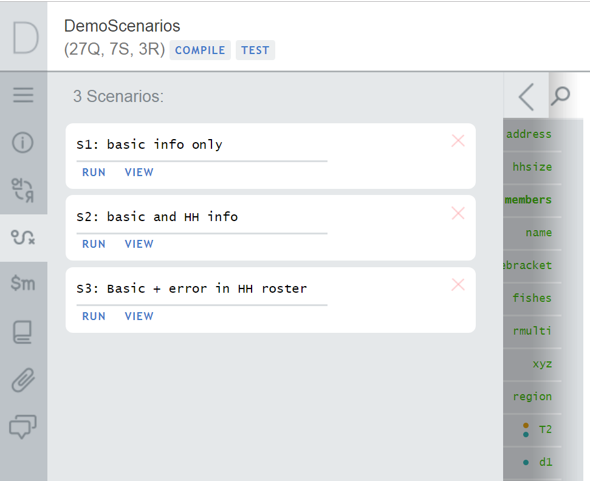
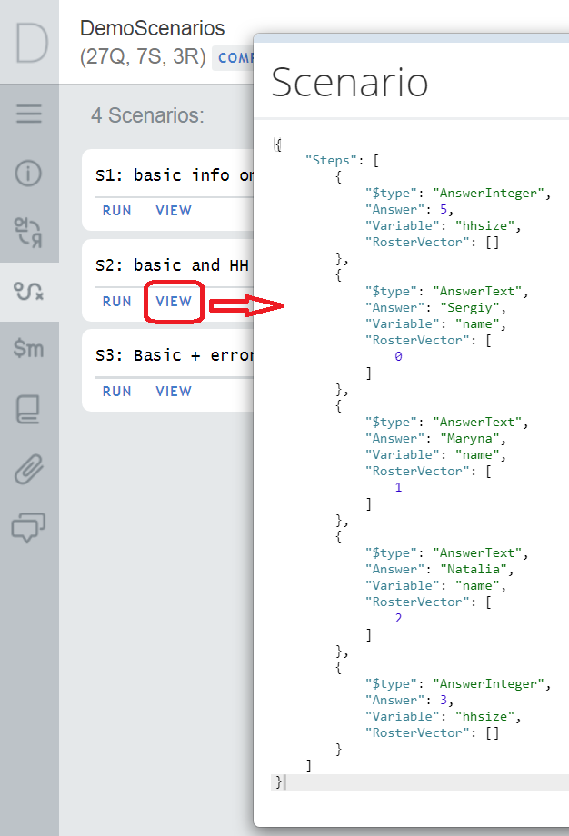

+++
title = "Testing Scenarios"
keywords = ["testing","scenarios"]
date = 2019-09-30T00:00:00Z
lastmod = 2019-09-30T00:00:00Z
+++

Survey Solutions scenarios represent a storage of responses provided during a 
testing session. The objective is **not** to collect the data (use Interviewer App 
for that), but to simplify testing of complex questionnaires which require a 
certain time-consuming input.

Two actions are available for a scenario in the Designer:

- **view:** review the answers entered in the scenario;
- **run:** start testing and apply the scenario to the questionnaire.

Here is what you need to know about scenarios:

- The scenarios are saved from the tester (WebTester or the Tester App).
- There can be multiple scenarios for the same questionnaire.
- A scenario doesn't have to cover all questions in the questionnaire, but may be
incomplete, for example, a scenario may cover just the first section or two.
- A scenario may become **no longer applicable**. This can be when the changes in the
questionnaire were significant (for example question type has changed) and the
recorded scenario no longer applies to the new version. In this case an attempt to
start a scenario will result in a message "*Interview data can't be applied to new
version of questionnaire. Empty interview created.*" and lead to a blank
questionnaire.
- Scenarios are **not copied** when you copy a section or the whole questionnaire
into another questionnaire.
- To edit a scenario, you need to run it first, then make any changes interactively
in the Tester (or WebTester), then save under the same or a different scenario name. 
One **may not** edit scenario steps directly, only view.
- Saving a scenario requires **edit permission** for accessing the questionnaire.
- Creation and changes to scenarios are **not** reflected in the questionnaire history.
- A scenario may involve input that results in validation errors. This is actually
one of the objectives of scenarios, to make sure the validations work!
- A scenario saves all the steps, how the answers were applied to the questionnaire,
not just the resulting final state! This is obvious from the recording of the
scenario steps:

notice the household size question (*hhsize*) was first answered with value 5, then 
changed to 3.

