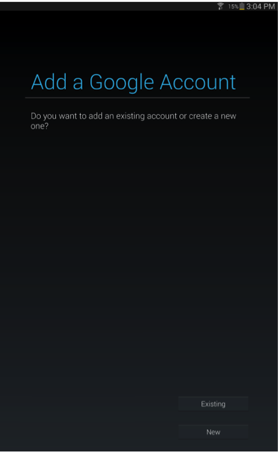
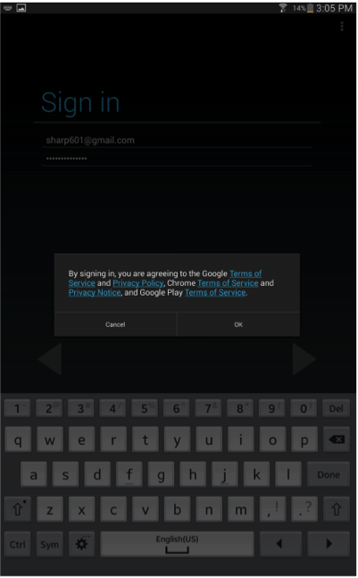
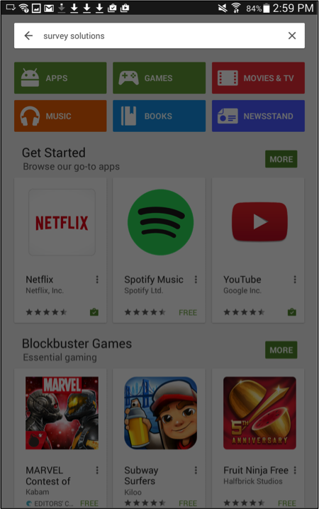
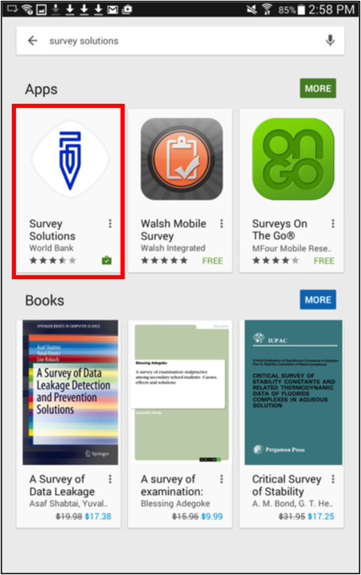
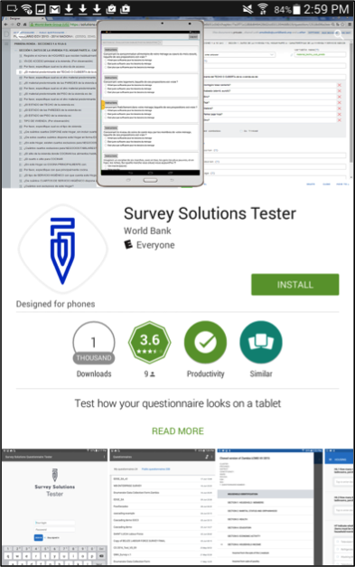
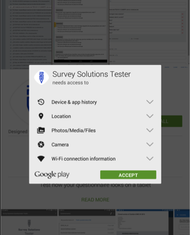
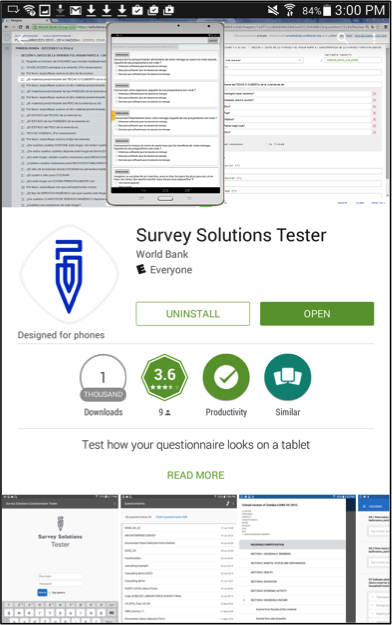
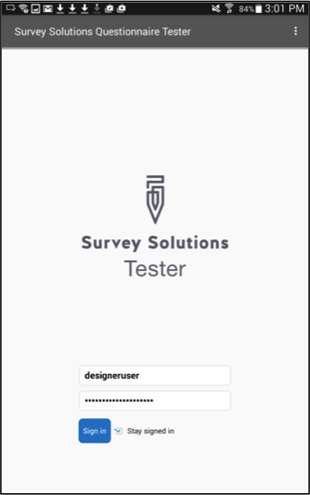
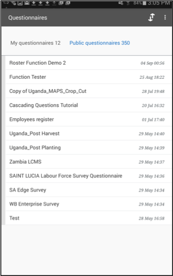

+++
title = "Testing Your Questionnaires Using the Tester Application"
keywords = ["testing","tester","app","google play","tablet"]
date = 2016-07-21T17:20:36Z
lastmod = 2016-07-21T17:20:36Z
aliases = ["/customer/portal/articles/2505348-testing-your-questionnaires-using-the-tester-application","/customer/en/portal/articles/2505348-testing-your-questionnaires-using-the-tester-application","/customer/portal/articles/2505348","/customer/en/portal/articles/2505348","/questionnaire-designer/testing-your-questionnaires-using-the-tester-application"]

+++

Although the web-based Questionnaire Designer application provides an
easy way to create your questionnaire, sometimes you need to see what
the questionnaire looks like on a device screen and how the
questionnaire operates (conditions and variables). Depending on the mode
of data collection, and the stage of testing you can choose to test the
questionnaire with the Tester app on a tablet or the [online
tester](/questionnaire-designer/testing-your-questionnaire-with-the-online-tester).    
   
This article will walk you through the process of installing and testing
your questionnaire using the Android Questionnaire Tester app on a
tablet. 

 

Step 1
------

**Before you start—you will need to set up a [Google
account](https://accounts.google.com/signup) if you do not already have
one.**  
 

 

The Questionnaire Tester is only available on the Google Play Store. To
access the Play Store, you have to create a Google Account. You already
have a Google Account if, for example, you use Gmail or Google Drive. In
that case, your login and password for the Play Store will be identical
to the Gmail or Google Drive credentials. If you do not have a Google
account, you can create one [here](https://accounts.google.com/signup).

 

Step 2
------

**Open the [Google Play store](https://play.google.com/store)**  
 

 

 

On the home screen of your Android device, tap on the *Play
Store* icon.  

 

 

Step 3
------

**Enter your Google Account credentials**  
 

 

 

If you have not used any Google services on your tablet, you will be
asked to enter your username and password. Insert it and accept the
terms and conditions of the Google Play Store.  

 

<table>
<tbody>
<tr class="odd">
<td></td>
<td></td>
</tr>
</tbody>
</table>

 

 

Step 4
------

**Search for *Survey Solutions***

 

 

   
At the top-left corner of the screen that follows, you will find a
*Search* field. Insert *Survey Solutions* to look for the Tester app. As
you are redirected to the results page, tap on the first app starting
from the left.  

 

<table>
<tbody>
<tr class="odd">
<td></td>
<td></td>
</tr>
</tbody>
</table>

 

 

Step 5
------

**Install the software**

 

 

On the next screen, tap the *Install* button. Soon, the installation
will start. Once it is finished, the *Install* button will be replaced
by the *Open* button. Tap on it to open the Questionnaire Tester.

 

<table>
<tbody>
<tr class="odd">
<td></td>
<td></td>
<td></td>
</tr>
</tbody>
</table>

 

Step 6
------

**Log in**  
 

 

 

Sign in using the same username and password that you have used with the
Questionnaire Designer at *designer.worldbank.org*. On the next screen
you will find a list of all the questionnaires that you have created.
Select the one that you would like to test by tapping on its name.
**Your questionnaire will have to compile without errors before you can
load it in Tester. **You will see an error message if your questionnaire
currently has errors.  
 

<table>
<tbody>
<tr class="odd">
<td></td>
<td></td>
</tr>
</tbody>
</table>

 

Step 7
------

**You are ready to test the questionnaire!**  



If you have made changes to the questionnaire in Designer and want to
see the changes you have made in Tester, you will have to reload the
questionnaire. To reload the questionnaire, click on the button at the
top right with two arrows to reload the questionnaire. All the changes
you have made in Designer will now be applied in Tester. Any data that
you have entered previously will remain after reloading the
questionnaire.  


