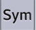
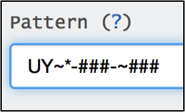

+++
title = "Text Question"
keywords = ["text","question types","pattern ","export"]
date = 2016-06-17T19:30:38Z
lastmod = 2016-06-17T19:30:38Z
aliases = ["/customer/portal/articles/2468455-text-question"]

+++

Description
-----------

A text **question** expects an answer to contain
alphanumeric characters (A-Z, a-z, 0-9), basic punctuation, symbols, and
spaces. The structure of the answer can be defined using a pattern. This
may be used for phone numbers, id codes and flight numbers.   
  
  
  
  
The picture below displays a default text question on a tablet that
accepts alphanumeric characters with no specific pattern defined.   
  
  
  
The picture below displays a text question on a tablet with a specific
pattern defined.   
  
  
 

 Creating a text question   
----------------------------

  
In Questionnaire Designer,

1.  Click on the *Question Type* box.
2.  Select *Text*.

  

  How a text question appears on a tablet 
-----------------------------------------

  
To answer the question the enumerator has to tap on the question box for
the keyboard to display. The keyboard automatically shows alpha
characters, but the enumerator can navigate through the keyboard to
select numeric characters and basic punctuation symbols.  
  
  
 

<table>
<tbody>
<tr class="odd">
<td style="text-align: center;"></td>
<td style="text-align: center;"></td>
</tr>
<tr class="even">
<td style="text-align: center;">Click on to change the display of the keyboard.</td>
<td style="text-align: center;">Click on  to change the display of the keyboard.</td>
</tr>
</tbody>
</table>

  
  
Once the enumerator enters the answer the text is shown in the answer
field.  
  
  
  
  
 

Options 
--------

  
**Pattern **  
  
If you know the format of the expected answer use
the ***Pattern ***field to define a specific format for the
answer, otherwise leave this field blank.   
  
  
  
  
  
To define a pattern, add a sequence of characters which defines the
specific format. This sequence can contain fixed letters, fixed numbers,
and symbols representing alpha, numeric or alphanumeric characters.   
  
 

<table>
<thead>
<tr class="header">
<th style="text-align: center;">Patterns</th>
<th style="text-align: center;"> </th>
<th> </th>
<th style="text-align: center;">Represent</th>
</tr>
</thead>
<tbody>
<tr class="odd">
<td style="text-align: center;">~</td>
<td style="text-align: center;"> </td>
<td> </td>
<td style="text-align: center;">One alpha character (A-Z,a-z)</td>
</tr>
<tr class="even">
<td style="text-align: center;">#</td>
<td style="text-align: center;"> </td>
<td> </td>
<td style="text-align: center;">One numeric character (0-9)</td>
</tr>
<tr class="odd">
<td style="text-align: center;">*</td>
<td style="text-align: center;"> </td>
<td> </td>
<td style="text-align: center;">One alphanumeric character (A-Z,a-z,0-9)</td>
</tr>
<tr class="even">
<td style="text-align: center;">##/##/####</td>
<td style="text-align: center;"> </td>
<td> </td>
<td style="text-align: center;">Date</td>
</tr>
<tr class="odd">
<td style="text-align: center;">(###)-###-####</td>
<td style="text-align: center;"> </td>
<td> </td>
<td style="text-align: center;">Phone number</td>
</tr>
<tr class="even">
<td style="text-align: center;">AA####</td>
<td style="text-align: center;"> </td>
<td> </td>
<td style="text-align: center;">Flight number</td>
</tr>
<tr class="odd">
<td style="text-align: center;">~*-###-~###</td>
<td style="text-align: center;"> </td>
<td> </td>
<td style="text-align: center;">Id code</td>
</tr>
</tbody>
</table>

  
  
  
For example, for a question asking for the national id of a household
member we will add the following sequence in the pattern text field:   
  
  
  
  
  
On the tablet the question’s answer field displays the specific format
that the enumerator must follow, as shown in the pictures below.   
  
 

<table>
<tbody>
<tr class="odd">
<td></td>
<td></td>
</tr>
</tbody>
</table>

   
 

Export
------

  
A text question’s answer is exported as a text variable in a
tab-delimited file. The name of this variable is the question’s
*variable name* that was defined in the Questionnaire Designer.  
  
Below are two examples that illustrate the export of a text question for
an open answer, and a specified answer format.   
  
  
**Text question without a pattern**  
  
  
  
  
Unanswered question exported in tab-delimited file  
  
  
  
Answered question exported in tab-delimited file  
  
  
  
**Text question with a pattern**

 

  
  
  
Unanswered question exported in tab-delimited file  
  
  
  
Answered question exported in tab-delimited file  

