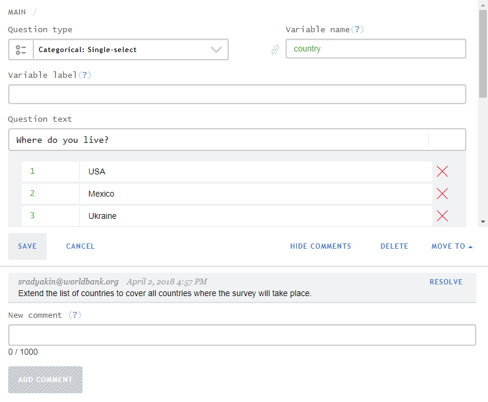
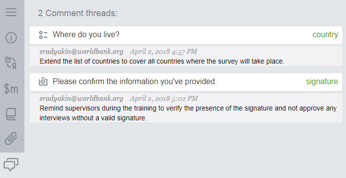

+++
title = "Comments in Designer"
keywords = [""]
date = 2018-04-02T20:31:16Z
lastmod = 2018-04-02T20:31:16Z
aliases = ["/customer/portal/articles/2932008-comments-in-designer","/customer/en/portal/articles/2932008-comments-in-designer","/customer/portal/articles/2932008","/customer/en/portal/articles/2932008","/questionnaire-designer/comments-in-designer"]

+++

Comments in Designer are an essential tool for collaboration of multiple
users working on the same questionnaire. Each of the collaborators may
leave comments to questions, indicating potential problems in
implementation, or suggesting improvements. For example, It is common
for the reviewers, that have a shared access to a questionnaire to leave
the comments for the original author.  
  
  
  
The full list of comments in all sections of the questionnaire can be
seen in the comments tool, which is accessible from the toolbar. Often
the comments represent a kind of to-do list:  
  
  
  
Comments can be marked as resolved, but even resolved comments are still
recorded with the questionnaire.  
  
A questionnaire can be shared by inviting users from the questionnaire's
[settings](/customer/en/portal/articles/2465929)
dialog.
