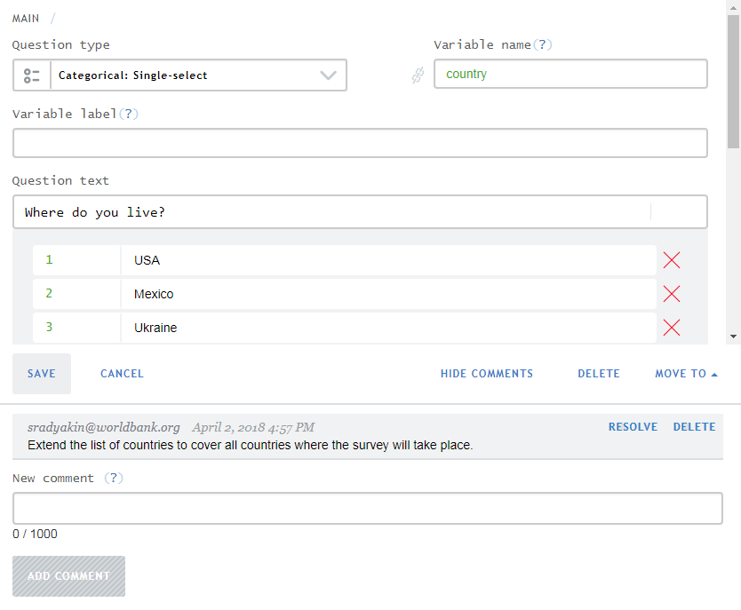
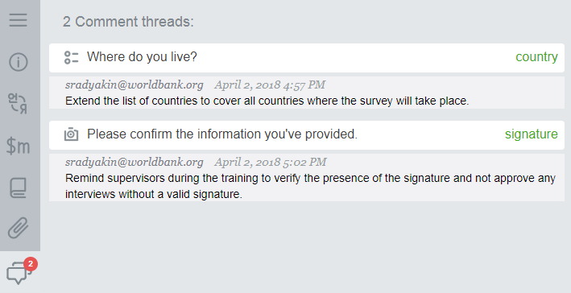

+++
title = "Comments in Designer"
keywords = [""]
date = 2018-04-02T20:31:16Z
lastmod = 2026-09-21T20:31:16Z
aliases = ["/customer/portal/articles/2932008-comments-in-designer","/customer/en/portal/articles/2932008-comments-in-designer","/customer/portal/articles/2932008","/customer/en/portal/articles/2932008","/questionnaire-designer/comments-in-designer"]

+++

Comments in Designer are an essential tool for collaboration among multiple users working on the same questionnaire. Each collaborator may leave comments on questions, indicating potential implementation issues or suggesting improvements. For example, reviewers who have [shared access to a questionnaire](/questionnaire-designer/interface/share-questionnaire/) often leave comments for the original author.

To leave a comment on a question, click the `ADD COMMENT` button at the bottom of the panel where you configure the question's properties. If there are comments on this question already, the button will appear as `SHOW COMMENTS (2)` (where `2` is the number of comments, whether resolved or unresolved).

  

Click `HIDE COMMENTS` to close the panel showing the comments (the comments remain recorded with the questionnaire and accessible to collaborators).

The full list of comments across all sections of the questionnaire can be viewed in the `Comments` tool, accessible from the [panel of advanced instruments](/questionnaire-designer/toolbar/panel-of-advanced-instruments/). In many cases, comments serve as a kind of to‑do list:

  

Comments can be marked as *resolved*, and resolved comments remain with the questionnaire until they are *deleted*.

The counter overlaying the comments icon shows the current number of unresolved comments (if any).
