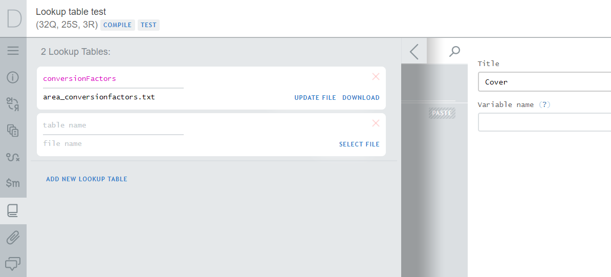
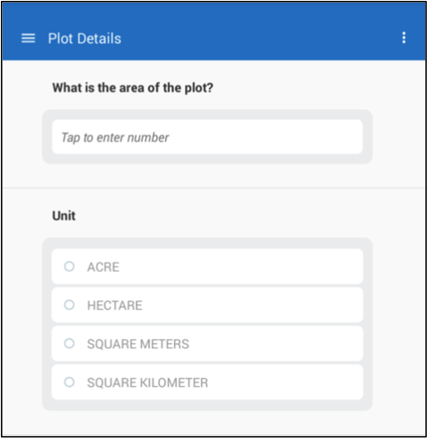

+++
title = "Lookup Tables"
keywords = ["conditions","table","reference","rowcode","lookup"]
date = 2016-06-16T16:33:33Z
lastmod = 2024-03-13T00:00:00Z
aliases = ["/customer/portal/articles/2466966-lookup-tables","/customer/en/portal/articles/2466966-lookup-tables","/customer/portal/articles/2466966","/customer/en/portal/articles/2466966","/questionnaire-designer/lookup-tables"]
+++

Overview
-----------------------------

*Lookup tables* are reference tables that may be used in the syntax expressions,
for example in validation and enabling conditions. Lookup tables are prepared as
external tab-delimited files and uploaded to the questionnaire in the Designer.  

We use lookup tables to find content by some code and apply that content in
validations and enabling conditions as part of larger expressions.

Lookup tables contain numeric data: the lookup code must be integer, while the
content may be integer or a floating point value. Lookup tables are not
suitable to store string content. The lookup code is often a code of an item in
a price survey, occupational code in a labor force survey, or a code of crop in
an agricultural survey. It may also be a combination code of two or more codes
(for example a district code and a locality code).

Lookup tables are particularly convenient for storing time series data, such as
historical exchange rates for various currencies. Other uses involve storing
estimated crop yields by crop, ranges of salaries by occupation, etc. While
anthropometric z-scores can be implemented via lookup tables as well, users
should refer to specialized z-score functions instead.

Lookup tables are inappropriate to store confidential data. For example, do not
store the correspondence between e.g. the *tax number* and *taxable income* of
individuals in the survey population as a lookup table.

Format
-----------------------------

The lookup tables must conform to the following format:  
 
- Contain the `rowcode` column all values in which are integer and unique.
- Contain one or more other numeric columns with reference data (these columns
may contain integer or fractional values).
- These other columns may be named arbitrarily as long as there are no
duplicates and the column names comply with the
[variable naming](/questionnaire-designer/components/variable-names/)
requirements.
- If fractional data is supplied, a dot ("*.*") must be used as a decimal
delimiter.
- Each line of the file must end with a new line character.
- Lookup table may not be empty (in other words it must have at least one lookup
 value).
- Lookup table may include blank values, in which case the value retrieved from
the table is C#'s **null** value.

The number of rows and columns in lookup tables is restricted. See
[Survey Solutions Limits](/questionnaire-designer/limits/survey-solutions-limits/)
for particular limits. Note that a questionnaire may include multiple lookup tables.

Note that the data uploaded as lookup tables is constant during the survey. If
one needs to change the values stored in the lookup table, the questionnaire
must be revised and re-uploaded to the data server.

Setting up lookup tables
-----------------------------

<CENTER>
    <A href="images/lookup_table_setup.png">
        
    </A>
</CENTER>

**Uploading a lookup table**

1. Click on the *lookup table* icon in the
[panel of advanced instruments](/questionnaire-designer/toolbar/panel-of-advanced-instruments/).

2. Click on the `ADD NEW LOOKUP TABLE` link.  

3. Type in the `table name` (which must be unique), and click on the 
`SELECT FILE` link to upload the tab-delimited lookup table.

4. Click `SAVE`.

The Designer will verify if the uploaded file is compliant with the format
requirements and issue an error message (and reject the file) if it is not
correct. For example, an error message may indicate "*The mandatory rowcode
column is missing*", which is a violation of the first requirement. If you
get any error message while saving the lookup table in the Designer, correct
the problem and re-upload the lookup table file.

**Modifying content of the lookup tables.**

Uploaded lookup tables can be modified in later editing sessions. This can
be done by:

1. downloading the table data file with clicking on the `DOWNLOAD` link, then
2. making any necessary changes to the data file, and then
3. re-uploading the data file by clicking `UPDATE FILE` link and saving the changes.

**Deleting lookup tables.**

Lookup tables that are no longer needed in the questionnaire can be deleted by
clicking on the red cross in the top-right corner of the lookup table's card in
the panel of advanced instruments.


Use of lookup tables in syntax expressions.
-----------------------------

The short syntax for the reference in condition expressions is:

```
    LookupTableName[code].ColumnName
```

It requires the name of the lookup table, the value of the code, and the
name of the column for the content of interest. This literally means: take
the lookup table with the name `LookupTableName`, search the column named
`rowcode` to locate the specific value `code`, then, if found, scan that
line of the table and return the value from the column named `ColumnName`.

Note that if the value `code` does not occur among the lookup table codes, an
exception occurs during the evaluation of the above expression. One can avoid
this by precedeing the evaluation with a boolean function `ContainsKey()`,
which checks if the value specified as the parameter is contained in the
rowcodes of a certain lookup table:

```
    LookupTableName.ContainsKey(code)
```

Consider the following example:
-------------------------------

Suppose, that the questionnaire asks for the area of a plot in two questions:
value (numeric) and unit (categorical single-select), and it is necessary to
supply a validation condition that results in an error message for plot areas
that are greater than `2.0` hectares.

<CENTER>
  <A href="images/643050.png"></A>
</CENTER>

Since the units may vary, we may not directly compare the answer to the
numerical question with the threshold `2.0`. But rather we must convert the
area to hectares first.

The tab-delimited file of the lookup table for unit conversion factors
necessary for this case may look like [this](images/area_conversionfactors.txt).
In preparation of this file we've used the numerical codes assigned in the
Designer to each of the choice categories in the single-select question:
```
Acres....1
Hectares....2
Square meters....3
Square kilometers....4
```

This lookup table we upload and save as `conversionFactors`. We then add the
a validation rule to the single-select question on the units with the error
message "*Plot area must be smaller than 2.0 hectares. Please confirm.*" and
the following expression:
```
   (plotarea * conversionFactors[self.Value].conversion) < 2.0
```

Here:

- `plotarea` refers to numeric area question.
- `conversionFactors` is the name of the look up table we have uploaded to Designer.
- `self` refers to the single-select unit question that holds the validation
expression, and
- `conversion` refers to the conversion factor column in the lookup table.  

If, for example, the option "*Acre*" is selected, then the numerical value
reported for plot area will be multiplied by the conversion factor in the row 1
of the `conversion` column in the lookup table to obtain the area value
expressed in hectares. Subsequently the expression compares this calculated
value with the threshold of `2.0` hectares.

Note that we don't have to check if the codes are contained in the lookup table,
because the lookup table is matched at design time with all the possible choices
in the categorical question.

### Random numbers

Lookup tables can store sequences of random numbers. Here is a
[lookup table](images/rnd_table_15000.txt) with `15,000` random integer numbers
from the interval `[0;999999]` stored in the column named `rnum` and the
[Stata script](images/generate_rnd_15000.do) that generated it.
