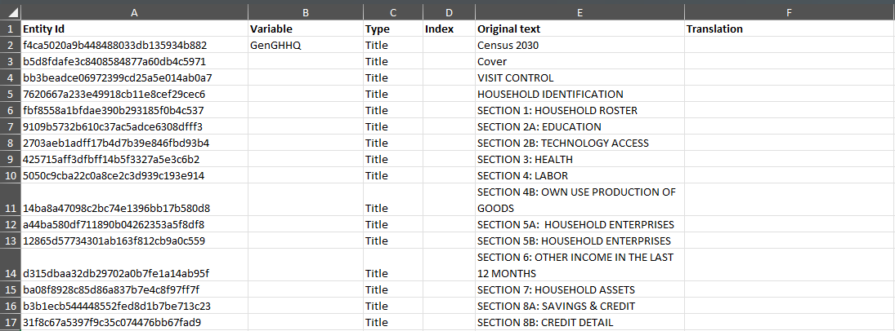
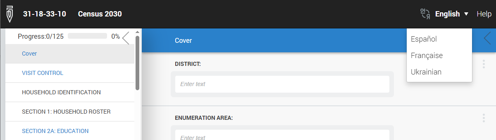

+++
title = "Multilingual Questionnaires"
keywords = ["multiple languages","translation","localization"]
date = 2016-11-02T19:07:27Z
lastmod = 2026-04-20T00:00:00Z
aliases = ["/customer/portal/articles/2626663-multilingual-questionnaires","/customer/en/portal/articles/2626663-multilingual-questionnaires","/customer/portal/articles/2626663","/customer/en/portal/articles/2626663","/questionnaire-designer/multilingual-questionnaires"]

+++

This article describes composing multilingual questionnaires. For switching the
language of the Survey Solutions software itself and supported languages refer
to the [localization overview article](/faq/language/).

Often times researchers work in contexts where respondents of a survey
speak different languages. Therefore, to administer surveys and collect
higher quality data it is important to have questionnaires in the
corresponding language. You can create multilingual questionnaires in
Survey Solutions Designer by following the steps listed below.

Note that it's easier to follow them when the questionnaire development is
fully completed in the original language, but Survey Solutions allows updating
existing translations as well.

1.  Click the translation button in the advanced instrument panel on the
    left: . If no translations were provided
    earlier, you will only see a card with translation *"Original"* there,
    which is marked as `default`.

2.  Click the link `Get Template for Excel (XLSX)`. This will download a
    spreadsheet file in XLSX format that can be opened with Microsoft Excel,
    Open Office Calc, and other compatible applications.

3.  Open this file and locate the sheet "*Translations*". It contains the
    following columns:
    - *"Entity Id"*,
    - *"Variable"*,
    - *"Type"*,
    - *"Index"*,
    - *"Original text"*
    - *"Translation"*.

    **The translator should take values from *"Original text"* as input and write
    the translated version of it into the corresponding cell in the
    *"Translation"* column:**

    

    Values in any other cells of the sheet should not be modified!
    This includes the original content being translated. Any corrections to the
    original text need to be done through the Designer's interface, not in any
    translation file.

    Answer options for reusable categories/classifications are placed in
    their own dedicated sheets. The name of each such additional sheet is
    formed with a special marker "@@\_". **These sheets have the same columns
    and must also be translated**.

4.  After the translation has been completed, save the file. While it is
normally expected that the translation file is complete (all original texts are
translated to the target language) it is possible to leave some values
untranslated. In that case text from the "*Original text*" column will be used in
Survey Solutions.

5.  Switch back to Questionnaire Designer and in the translation panel
    click *Upload New Translation*.  Select your saved file to upload as a new
    translation. Designer will indicate number of translated strings it
    retrieved from the uploaded file.

6. Now specify any desired name to appear in the language selector for
interviews in CAPI and CAWI modes:

    

Uploaded translations can be:

- **deleted**: by clicking the red cross button on the translation card; the
original card (top) can't be deleted.
- **renamed**: by clicking on the translation name and revising it, then
preserving the changes with the `SAVE` button
(<A href="images/rename_translation.gif">see how</A>).
- **updated**: by clicking the `Download XLSX` link on the translation card,
and then re-uploading the updated file with the `Update` button.

  (Note that the uploaded file fully substitutes the corresponding translation
uploaded earlier).

You may also:

- set a **default language** for the survey, which is the
translation that applies to the *new interviews started from an assignment*. It
can differ from the language visible in the Designer's interface
(<A href="images/set_default_translation.gif">see how</A>).

- switch the language visible in the Designer by clicking `SWITCH TO` on any
translation's card. Note that for a switch that translation must be *complete*,
meaning not having any not translated text!. If the original translation was
not renamed by you, its card will have a blank name which will need to be
filled in appropriately.

While translating the text keep in mind the following:

1. HTML tags may be present in the original text to reflect desired
[text formatting](/questionnaire-designer/techniques/formatting-text/) and
normally should be preserved in the translation to achieve equivalent
formatting of the content.

2. [Hyperlinks](/questionnaire-designer/components/questionnaire-hyperlinks/)
may be present in the original text in which case the text of the link is
translated and the target typically remains the same.

3. [Text substitution](/questionnaire-designer/techniques/text-substitution/)
may be utilized, in which case it should be preserved intact.
