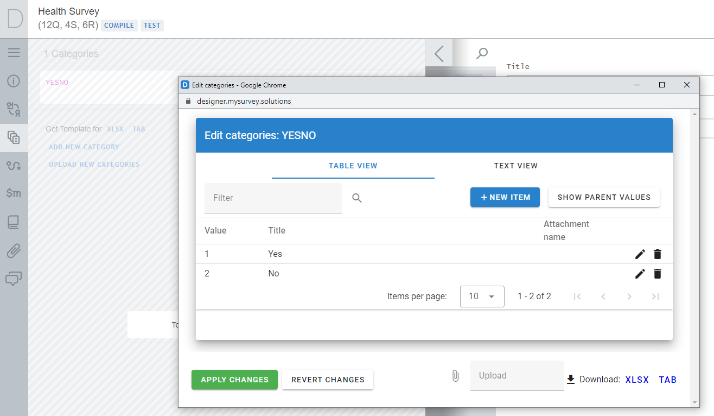
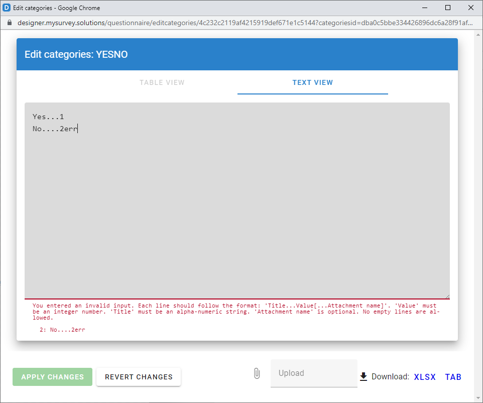
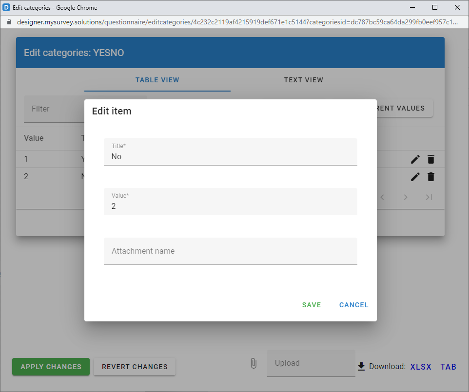

+++
title = "Reusable Categories"
keywords = ["categorical question","categories","options","choices","selections"]
draft = false
date = 2023-08-10
+++


Survey Solutions provides two question types that make use of categorical
selections, which are the `Single-Select Categorical` and
`Multi-Select Categorical` questions. Each of them allows the user to select
from a list of categories with the difference of whether only one selection is
allowed (single-select) or more than one selections (multi-select) are permitted.
Each of these question types has multiple presentations, such as with choice
buttons, or with a search option, etc (see
[Overview: Categorical question types](/questionnaire-designer/questions/categorical-overview/)).

In many surveys the same categories are applied to more than 1 question. Your
survey may involve multiple Yes/No/Don't know questions, or multiple questions
using the same categorical scale, etc. In this case one can define the
categories once, then reuse them in all the questions which rely on them.

There are several advantages to using reusable categories:

- one can easily introduce changes that affect all the questions using these
categories, (for example, if switching from 3-level to a 5-level satisfaction
scale);

- it is easier to translate questionnaires that make use of reusable categories,
simply because they eliminate redundancy in the material for translation (without
them each set of options will be issued for translation separately, which may
result in additional work, or even differences of translation of identical options).

Note that the same categories can be used by both single and multiple select
questions. While you will not do this with Yes/No categories, you may very well
encounter surveys, which do that e.g. for countries list (for example, the survey
may include a single-select question for the country of birth and a
multiple-select question for the countries visited).

If the categories represent some standard classification, it is recommended to
signal this through the title of the categories or include a comment in the
questionnaire meta-information. For example, the reusable categories for
occupation could be called `ISCO08_3` to signify they correspond to that ISCO-08
standard and contain 3-digit classification codes with corresponding titles).

We define reusable categories in a particular questionnaire by:
1. accessing the
corresponding element in the panel of advanced instruments at the left, then
2. clicking the `ADD NEW CATEGORY` link, then
3. entering the name of the reusable categories (which must obey the rules for variable names), and finally
4. defining the categories themselves in the following dialog that appears:

<CENTER><A href="images/editor1.png">
  
</A></CENTER>

If the number of categories is large, it is often easier to upload a file prepared externally, that can be done with the file upload tool located at the bottom of the dialog (the uploaded categories will replace the categories already defined, if any). One can also download the defined categories in *.xlsx or *.tab formats by clicking the corresponding download links.

These files must have the following columns defined (column names must be stored in the first line of the text file or the first row of the spreadsheet file):

- `value` - stores the codes of the categories;
- `title` - stores textual labels of the categories;
- `parentvalue` - stores codes of parent categories when the categories are intended for cascading selection (optional);
- `attachmentname` - stores names of attachments (for example, images) associated with categories (optional).

The order of columns in the files you prepare is not important, as their meaning is determined not by the order, but by the column names.

When a large number of categories is defined, they will be presented in multiple pages, with each page containing up to `10` (or `20`, or `50`, etc - selectable) categories. One can navigate across the pages with the firs/previous/next/last page navigation buttons.

Two distinct views are provided for defining categories: table view and text view. While tabular view is better organized on the screen, the text view is more suitable for copying and pasting the categories (e.g. between the different reusable categories, or to/from an external program).

<CENTER><A href="images/editor2.png">
  
</A></CENTER>

In the text view mode we format the categories as follows: textual label, two or more dots, numerical code of the category, optionally followed two or more dots and attachment name. For example:

```
Generic programmes and qualifications...............0
Education...........................................1
Arts and humanities.................................2
Social sciences, journalism and information.........3
```

If the categories contain references to the parent codes, then the format is as follows: textual label,two or more dots, partent code, slash "/", category code, optionally followed by two or more dots and attachment name. For example:

```
Basic programmes and qualifications.................0/1
Literacy and numeracy...............................0/2
Personal skills and development.....................0/3
Education...........................................1/11
Arts................................................2/21
Humanities (except languages).......................2/22
Languages...........................................2/23
Social and behavioural sciences.....................3/31
Journalism and information..........................3/32
```

If the content in the text view violates the format requirement, the window will contain a corresponding message, indicating an erroneous entry. Until the error is corrected, you can't switch to the table view.

In the table view the entries are entered through a dialog form:

<CENTER><A href="images/editor3.png">
  
</A></CENTER>
