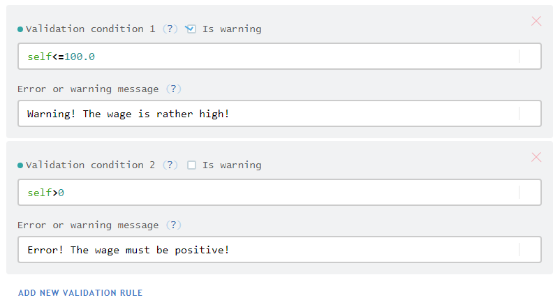

+++
title = "Validation warnings"
keywords = ["Validation warnings"]
date = 2018-04-02T22:27:01Z
lastmod = 2018-04-02T22:27:01Z
aliases = ["/customer/portal/articles/2932042-validation-warnings","/customer/en/portal/articles/2932042-validation-warnings","/customer/portal/articles/2932042","/customer/en/portal/articles/2932042"]

+++

Validation rules are an essential mechanism of improving the quality of
data in CAPI surveys. However, not in all situations a check may point
to a definitive problem with the data. In some cases the check may only
request attention of the interviewer. In this case we are talking about
warnings, rather than errors.  
  
Consider, for example, the following validation rules:  
  
  
In this case we are specifying that the wage must be positive, otherwise
we should show an error to the interviewer. However, we are less sure
about how high the possible wages are, so we will show a warning for the
interviewer if it is above 100.0 USD per hour. To achieve this, we set
the "***is warning***" flag in the Designer for this validation rule
(first).  
  
As with errors, several warnings may appear simultaneously as a result
of the data check.  
  
The warnings are rendered differently from errors (appear in orange
color rather than red) and not counted in the interview errors counter.
They are also not recorded in paradata.
