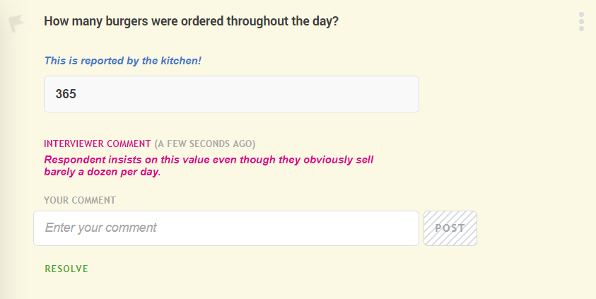
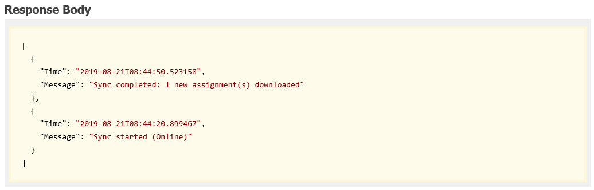

+++
title = "Version 19.08"
keywords = ["19.08"]
date = 2019-08-16T12:18:00Z
+++

Survey Solutions v19.08 adds the following useful features:

- Comments may be resolved by Supervisors and Headquarters users.
- Headquarters users may respond to Supervisors questions.
- Detailed user action log can be accessed via API;
- Export improvements.

## Comments may be resolved by Supervisors and Headquarters users.

A comment may be left for a particular question by an interviewer, or a member of the
supervising team (supervisor or an HQ user). The comment usually describes a point of
attention or requesting a correction to be made. And when the comment is addressed,
it is important to mark it as such.

Whenever a comment is present, a supervisor or an HQ user may mark it as resolved by
clicking the *RESOLVE* button:

 

Resolving the comment does not erase it completely, but hides it from the screen behind
the *SHOW RESOLVED* button.

## Headquarters users may respond to Supervisors questions.

Headquarters users could approve the interviews without waiting for the supervisor decisions.
Yet the involvement of the supervisors was necessary in surveys where supervisors questions
were included, as the HQ-users didn't have a possibility to fill out those questions.

This limitation has been overcome in v19.08 and the HQ-users can now respond to the supervisor
questions before approving the interview. This allows creating flatter hierarchies in small 
surveys, where all the supervisory work is done by the HQ users without the necessity to man 
the supervisor position.

## Detailed user action log can be accessed via API.

The detailed actions log is useful for monitoring the activity of the users, such as when they
synchronize and whether they started working on an assignment.

See the support page for more information on the detailed actions log:
https://support.mysurvey.solutions/headquarters/reporting/detailed-action-log/

This log was previously only available interactively at the HQ. Now, in v19.08 a new API query
has been added to permit a download of such a log (for a particular interviewer) from an
external API client.

 

It remains the responsibility of such an API client to parse out the events it is interested
in from such a log of time stamped messages.

## Improvements in Export

Improvements in exporting of the data include the more natural behavior of the selectors at
the export page, as [requested by macuata and other users](https://forum.mysurvey.solutions/t/data-export-dont-clear-selection-after-clicking-add-to-queue/1843).

Another change fixes a bug where if survey includes more than one version, exporting all of
them into a cloud storage overwrote them retaining only the last one, as [described by andresarau and others](https://forum.mysurvey.solutions/t/data-export-name-of-the-files-to-include-version-of-the-questionnaire/1905).

Now all of them will be exported with a suffix indicating a version, so that they can be
placed in the same cloud storage.