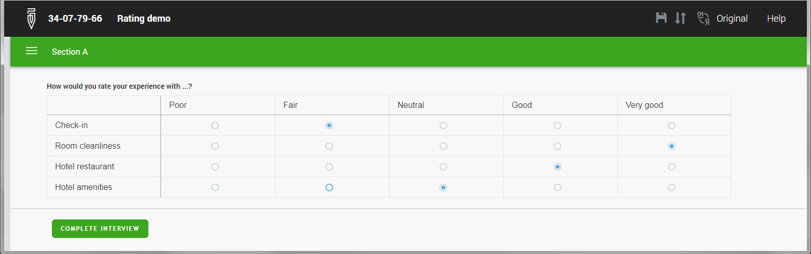
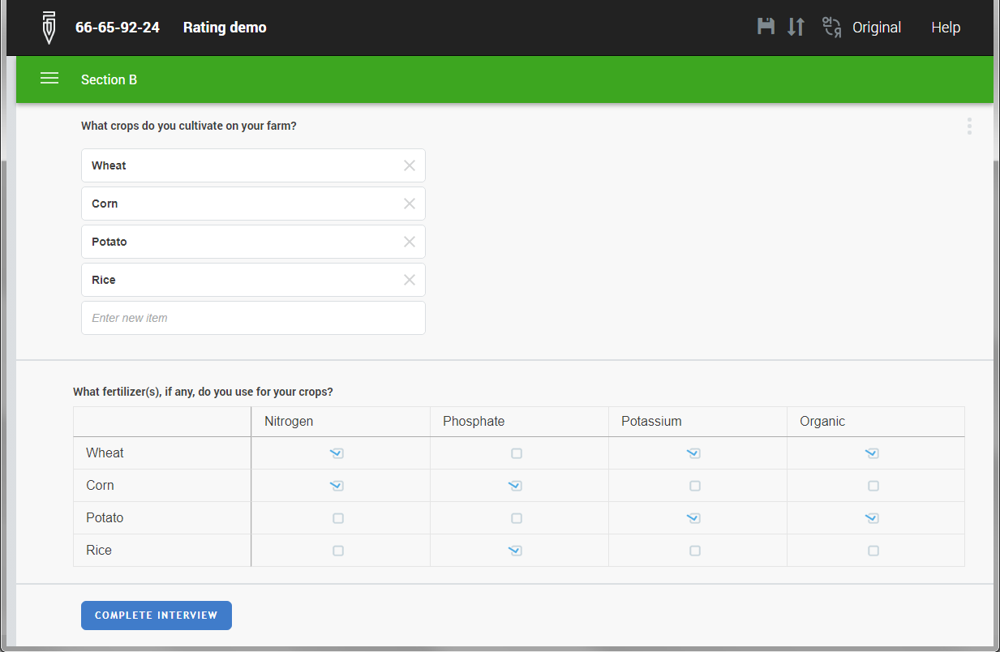

+++
title = "Version 20.01"
keywords = ["20.01"]
date = 2020-01-13T01:01:01Z
lastmod = 2020-01-13T01:01:01Z
+++

Survey Solutions v20.01 adds the following useful features:

- Matrix presentation of categorical questions in CAWI surveys;
- Reusable categories in multiple categorical questions.

## Matrix presentation of categorical questions (CAWI)
Single-select and multi-select categorical questions may now be presented in 
a more compact form suitable for ranking/matrix questions in CAWI mode.

  

To create this structure the designer should place one (and only one) question 
into a roster. The categories of this question will determine the columns of 
the matrix (*'Poor'...'Very good'* in the above illustration), while the
roster items will determine the rows. Finally the roster mode should be set to 
**Matrix**. We've added this mode to existing **Sub-Section**, **Flat**, and
**Table** modes for the presentation of the roster.

Despite the shown matrix appearance on the screen, the structure remains a 
roster with a categorical question in it for the purposes of the syntax writing 
(e.g. **<TT>EXPERIENCE[3].Satisfaction</TT>**) and data export (data collected in this
way will end up in a separate file).

Number of rows may be fixed (use fixed roster) or be triggered by another question 
in the questionnaire, for example numeric, multiselect or a text-list.  The 
question in the roster may also be a multiselect:

  

The matrix presentation of the roster is available only in the CAWI mode. In the 
CAPI mode such a roster will be presented as a roster with sub-sections.

## Reusable categories
This release has brought a long awaited feature of reusable categories: a 
questionnaire designer may now define a set of categories and use them multiple 
times across the questionnaire in different single-select and multi-select questions. 
For example, the same list of all countries in the world could be reused for 
questions *"Which countries have you visited?"*, *"Which country did you visit last?"*, 
*"Which country do you plan to go next?"*.

There are numerous advantages of this approach:

- Categories are defined once, subsequent reuse is faster for the designer;
- Any changes in the list immediately affect all questions where these categories are used;
- The questionnaire becomes more compact (in terms of its size);
- There is less work for the translator as the translation needs to be supplied only once;
- etc.

To define reusable categories:

1. click the corresponding icon 
on the toolbar,
2. upload the file with categories (Excel and tab-delimited file formats are supported),
3. assign a name to the set of the categories.

After this you can select this named set in the single-select and multi-select questions
of the questionnaire.
