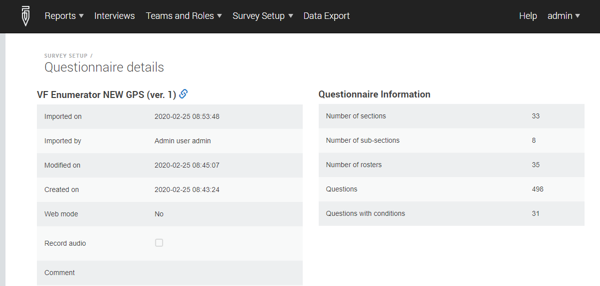
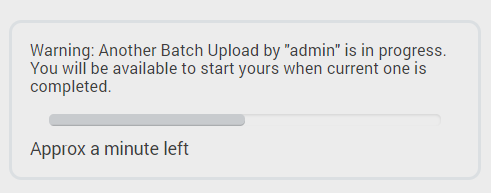
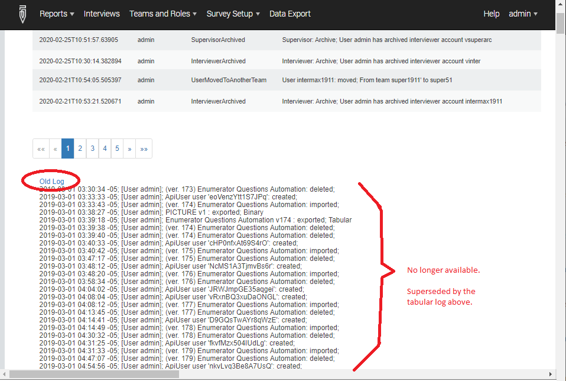

+++
title = "Version 20.03"
keywords = ["20.03"]
date = 2020-03-10T01:01:01Z
lastmod = 2020-03-10T01:01:01Z
+++

Survey Solutions v20.03 adds the following useful features:

### Changes to GPS question behavior
Recorded coordinates are rendered as a clickable link, which when clicked, opens a Google-map centered at the recorded location. 

Rendering of the map preview on the tablet requires Google-services to be installed on the tablet.

### Changes to audio audit option.
The option to activate the Audio Audit has now been moved from the questionnaire context menu to the questionnaire details page.

  

### Changes to assignments upload dialog
Assignments are created sequentially, one at a time. If multiple HQ users attempt to upload their samples at the same time, the first one will succeed, but the second will need to wait the first upload to finish. Survey Solutions will display the corresponding informational message, indicating which other user has started the upload and the estimated time remaining until finish:

  

### Changes to questionnaire import dialog
Importing a questionnaire is not instantaneous, especially in the case where the questionnaire contains multiple language translations that need to be rendered as separate PDF documents. The dialog displayed during importing the questionnaire will now show the progress of the import operation and estimated time to complete it.

### API Changes
A new [API](/headquarters/api/api-interactive-description/) query is now available to create users. The API documentation has also been reformatted and refined.

### Designer can copy questions with reusable categories
Designers of questionnaires can now copy questions with reusable categories from one questionnaire to another. If the questionnaire doesn’t have the same matching categories, they will also be copied from the source questionnaire.

### Local server password policies
Survey Solutions will obey password policies set up in the <TT>**appsettings.production.ini**</TT> file of the standalone data server. The administrator of the standalone server may adjust these policies to differ from the default requirements (for example to require passwords to be longer, or utilize certain types of characters). All Survey Solutions cloud servers (new and existing) continue using the same password policies.

### Local server metrics
A public metrics page is introduced for every standalone server: <TT>**www.YOURSERVERNAME.com/metrics**</TT>. 
This page publishes various statuses and performance indicators of the server. 
The data is published in the [prometheus format](https://prometheus.io/docs/concepts/data_model/).

### Old system log is no longer available
We kept the old format of the system log for compatibility in a few recent versions. It is now completely superseded by the log in the new format:

  

