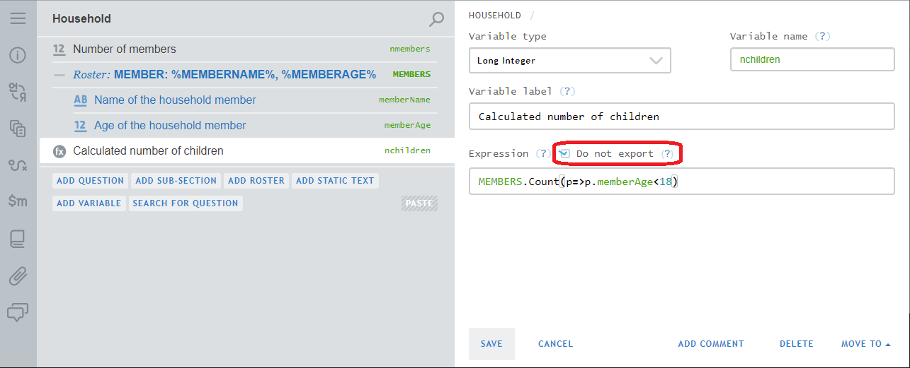
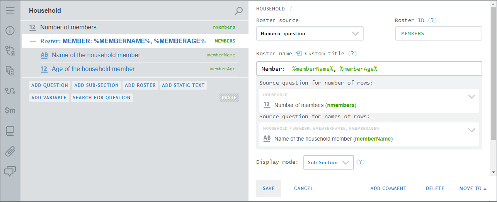

+++
title = "Version 20.04"
keywords = ["20.04"]
date = 2020-04-06T01:01:01Z
lastmod = 2020-04-06T01:01:01Z
+++

Survey Solutions v20.04 adds the following useful features:

### Non-exportable variables

Calculated variables are used extensively in Survey Solutions questionnaires for complex checks, skips, and other uses. They were always exported with the answers to the questions in the final dataset. This version allows the designer of the questionnaire to mark certain variables as non-exportable. Such variables are considered temporary, needed only during the interview execution, and not exported with the survey data.

  

### Filter in categorical questions linked to a list

Linked-to-list questions were earlier not allowed to have filters. This is now permitted. This is commonly needed when we need to do double screening, such as *"Who is employed?"* and then from the selected individuals only answer *"Who has more than one job?"*. Earlier this was possible only if there was a roster triggered by the members list, now such roster is no longer a requirement.

### Customization of labels on the roster buttons

The author of the questionnaire can now customize the appearance of the titles on the roster buttons, when the newly added checkbox is checked.

  

For example, the above setup will display "*Max Musterman, 45*" instead of just "*Max Musterman*".

### Do not require text

For static texts mentioning attachments (pictures) there is no longer requirement to include some descriptive text. This is convenient for inclusion of logos and other uses where no explanatory text is needed.

### GPS pick from map

In the assignment creation dialog the headquarters user can now specify the value of the identifying GPS question by pointing to a particular location on the map.

### Export v2 API

The [export API has been changed](https://demo.mysurvey.solutions/apidocs/index.html#). The initial post request to generate the export data file now returns a numeric ***JobID***, which must be used in all subsequent requests related to that export job (including obtaining the status of a job and picking the resulting export file) instead of the original combination of the export parameters.

The new API is accessed through the v2 prefix. The old procedure for data export (accessible via the v1 prefix) continues to work, but will be phased out in the future releases. If you are using API for data export, update your code at the soonest.

### Export format changes

The system-generated file [**assignment__actions**](/headquarters/export/system-generated-export-file-anatomy/) now contains information on **all** assignments. In earlier versions it contained only information on assignments that originated the interviews included in the particular export file.

This should help in building dashboards, analysis of survey progress and pending workloads.