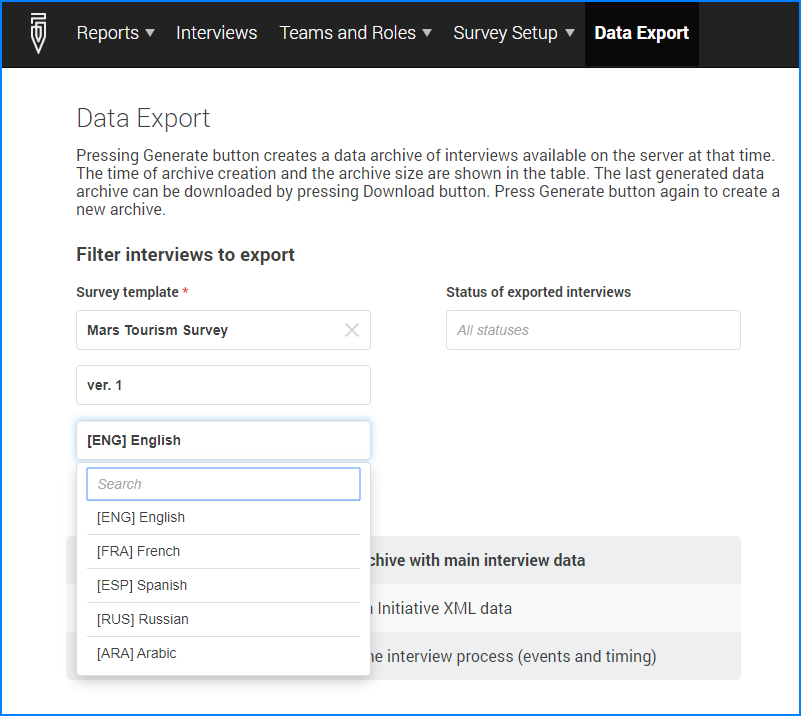

+++
title = "Version 20.06"
keywords = ["20.06"]
date = 2020-06-10T01:01:01Z
lastmod = 2020-06-10T01:01:01Z
+++

Release 20.06 of Survey Solutions adds the following new features:

- Selection of language for export;
- Possibility to reject interview to a different user;
- Increased Limit for dimenstions of lookup tables;
- Introduced new Maps API;
- Temporary Web Interviews

### Selection of language for export
Survey Solutions allows data collection in multiple languages if the designer of 
the questionnaire has included translations for questions, options, and other 
localizable questionnaire elements. Up to this version the export of data was 
possible only in the main language, which was not optimal for international teams 
collaborating on surveys. Now the export may be produced in any language included 
as a translation to the questionnaire. The corresponding language selector will 
appear at the export page if the selected questionnaire contains any translations 
in addition to the default language.

  

This feature was requested multiple times in our users' forum 
[here](https://forum.mysurvey.solutions/t/export-data-in-translated-questionnaires/1609), 
[here](https://forum.mysurvey.solutions/t/option-to-export-with-variable-value-labels-from-other-languages/2222), 
as well as in numerous requests sent to the support email.

You will also find that you can now rename the original language from the fixed 
word *'Original'* to any title that better describes the language.

### Reject interview to a different user
In the previous versions if an interview needed to be rejected to a different user 
the supervisor had to do two actions: first reject the interview, then re-assign 
to another interviewer. In the new version this can be done as a single reject-to 
action.

This is not just a convenience feature. This has important data integrity 
consequences. In the older versions if the original interviewer managed to 
synchronize between the two actions, he was getting the rejected interview, and 
so did the new interviewer. This resulted in unwanted duplicates if the 
supervisors were not paying attention. In this new version the rejection and 
re-assignment is done as a single atomic action, so that the original interviewer 
doesn’t stand a chance to collect the interview back on rejection (clearly, the 
supervisor can still reject to the original interviewer if she wishes to do so).

### Limit for lookup tables has been increased
Lookup tables had a limit of 5,000 rows which was shorter than the maximum number 
of items in the categorical questions (15,000). This resulted in the need to break 
down conditions to seek values in 2 or 3 lookup tables, possible, but inconvenient 
for writing conditions and maintaining the tables.

The new limit on the number of rows for the lookup tables (15,000) allows to 
accommodate the values necessary for validation of the categorical questions 
without the need to break them among multiple tables.

### Maps API
A new API has been added to manipulate the maps assignments at the server. The 
following endpoints are added:

- Get information about the currently loaded maps;
- Get information about the currently made maps assignments;
- Assign maps to interviewers;
- Un-assign maps to interviewers;
- Delete maps.

These queries are implemented through the graphql API functionality. See the full 
graphql schema at: https://demo.mysurvey.solutions/graphql/schema or the 
corresponding page at your server. 

Note also that all these queries must be executed as POST-type queries.

### Temporary web interviews

As an efficiency mechanism, the new version of Survey Solutions will create web 
interviews as temporary interviews until the first answer to a question is given 
by the user.  This will reduce the number of started interviews, which contain 
absolutely no user input. As soon as the user provides any input (such as answers 
a question, or writes a comment) the interview is getting placed into the list of 
the interviews. But if the user leaves the page without entering any information, 
the interview is disposed of.
