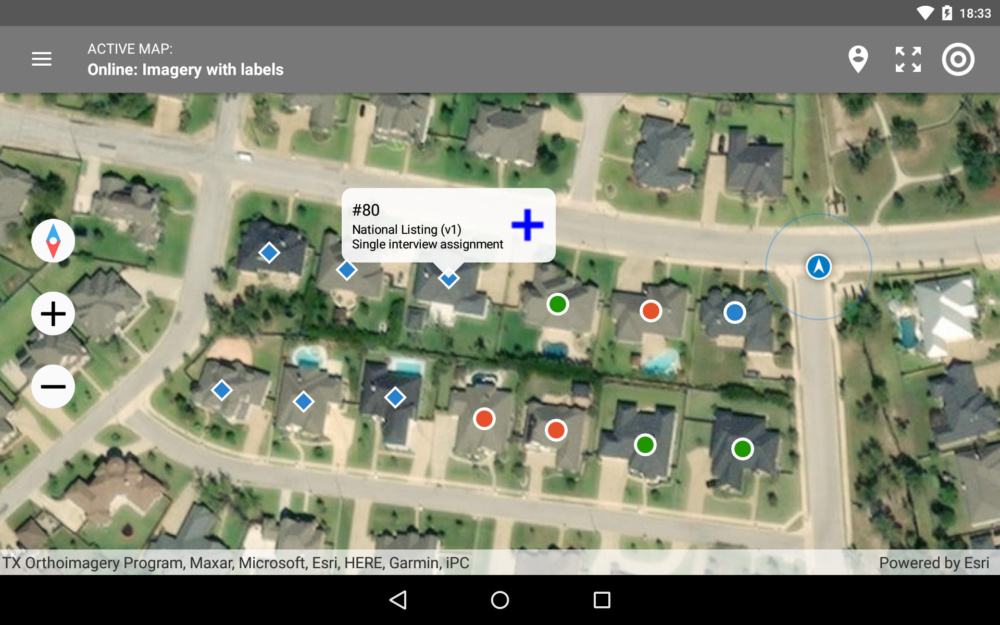
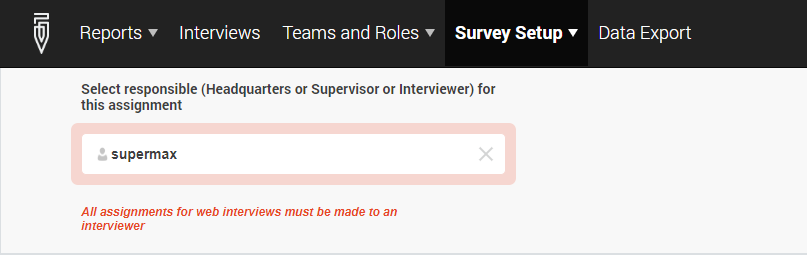
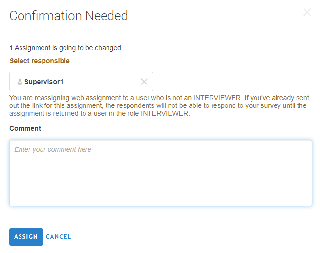
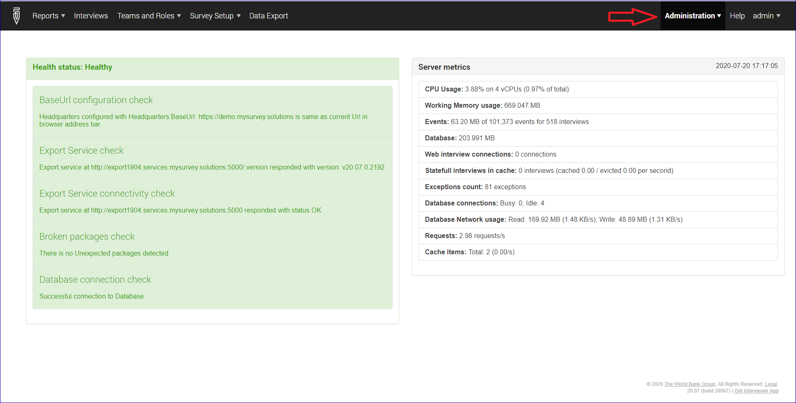

+++
title = "Version 20.07"
keywords = ["20.07"]
date = 2020-07-20T01:01:01Z
lastmod = 2020-07-20T01:01:01Z
+++

Release 20.07 of Survey Solutions adds the following new features:

- Map dashboard;
- Dedicated cover page;
- Reopen at last point;
- Do not allow web interviews to Supervisor;
- Server administration diagnostics;
- Other changes and improvements.

### Map dashboard

  

The map dashboard is placing markers corresponding to geo-coded assignments (diamonds) and interviews (circles) on the map (which could be an online map, or a pre-loaded offline map).
The interviewers have a possibility:

- to start, continue, edit or reopen interviews from the map interface if they find it more intuitive than from the original dashboard;
- evaluate the completeness of coverage for a certain block or area.
decide what is the closest next destination where an interview must take place.

Assignments and interviews can be shown separately or together, and the map dashboard can be restricted to one survey or all surveys.

The detail can be read in a separate article dedicated to the [map dashboard](/interviewer/app/map-dashboard/).

## Special section: cover page

It is expected that any real survey will have one or more questions that help (interviewers) locate the respondents and help (supervisors) to distinguish between different interviews.

A dedicated cover section is now always generated for every questionnaire created in Survey Solutions Designer. All questions placed to the cover page are automatically designated as identifying.

Absence of identifying questions (empty cover page) is a common questionnaire design mistake.

Read more about the role of the cover page in the following article:
[Special section: Cover Page](/questionnaire-designer/components/special-section-cover/)

## Interviews reopen at the same point were left

Interviews which were started, but not completed and are reopened for continuation will open at the last answered question. If the interviewer has been in one of the service sections: ‘cover’ or ‘complete’. This will simplify the work of the interviewers since they can continue the interviewer from where they left it.

## Improvements to web interviews
Web interviews may be started only when they are assigned to an interviewer. This rule has caused a lot of confusion among the users (as evidenced by the number questions that came to the forum and support regarding this issue).

The new version will give notable warnings to minimize the chances of interviews being assigned to a person other than an interviewer, for web interviews.

At creation of an assignment - the message is blocking, meaning that a web-assignment will not be created with initial responsible different from interviewer:

  

If subsequently the same assignment is being re-assigned a corresponding message is issued to the user performing the reassignment:

  

The operation may still be performed at the responsibility of the user performing the action.

## Server administration diagnostics

A new menu item has been added for the Survey Solutions server administrators: *menu → administration → diagnostics*, which brings a panel similar to shown here:

  

This page shows two kinds of information:

- left side shows diagnostics related to server configuration, whether the settings are set up correctly and the different components are able to talk to each other;
- right side shows various metrics of the server performance, such as the CPU load, memory usage, number of concurrent queries, or the database footprint.

Server administrators are requested to inspect the indications of this panel for common problems before bringing them up to the support.

## Other changes

- Cascading question can now be used in a cover section, (meaning it can function as identifying);
- Every questionnaire shall contain at least 1 section other than the cover section and at least one non-identifying question.
- Identifying question **must** have variable labels specified.
- One can no longer directly specify a question's scope as identifying - all identifying questions are designated as such when they are placed into the cover page section.
- Server administrator can now download the [server audit log](https://support.mysurvey.solutions/headquarters/svymanage/audit-log/) as a single file in CSV, TAB, or XLSX format.
- The API endpoint for creating the assingments now supports all the same question types as preloading throught the interface (file upload).
- The time-axis of the cumulative chart report used to show duplicate labels under some conditions - this has been fixed.
