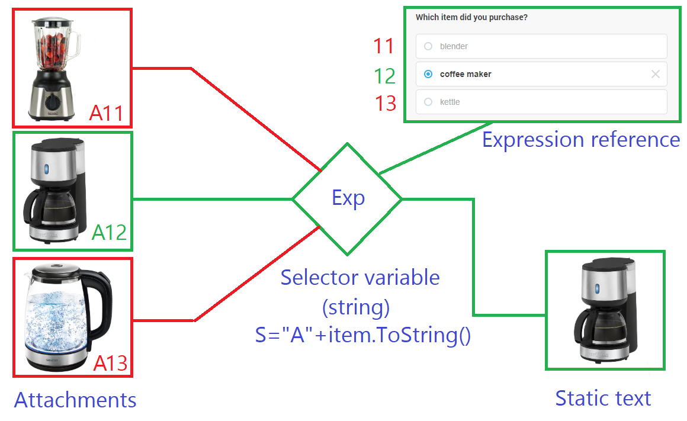
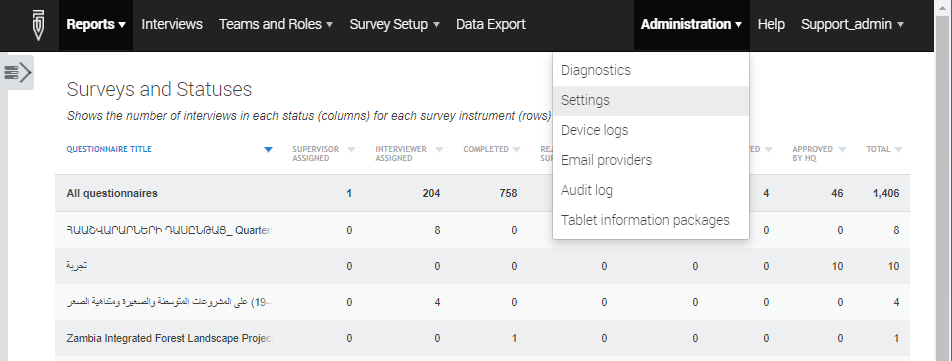

+++
title = "Version 20.08"
keywords = ["20.08"]
date = 2020-08-05T01:01:01Z
lastmod = 2020-08-05T01:01:01Z
+++


Release 20.08 of Survey Solutions adds the following new features:

- Flexible images;
- Integrated export service in installation;
- Date received on the tablet for assignments and interviews;
- Other changes.


### Flexible Images

Images included in static texts used to be only fixed. Now a single static text element can display different images depending on the situation in the interview.

<CENTER>
  
</CENTER>

To utilize flexible images we reference a selector variable (a string variable) rather than attachment name directly. This variable may utilize answers to any questions or other variables in the questionnaire in its expression. If the string variable evaluates to the name of an attachment, that attachment will be displayed in the static text, otherwise no image will be displayed. The expression may be rather simple, such as a selector between two alternatives:
```
(gender==1) ? "boy" : "girl"
```
or utilize elaborate logic and complex expressions, for example, referring to lookup tables. The single static text is now sufficient where a hundred of static text elements with conditions was necessary earlier to show one of the alternative images, such as common in e.g. price surveys.


## Integrated export service in installation.
Many users experienced problems configuring the Survey Solutions installation in a way that the main site can utilize the data export service and data export service can find back the main site. The previous release has already added a diagnostic health check facility to verify the correctness of settings (see [release notes for version 20.07](/release-notes/version-20-07/)). This has now been simplified so that the users don’t have to reconfigure the settings of the export service when it is installed on the same machine (most users' situation) streamlining the installation by the user.

## Received date.
Headquarters and supervisor users now see when (date) the interviewer has received a particular assignment or interview where they used to see just a binary attribute whether it has been already received by the tablet or not.

This change serves two purposes:

1. Helps understand whether it is reasonable to expect a response to this assignment already or not yet (for the management).
2. Helps prevent errors of reassigning interviews/assignments to a different interviewer.

The second is particularly important. Recall, that it is always dangerous to do a reassignment of something that an interviewer has already received on the tablet. This is because (s)he may have already started filling out that interview. But when it is absolutely unavoidable to make such a reassignment, reassigning the ones received last is safer, as there is less probability that the interviewer has already started working on it.

## Other changes
- Server administration items are moved from the administrator's account menu, to the special Administration menu and the account menu only to contain items related to account management.
<CENTER>
  <A href="images/administration_menu.png"></A>
</CENTER>

- Report on interviewers will now contain the full name, email, and phone number (if specified) as well as the last date/time (UTC) of login to the web interface is also registered. (The date of last synchronization of the tablet device was earlier available in the interviewer profiles).
- Web questionnaires will now have their questionnaire title also translatable (previously only available in the main language).
- Number of selections in limited multiselect questions is now displayed consistently below the selections in on tablets and on the web.
- The report on interviewers when exported in Excel or other format will have the accounts of interviewers sorted alphabetically (previously no sorting) and with proper formatting (thousands separators) of magnitudes where this is essential, such as size of a database or free storage space.
- Version 20.08 is to fix the compatibility issue [reported in the forum](https://forum.mysurvey.solutions/t/cant-connect-to-the-server/2851/6).
