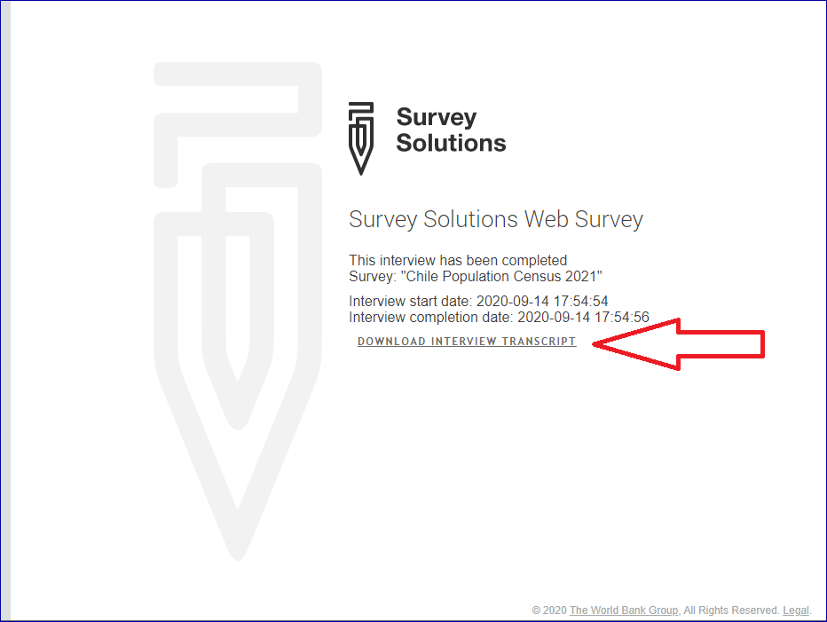
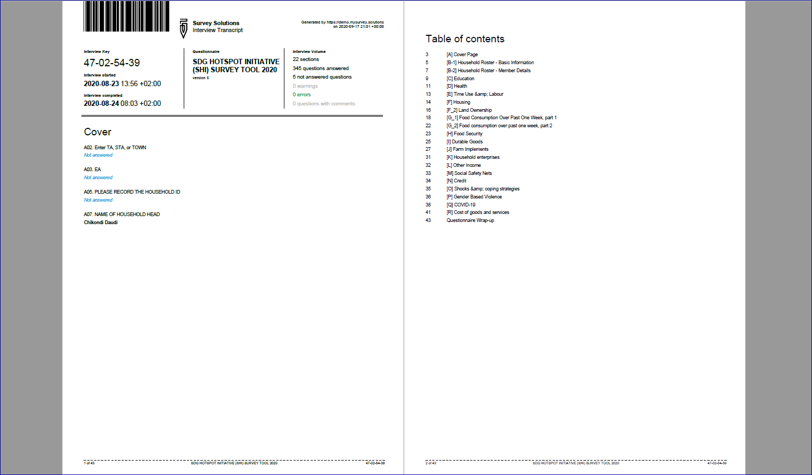
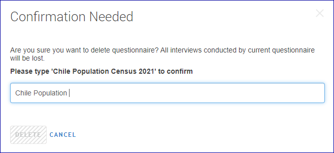

+++
title = "Version 20.09"
keywords = ["20.09"]
date = 2020-09-17T01:01:01Z
lastmod = 2022-08-23T01:01:01Z
+++

Release 20.09 of Survey Solutions adds the following new and modified features:

- Interview transcript.
- Shapefile can be overlaid onto the map dashboard.
- Changes to data export organization.
- Warning at deletion of a questionnaire from HQ.
- Other changes.

## Interview transcript: download of PDF of questionnaire with answers.

A transcript of the interview showing all questions, answers and timestamps when
the answer was given can be now produced for any interview. The transcript is
available:

- for the supervisors and headquarters users from the interview review page, and
- for the respondents at completion of the interview.

 

The transcript of an interview can be used to:

- present the content of the interview to a consumer outside of the Survey
Solutions system, such as for archival preservation;
- sending (through a different system) to the respondent as a confirmation of
the answers registered in the interview;
- download an interview as a PDF and review it offline in a situation where
supervisors don’t have reliable internet connection.

## Shapefile can be overlaid onto the map dashboard.
A new button has been added to the map dashboard. It allows overlaying a
shapefile on top of the basemap. A single shapefile may be placed on the tablet
in the following folder:

`\TheWorldBank\Shared\ShapeFileCache`

It is the same shapefile that is used in the map dashboard and in the geography
questions.

The shapefile may show the division of the country into administrative units
(districts, counties, etc) or statistical units (enumeration areas).

## Changes to data export organization
When exporting the data the HQ user now decides whether to include or exclude
the metadata into the export file (included by default). Metadata are
descriptives that do not change during the survey, such as questionnaire in
PDF, DDI, or JSON formats, etc. After the metadata is downloaded once, there
is no need to download it again, but exclude it to make the downloads smaller
and faster. Before shutting down the server when the data is downloaded for the
final time, include the metadata into the download. This is especially important
if the software was updated in the meanwhile to make sure the paradata
corresponds exactly to the final export of data.

The organization of the metadata in the Survey Solutions export file is
described in the following article: [Organization of meta-data storage in the
exported data](/headquarters/export/metadata-organization/)

Paradata export files have the following changes: variable `timestamp_utc` shows
the event timestamp in the UTC using the following format: `YYYY-MM-DDThh:mmZ`,
and variable `tz_offset` contains the difference in hours between the time zone
of the event origin and the UTC. For example, if the timestamp in paradata is
recorded as `2020-09-19T16:45Z` with time zone offset `+3:00` then the clock was
showing `19:45` of the same date at the location where the event originated.

To prevent confusion, older variables `timestamp` and `offset` are no longer
exported. If you have a script or other automated procedure to process paradata,
please, adjust accordingly.

## Warning at deletion of a questionnaire from HQ
To protect the users from accidental deletion of survey data, Survey Solutions
now requires the admin user to retype the title of the questionnaire before it
is deleted. Additional warning will indicate if there are any received
assignments or rejected interviews on the tablets on which there may be
unsynchronized changes, which will also be lost if the questionnaire is deleted.

## Other changes

- **Supervisors can approve rejected interviews**: Supervisors that have
accidentally rejected interviews instead of approving them will now have an
opportunity to approve them in the rejected state, in which case it is passed
to the HQ-users. Previously this required cooperation of the interviewer to
complete the interview first. Yet the supervisor must be aware that if a
rejected interview has been already picked up by the interviewer on a tablet,
then such a recall may create, potentially, an orphaned interview (interview
from that tablet will not be accepted by the server after the recall.)

- **Number of not answered questions**: The list of the interviews at the
supervisors/headquarters users interface now contains an additional column
showing the number of enabled, but not answered questions (by interviewer,
supervisor, or identifying questions). This column is given a title
*"Not answered"*. Additionally the same statistic is added at export to the
system-generated `interview__diagnostics` file, in the `n_questions_unanswered`
variable.

- **Indicator for conditionally shown questions**: An orange donut symbol is
now shown in the questionnaire designer for elements which are shown
conditionally and for which the flag *hide if disabled* is activated, otherwise
the traditional orange dot marker is shown.

- **No more export service folder**: The folder named `Export service` is no
longer created by the installer during the Survey Solutions installation or
update.

- **Bugfix** to an issue with the keyboard getting in the way while working with
the Interviewer app [reported in the forum](https://forum.mysurvey.solutions/t/options-hidden-behind-the-keyboard/2871).

--------
  

***Earlier version of this page incorrectly specified variable names
`timestamp_utc` and `tz_offset` as `timestamp__utc` and `tz__offset`.
This has been rectified. Note, the correct spelling of these variable
names includes only single underscore character, not two.***

  
--------
