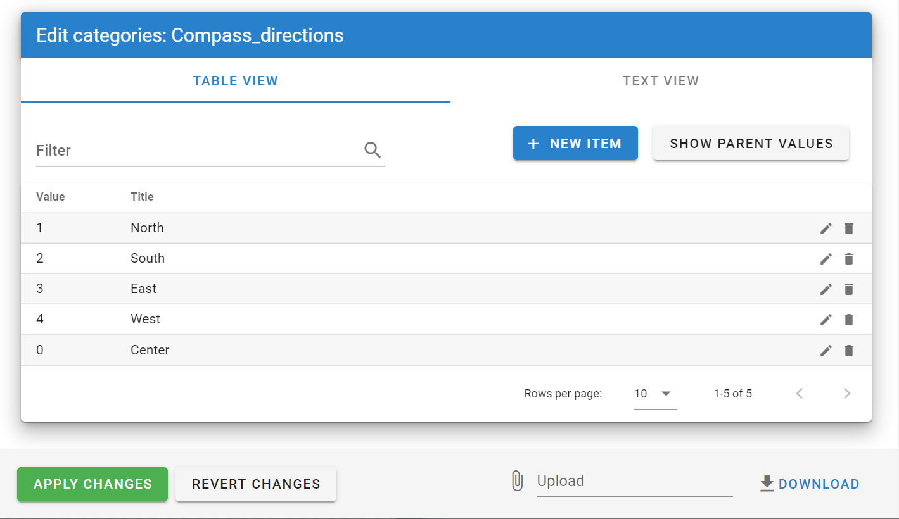
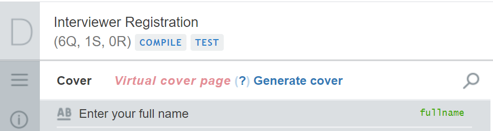
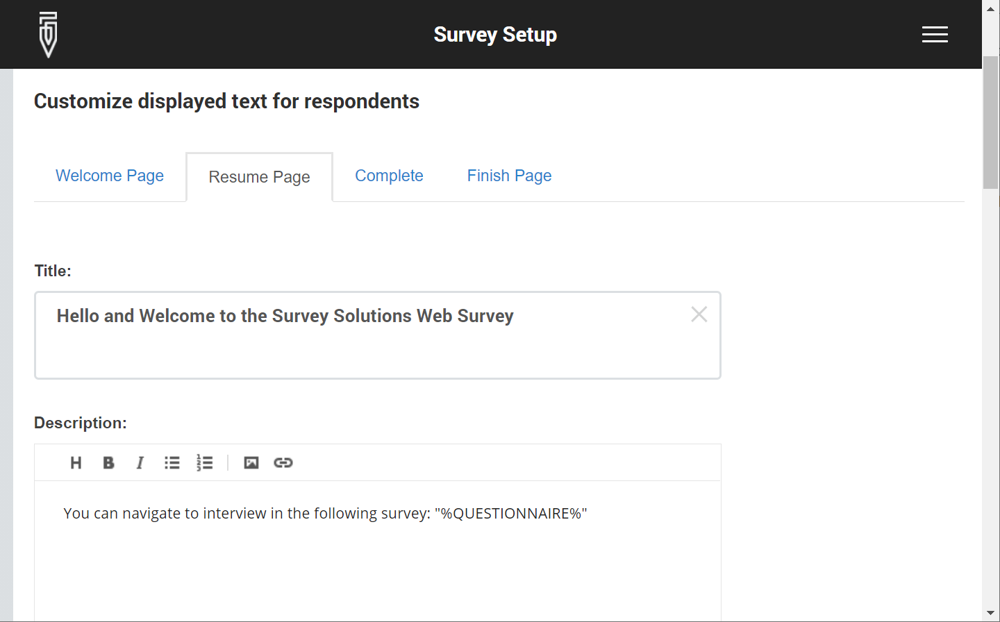

+++
title = "Version 20.10"
keywords = ["20.10"]
date = 2020-11-07T01:01:01Z
lastmod = 2020-11-07T01:01:01Z
+++

New features in Survey Solutions version 20.10.

1. Editor of reusable categories in Designer.
2. Generation of cover page.
3. Linked combobox single-select question.
4. Formatting for web-interviewing pages.
5. Approve rejected interviews at HQ.
6. Interview resume event indicates where the interview was resumed.
7. Send email confirmation with answers to web-interview respondents.
8. Public API now allows protection of questions.
9. Improved speed for survey deletion and assignments upgrade.
10. Updated Spanish translations.
11. Fixed geography question to work on Android 10.0.

### Editor of reusable categories in Designer

Reusable categories editor allows defining new and editing existing reusable
categories in the interface of the Designer tool, without first defining an
external file, which was the case earlier.

### Generation of cover page

Questionnaires designed in the Designer tool before July 20, 2020 are editable
in the compatibility mode that retains identifying questions in their positions
and presenting a 'Virtual Cover Page' aggregating all identifying questions into
a single read-only section.

To take advantage of the new capabilities of the real cover page section, the
actual cover page section needs to be generated, which the questionnaire author
can do by clicking the corresponding link:

This is an irreversible process. Only update the questionnaire if you know it
will not be used with Survey Solutions Headquarters earlier than v20.07.

### Linked combobox single-select questions

A new flavor of the single select question has been added: linked combobox.

This question is useful if one needs to select from a list of the values
specific to the interview (either preloaded in advance or collected in
the same interview).

### Text formatting for web-interviewing pages

Web-interviews involve a number of pages on the server: welcome page,
resume page, and finish page, where the survey coordinator may provide
custom text. The new feature permits markdown formatting to be used for
text decoration in these pages.

Notably, besides text decoration, users can now insert images into the
content of these pages.

### Approve rejected interviews

Earlier versions required an interviewer action if the supervisor has changed
his/her mind and now wants to approve the interview already rejected (
completion action by the interviewer).

New version allows the supervisor to approve such rejected interviews without
awaiting for the interviewer action. Note however, that this action should be
taken with caution. If the interviewer has already received the rejected
interview on the tablet, any changes to that interview will be lost, if the
interview is subsequently approved by the supervisor before the changed
completed interview is received on the server. (technically the interview will
be stored in the 'broken packages').

### Interview resume event indicates where the interview was resumed
This is important for mixed-mode surveys, which involve work on interview on
tablets and using web.

Paradata files exported from this version onwards will contain a mode
specification for each 'Resumed' event. The value can be either of the
following specific and non-localizable strings:

- Web
- Tablet
- Unknown

Where the value *"Tablet"* denotes the session was resumed on a tablet, value
*"Web"* denotes the session was resumed on the server via a web-connection
(either by a Web-interviewer or by a respondent to a web interview). The value
*"Unknown"* is utilized for compatibility and is present for events recorded
before the upgrade to this new version.

### Send email confirmation with answers to web-interview respondents

Participants in web surveys may now receive a confirmation email from the survey
organizers - two new checkboxes are added to the configuration of web interviews:
"Send email after web interview completion" and "Attach PDF transcript."

This is useful if it is important for the respondents to retain a transcript of
their answers to the survey.

### Public API now allows protection of questions

Property "ProtectedVariables" has been added to the API query generating new
assignments on the server, which may contain an array of variable names to be
protected.

Protection of answers is not the same as 'read-only'. Read more [here](/headquarters/preloading/protecting-pre-loaded-answers/).

### Improved speed for survey deletion and assignments upgrade.

Several clients collecting surveys with more than 1mln interviews have
experienced that some operations take abnormally large time. The procedures for
deleting the survey and upgrading assignments have been performance-optimized
and as a result the new version performs these operations much faster.

### Updated translations to Spanish

Translation of Survey Solutions to Spanish has been updated, thanks to Vladimir Aguiñada, who has
contributed the updated Spanish text.

### Fixed geography type question to work on Android 10.0

The code responsible for the geography type questions was not working correctly
on tablets with Android version 10.0. This incompatibility has been fixed now.
