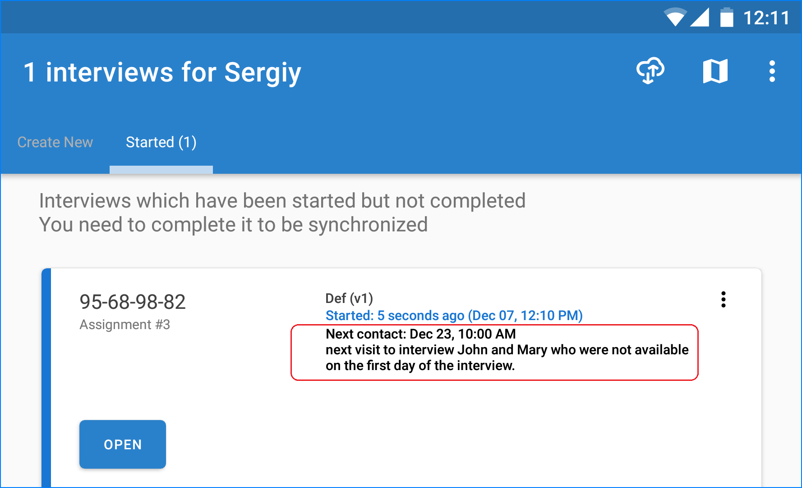
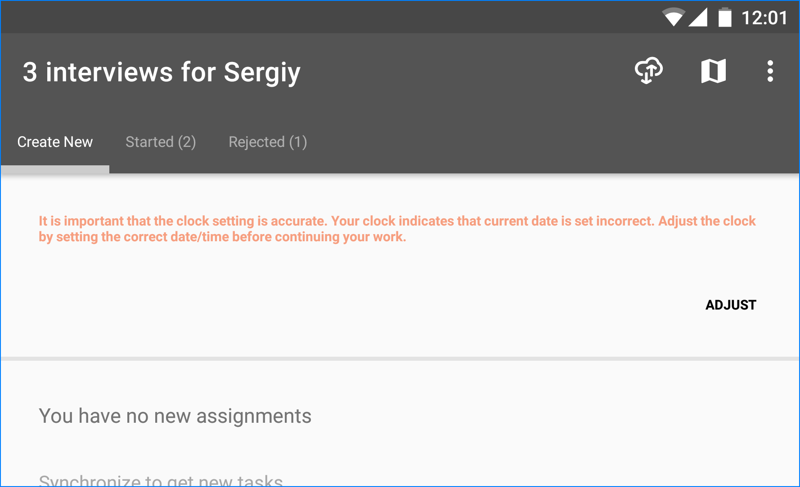

+++
title = "Version 20.12"
keywords = ["20.12"]
date = 2020-12-14T01:01:01Z
lastmod = 2020-12-14T01:01:01Z
+++

New features in Survey Solutions version 20.12.

1. Calendar events.
2. Alert interviewers of wrong clock settings.
3. Variables on dashboard.
4. Filter by status in survey statistics report.

### Calendar events

Calendar events is a new feature of Survey Solutions, which allows the
interviewer to assign a calendar event to a certain assignment or an
interview. This is useful if the interview can't be completed on the
spot and requires scheduling for another visit.

The calendar event consists of a date, time and an optional message.

The entered information will be shown on the interview/assignment card after
the '*next contact*' prompt:

The event marker is automatically shown in red color if it is in the past.
The interviewer may adjust the calendar event's properties (date, time,
  comment) or delete it.

During the synchronization the information on the calendar events is also
sent to the server. If the interviewer logs in to the web interface, he/she
will find the left reminders attached to assignments there.

The headquarters/supervisors will be able to find the information about the
calendar events in the grids showing the lists of assignments and interviews,
as well as in the detailed view of the assignment properties.

The same information is available through API queries to help automated
systems that may reflect this information in the form of calendars or
schedules.

Alert interviewers of wrong clock settings

Complete discharge of a tablet may lead to reset of the built-in clock to
some default value, such as the date of manufacturing of the tablet, or
date of the compilation of the Android OS, or another constant, for
example *January 01, 2011*. If the interviewer continues operation with a
wrong clock setting, this will corrupt timestamps of answers and make
paradata unusable.

Most tablets/phones would automatically adjust the clock settings when
connecting to mobile or Wi-Fi networks. Yet, if the device is working
disconnected there is usually no opportunity for such automatic clock
correction.

The new version will automatically notify the interviewer if it detects the
clock setting is obviously wrong indicating time earlier than known actual
time. The message serves as a warning, but it is recommended that the
interviewers immediately check their clock and time zone settings.

### Variables on dashboard

Values of variables calculated in the interview will now appear at the
dashboard (or card view for tablet-based interviewer) if they are placed
into the cover section by the questionnaire designer.

Variable label (must be specified for all elements of a cover section) is
used as an explanatory text.

For example, this feature is useful if we want to automatically determine
and show the name of the household head or his/her contact phone number
at the dashboard.

Note that the variables are calculated for interviews only (not calculated for
any assignments).

### Filter by status in survey statistics report.

Survey statistics report is useful for quick diagnostics and checks during
the survey collection, yet these reports may be contaminated by information
from interviews that are not completed, or completed, but not approved yet.

The new filter allows to concentrate the report, for example, only on the
interviews approved by the supervisor.
