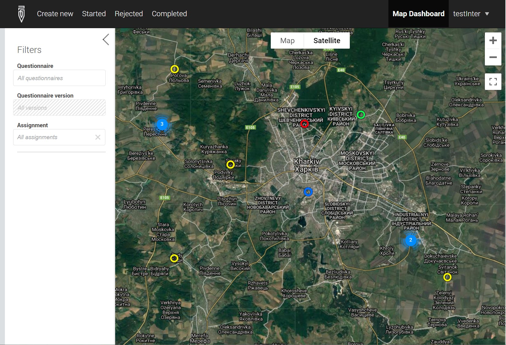
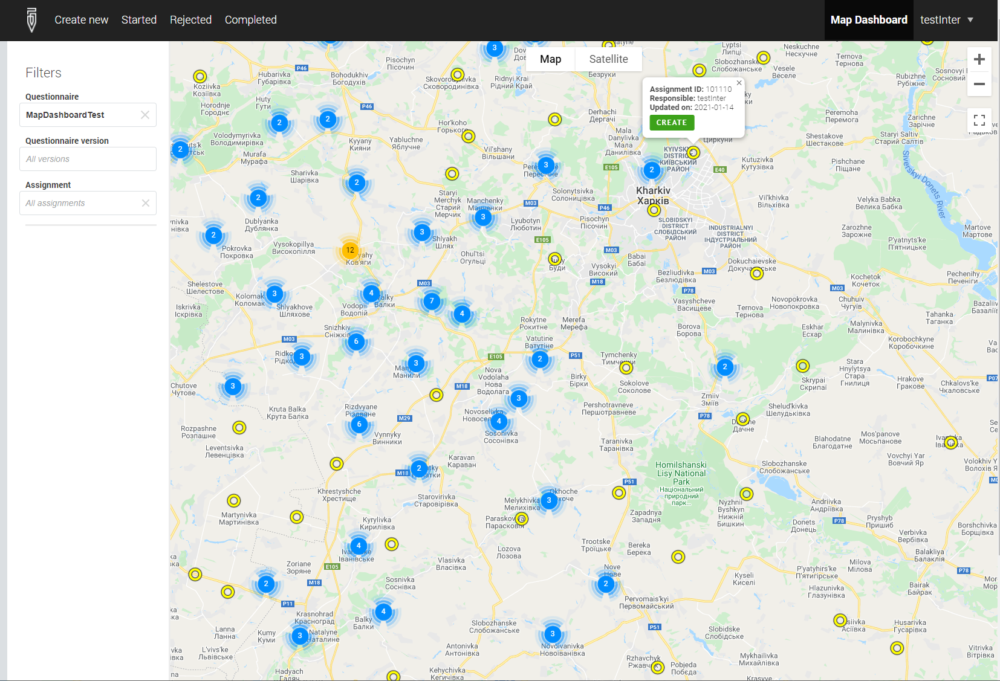

+++
title = "Version 21.01"
keywords = ["21.01"]
date = 2021-01-22T02:02:02Z
lastmod = 2021-01-22T02:02:02Z
+++

The new version 21.01 brings the following new features:

1. Isolation of work into workspaces;
2. Server-wide users management page;
3. Map dashboard for online users;
4. Other changes.

### Isolation of work into workspaces

This feature is the response of the Survey Solutions developers team to
frequent requests of the users to separate different data collection
operations to limit access to data for the users that manage the surveys.
This is common for organizations that conduct multiple operations, often
in several locations or countries, cooperate with different partners and/or
have to outsource work to different subcontractors.

Recall that the HQ-users have access to all the data that is collected as
part of any survey that is being conducted on the server. This gives any
HQ-user to intervene in any survey by making new assignments, or making
approval/rejection decisions, and importantly, exporting/downloading the
data. Until now the only way of making the isolation was to instantiate
multiple Survey Solutions data servers, which was costly and required
multiple administrator accounts to coordinate the work of multiple servers.

Over the last year we have had extensive discussions with users setting
up their servers and facing the above problem. As a result, we are
introducing a new concept of a workspace into the Survey Solutions, which,
we hope, will help in this regard.

Workspaces allow partitioning of a single server into multiple compartments
that have limited impact on each other.

The following are the rules guiding the use and functioning of the workspaces:
1. An administrator has access to all workspaces.
1. A user with an HQ and observer accounts may belong to one, some, or all
workspaces, as designated by the administrator.
1. Each interviewer and supervisor account may log in to a single workspace.
1. User names are unique across all workspaces.
1. Questionnaires are imported into workspaces. Same questionnaire may be
imported into different workspaces if necessary and their version numbering
is independent.
1. Workspaces may be created, disabled, and deleted.
1. Disabling a workspace locks all activity in the workspace (stops web
  interviews, does not allow any user to log in). Users attempting to access
  a disabled workspace will receive a *"Workspace Disabled"* error page and
  must contact their survey coordinator for further instructions.
1. A workspace may be deleted only if it doesn’t have any surveys/questionnaires.
1. Deleting a workspace actually deletes (not archives) all the user accounts
(interviewer/ supervisor) and all the maps that were part of that workspace.
1. Deletion of a workspace is irreversible.
1. Administrator configures each workspace settings separately (logo, global
  message, export password, email providers, etc).
1. The troubleshooting tools available for administrator
  (audit log, device logs, tablet information packages, etc) are separated by
  workspaces.
1. Users having access to multiple workspaces may switch between them using a
  workspace selector without the need to log in to each workspace separately.
1. Reports are built based on the content of a single workspace.
1. A special workspace named *'primary'* is always defined and can not be
  disabled or deleted. Any server updated from earlier Survey Solutions
  versions will place all the earlier entered data (including survey data,
  user accounts, maps, etc) into the primary workspace.
1. An observer may observe only in the workspaces in which he is permitted by
  the administrator, even if impersonating users that have access to other
  workspaces.

Each workspace is assigned an identifier and a text label. The text label is
shown to the users when they switch between the workspaces, while the
identifier is used for forming the URLs in API calls.

To manage workspaces, the menu item `server administration` (available for
administrators only) now leads to the list of the workspaces defined on the
server. The settings and troubleshooting tools collected in the context
menu were previously relevant for the whole server, but now are attributable
to a particular workspace. For each enabled workspace the following actions
are provided in the workspace context menu:

- Edit,
- Settings,
- Email providers,
- Device logs,
- Audit log,
- Tablet information packages,
- Disable*
- Delete*

*) The actions to disable and delete a workspace do not apply to the primary
workspace.

Disabled workspaces may only be turned back on or deleted, so their context
menu is smaller:
- Enable
- Delete

The workspaces is a major change to the earlier established hierarchies and rules, and we continue to build functionality around this new concept. We have attempted to make as smooth as possible transition for our existing users, and hope you will make good use of this new capability.

### Server-wide users management page for administrator

Since the account names are unique on the server, the admin needs a
consolidated view of all user accounts, regardless in which workspace
they are defined. This is implemented in the `Users Management` menu
of the server administration view. For each user account defined in
the server the following information is listed:
- account name (login)
- role
- workspace(s)
- full name
- email
- phone number

A padlock icon located next to the user account indicates that this account has
been locked (e.g. an interviewer account locked by his supervisor).

The filters in the left side of the page allow to concentrate only on users
with particular attributes: locked, archived, ones without assigned workspaces,
or being placed in disabled workspaces.

In this list the administrator may access the profile of every individual user
(except archived ones) to correct the contact information, reset the password
or grant access to workspaces for HQ-users, observers, and API accounts.

### Map dashboard for online users.

The new map dashboard feature introduced in Survey Solutions v21.01 is a tool
for a graphical presentation of the worklist on a map and provides functionality
similar to the tablet map dashboard added in v20.07 to the Interviewer App.

It is accessible to interviewers through the menu item `Map Dashboard` and for
managers (supervisors/HQ-users/Admins) via a map icon at the pages showing
assignments or interviews.

  

The map dashboard is not to be confused with the earlier available map report.
Here are some important differences:

<TABLE  class="table table-striped table-hover">
  <TR>
    <TH bgcolor="orange">
Map report
</TH>
    <TH bgcolor="orange">
Map dashboard
</TH>
  </TR>
  <TR>
    <TD>Shows interviews only</TD>
    <TD>Shows interviews and assignments</TD>
  </TR>
  <TR>
    <TD>Available for HQ/admin/supervisor</TD>
    <TD>Available for HQ/admin/supervisor and interviewers</TD>
  </TR>
  <TR>
    <TD>Does not allow to start new interviews from the map view.</TD>
    <TD>Allows to start new interviews from the map view.</TD>
  </TR>
  <TR>
    <TD>Does not allow survey managers (supervisors, HQ) to approve or reject interviews.</TD>
    <TD>Allows survey managers (supervisors, HQ) to approve or reject interviews.</TD>
  </TR>
  <TR>
    <TD>Uses a simple marker, same for interviews in any status.</TD>
    <TD>Reflects the different statuses of interviews with different markers.</TD>
  </TR>
  <TR>
    <TD>Reflects interviews in one survey only</TD>
    <TD>Reflects interviews in all surveys or in a single survey/version.</TD>
  <TR>
    <TD>Allows selection of any GPS location question</TD>
    <TD>Uses only the first GPS location question (from the cover page)</TD>
  </TR>
  <TR>
    <TD>Does not allow filtering by assignment number</TD>
    <TD>Allows filtering by assignment number</TD>
  </TR>
    <TD>Allows anonymization with a heatmap</TD>
    <TD>Does not allow anonymization with a heatmap.</TD>
  </TR>
</TABLE>

  

 

Similar to the map report, the map dashboard will reflect multiple points
located closely together as a cluster, reflecting the number of such points
on the cluster. To see individual points, zoom in to the cluster to see
individual points.

### Other changes

- a Czech translation has been included for the Interviewer App; users whose
  tablets are set up with preference for the Czech interface will find the
  Survey Solutions Interviewer App in the Czech language immediately after
  the update. Other users may switch the language in the language settings
  of the OS Android.
- Users of graphql API interface are notified of the changes to the graphql
  schema and the location of the graphql schema. Please, refresh your
  graphql schema from  https://demo.mysurvey.solutions/graphql?sdl
  (or the equivalent page at your server).
