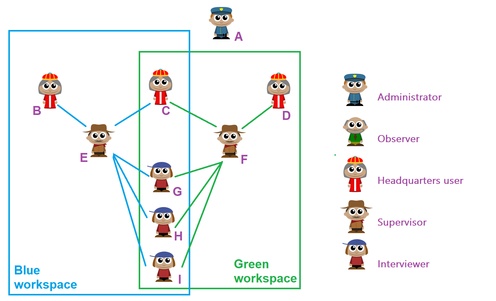
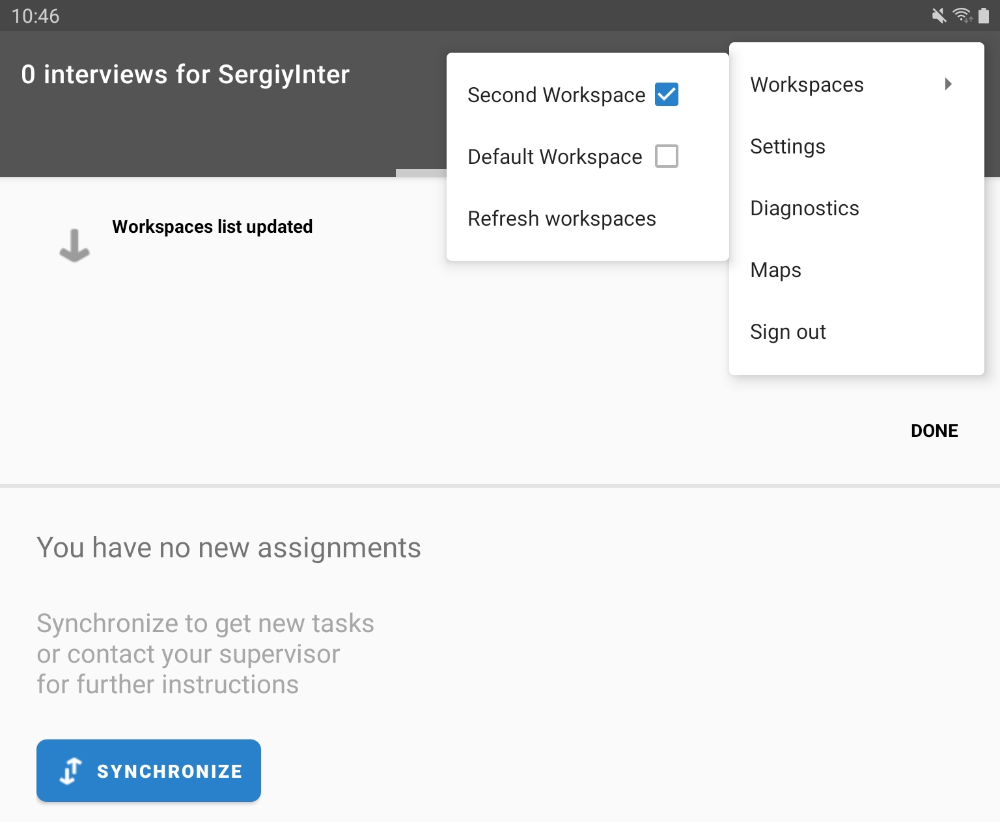
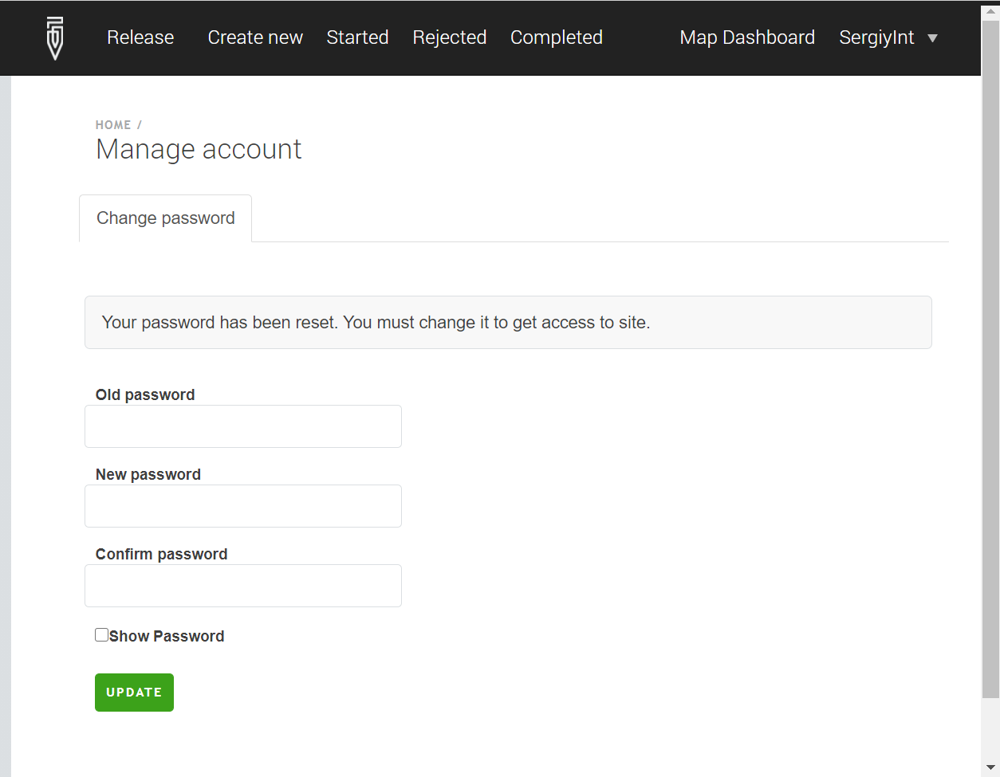
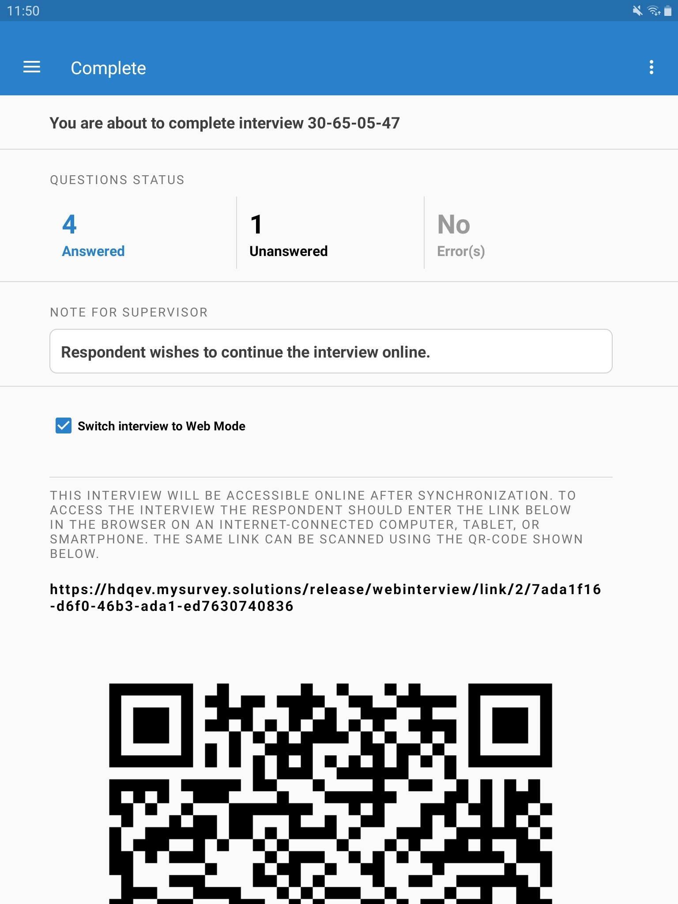

+++
title = "Version 21.05"
keywords = ["21.05"]
date = 2021-05-11T00:00:00Z
lastmod = 2021-05-11T00:00:00Z
+++

The new version 21.05 brings the following new features:

1. User management across workspaces;
1. Multiple workspaces on the tablets;
1. Own-passwords enforcement;
1. CAPI/CAWI Switch
1. Dynamic filters
1. Exposed variables
1. Progress indicator
1. Other changes

Before we jump to the discussion of the newly added features, an important
note for users upgrading from earlier versions:


 
After the server is updated to v21.05:
  

- If there are any teams (interviewers and supervisors) working offline (synchronizing via the Supervisor App), **and**
- the Supervisor App is subsequently updated to the version 21.05

then the Interviewer Apps will stop finding the offline supervisor for synchronization and must be updated to the new version manually by installing a new version of the interviewer from the updated server over the existing Interviewer App.

Do not uninstall the Interviewer App or you will lose all the unsynchronized data on the interviewer tablet.
{}

### User management across workspaces

An interviewer and supervisor may now be members of several workspaces! An interviewer may report to different supervisors in different workspaces!

  

This has never been possible before in Survey Solutions, but based on popular requests this is now possible! For example, the interviewer H in the above chart may be reporting to supervisor E in the green workspace, but to supervisor F in the blue workspace. The supervisor in the green workspace, of course, may only see the interviews conducted by the interviewer in his (green) workspace, and not in the other workspaces (even if he is part of those workspaces). Within each workspace each interviewer still has one supervisor controlling him/her.

Since the interviewer is now part of several workspaces, no workspace staff may fully block them. This means for example, that the interviewer account may no longer be locked (or unlocked) by the supervisor. Instead, the management of the accounts is a privilege of the administrator.

For transitioning from earlier versions, any users with locks imposed on them will remain locked, but unlocking must now be performed by the administrator.

When a workspace is deleted, the accounts that were only members of that workspace are left without any workspace, until the admin places them into some other workspace. Users that are not assigned to any active workspace can’t log in to the server or perform synchronization from tablets.

### Multiple workspaces on the tablets.

Following the above changes, an interviewer may be part of several workspaces (on the same server). This interviewer when working on the tablet will be able to contribute to multiple surveys and also report to different supervisors (each interviewer reports to only one supervisor in each workspace).

On the tablet a new switch has been added to the main menu to facilitate the switch between the workspaces:

  

The menu shows the list of the workspaces to which the interviewer has access. The currently active workspace is checked. The list can be actualized with the `Refresh workspaces` menu item. This is needed when the interviewer is added to a workspace after the initialization of the account on the tablet.

The synchronization in each of the workspaces is performed independently: when the interviewer synchronizes in workspace 1, this does not send out or receive any of the assignments/interviews in workspace 2. Same applies to maps, the maps within each workspace are synchronized independently.

The dashboard (the regular card view and the map view) only shows the interviews/assignments of the currently active workspace.

### Own-passwords enforcement

This version of Survey Solutions contains an important security improvement. In the earlier versions the passwords assigned to accounts by superior users were known to them. For example, when an HQ-user created an account for an interviewer, the account password was known to more than one person - the interviewer for whom the account was created and the HQ user who created it. This created situations of impasse where the interviewers needed to be accountable for the actions undertaken under their accounts as they had no way of resetting their own credentials.

In this new version any user, whose account’s password was assigned by a different user will need to change it before proceeding to work under this account. Until the password is changed, no other actions can be undertaken under such an account.

The same procedure has to be undertaken when the account password is reset later on, when the user reports she has forgotten the password and can no longer access her account.

The new password selected by the enumerator must comply with the same security requirements as for the users that may change their own passwords on the server (such as HQ- or admin-users).

For interviewers the password may be changed using the tablet or by directly logging in to the server.

The feature allows the user to change password for own account only when the communicated password is valid. If the interviewer’s password was changed at the HQ and the new password for the account was not communicated to the interviewer, she will not be able to reset own password on her own without the cooperation of superior users.

  

This feature is not optional. It may not be switched off or disabled. Yet as a transitory measure the passwords assigned before the update to this version will be considered as entered by the respective users and not requiring to be changed. After the update they can log in with the passwords that were communicated to them earlier by their superior users. Yet after the update, if they ever need to reset a password, they will have to select own password after the reset password is communicated to them following the new rules.

Note, the need to reset the password applies also to the administrator user, as the installation of the server and creation of the admin account may have been done by another person who doesn’t play a role in the Survey Solutions system. Correspondingly, the administrator user must select and enter a new password before proceeding to create other user accounts and manage the data server.

API accounts do not represent person-specific accounts. Thus the API users neither need nor have technical means to change own passwords.

### CAPI/CAWI Switch

The interviews can be switched between CAPI and CAWI modes regardless whether they originated from regular or web assignments.

Supervisory staff (supervisor, headquarters, or admin users) can see the current status (CAPI or CAWI) of each interview in the `Interview mode` column of the interviews list. The context menu provides the `Switch to…` item to switch to the mode opposite the current (if the current mode is CAPI then ‘Switch to CAWI’ and the other way around).

The switch can also be done by the interviewers on the tablets: if the interviewer encounters a respondent that wishes to finish the interview via the internet himself/herself, then the interviewer shall complete the interview with a mark that the interview is to be switched to the CAWI mode on the completion screen (`Switch interview to Web Mode`). When the interview is so marked, it will show a QR-code with the link that should be issued to the respondent. The respondent may either read the QR-code with a smartphone, or copy the accompanying textual link for use on a computer.

  

Interviews completed in such a manner will not appear on the `Completed` page, but instead will appear on the new `Web interviews` page until the next synchronization. Cards corresponding to interviews switched to CAWI mode will contain an additional button `Show QR code` to display the QR-code/link to be shared with the respondent to that interview. After a successful synchronization the cards will disappear from the `Web interviews` page.

Note, that if the switch has been done on the tablet, the respondent will be able to continue the interview online after that tablet is synchronized with the server.

For the interviewers to be able to switch the interviews from CAPI to CAWI mode, the survey must have the web mode activated and the checkbox `Allow Interviewer to switch to CAWI mode` must be checked.

### Dynamic filters
Dynamic filters is a new feature, which allows to filter interviews on interviews page and in the map report. Dynamic filters are based on a logical expression and may utilize identifying questions and exposed variables. Dynamic filters are described in [this article](/headquarters/interviews/interviews-filters).

### Exposed variables
Exposed variables is a new feature in Survey Solutions Headquarters that allows using of questions and variables from interviews in dynamic filters. Exposed variables are described in [this article](/headquarters/svymanage/exposed-variables).

### Progress indicator
We have introduced an [interview progress indicator](/interviewer/app/progress-indicator) shows the progress of the interview as a percentage of answered questions in all questions.

### Other changes and fixes

- Reminders were sent to web respondents if they failed to respond to a CAWI survey even after the survey was closed (web-mode disabled). This has been fixed.
- [Command line parameters](/headquarters/config/installer-command-line/) for the Survey Solutions server installer have been introduced.
