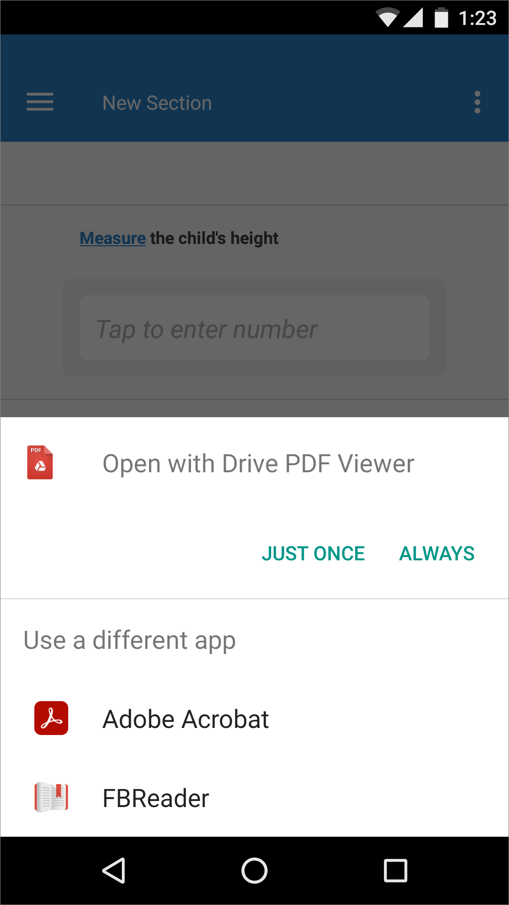

+++
title = "Version 21.06"
keywords = ["21.06"]
date = 2021-06-28T00:00:00Z
lastmod = 2021-06-28T00:00:00Z
+++

This sprint was dedicated to making Survey Solutions more stable, robust and
secure. We have introduced numerous patches addressing security concerns.

We appreciate the advice and helpful suggestions that we have received from
the UN International Computing Centre (UNICC), National Institute of Statistics
(INSSE) Romania,
[Ministry of Livestock, Agriculture and Fisheries](https://www.gub.uy/ministerio-ganaderia-agricultura-pesca/)
and
[National Center for Computer Security Incident Response](https://www.gub.uy/centro-nacional-respuesta-incidentes-seguridad-informatica/) of Uruguay, and The World Bank security team.

The changes introduced in v21.06 are listed below.


1. Configurable session length
1. Autolock: protection against brute-force attacks
1. Control cookies security attribute
1. Other changes and bugfixes

### Configurable session length

The server administrator may configure a timeout for the duration of the
session. In case the device is left unattended and no new queries are
submitted from it to the server, the user will be automatically logged out
after a predefined interval.

```
[Authentication]
TicketExpirationTimeOut=00:10:00
```

The session is automatically extended after each query, so that the users
steadily working online will not be affected.

Inactive session length was already limited for web-respondents in the
earlier versions, and this limit continues to apply, see
[limits](/questionnaire-designer/limits/survey-solutions-limits/).


### Autolock: protection against brute-force attacks

Survey Solutions defends against brute-force attacks by presenting a
[CAPTCHA](/headquarters/accounts/captcha/) challenge after a number of
incorrect login attempts. The administrator can configure the server
component in such a way that if the incorrect login attempts continue even
with a CAPTCHA engaged, the user account becomes locked for a period of
time automatically.

This feature is described in more details in the
[autolock article](/headquarters/accounts/autolock/).


### Control cookies security attribute

New policy control for cookies in the `appsettings.production.ini` file.
Set this parameter to true if the server is behind a load balancer
(reverse proxy) with SSL termination.

```
[Policies]
CookiesSecurePolicyAlways=true
```


### Other changes and bugfixes

* Update to Survey Solutions v21.05 from an earlier version may have caused
  a blank dashboard in the Interviewer App on tablets (data stored, not shown),
  which required a separate synchronization and workspace selection. This has
  been fixed. We would like to thank Mr. *Ashwini Kalantri* for promptly
  [reporting this issue](https://forum.mysurvey.solutions/t/interviewers-not-able-to-synchronise-after-the-update-to-21-05/3593)
  in the users' forum.

* Tracking of assignments upgrades: in the assignment history of actions,
  if the assignment was upgraded from the earlier version of the questionnaire,
  a message will be present "*Upgraded from assignment ####*". Similarly in the
  data export, for the "*Created*" event the original assignment number will
  be exported in the *old__value* column.

* WebTester was reporting incorrect duration of audio recording
 (1 second regardless of the actual duration of the audio recording).
 This has been fixed. The issue applied to the WebTester only, not to
 the actual interviews.

* Survey Solutions HQ component failed to automatically verify the
  availability of the updates. This has been fixed. The updates to the
  server are now automatically verified, but not automatically installed.
  The server administrator(s) need to install them as needed.

* API users may assign workspaces to users (earlier only administrator-level
  users could assign workspaces to users). Still, the workspaces which can be
  assigned to user account are limited by the visibility of workspaces granted
  by the administrator users to the API account.

* Vulnerability allowing HQ-users to submit GraphQL queries beyond the
  assigned workspaces is now fixed.

* Survey Solutions failed to export datasets which involved calculated
  variables, which caused overflow during calculation. This has been fixed
  and the data will be exported, but the calculated variable will contain
  a zero value. The message by Mr. *Thorsten Schoel* in the user's forum
  [reporting this issue](https://forum.mysurvey.solutions/t/export-fails-with-extremely-large-number-in-double-typed-calculated-variable/3591)
  is much appreciated.

* Shapefile was not detected on the tablets if placed in the folder without
  workspace subfolders. This has been fixed. If there is no shapefile in the
  workspace-named subfolders, a shapefile in the parent folder will be
  suggested restoring the behavior established before the introduction of
  multiple workspaces for a single interviewer. The [issue report](https://forum.mysurvey.solutions/t/shapefile-overlay-not-working-in-new-version-21-05-1/3585) in the users' forum by Mr. *Klaus Blass* is much appreciated.

* Interviewer App crashed after answering a categorical question under some
  conditions. This has been fixed.

* Interviewer App crashed if the _*.mmpk_ digital map file didn’t contain any
  base layer. This has been fixed: the interviewer app will not crash, but
  such maps are still deemed unusable. The
  [issue report](https://forum.mysurvey.solutions/t/error-map-system-argumentoutofrangeexception-index-was-out-of-range-must-be-non-negative-and/3516) in the users' forum and example files sent by Mr. *Felipe Jimenez* are much
  appreciated.

* Updated versions of 3rd party libraries used internally by Survey Solutions.

* Removed built-in PDF viewer for the Interviewer App on the tablet.
  Interviewers should select one of the 3rd party PDF viewers to open
  questionnaire’s PDF attachments:

  <CENTER>
    <A href="images/select_pdf_reader.png">
       
    </A>
  </CENTER>
