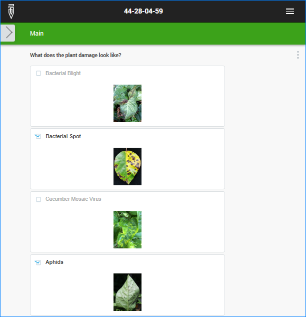
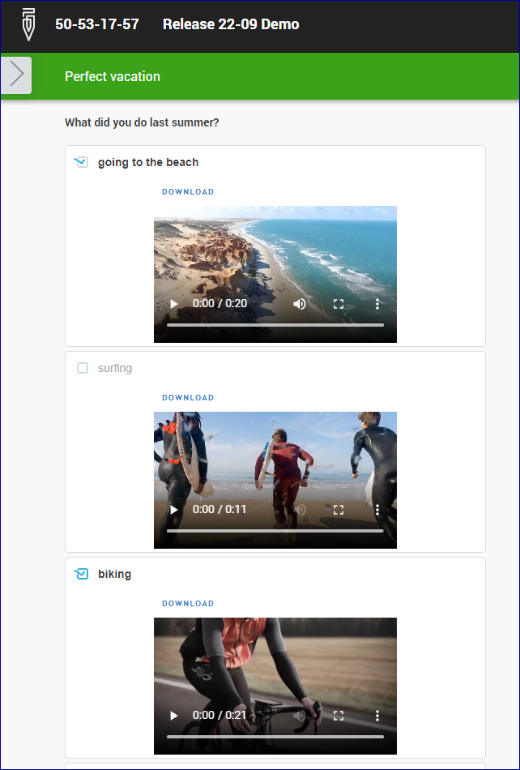
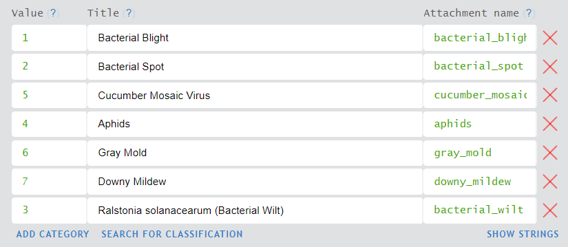

+++
title = "Version 22.09"
keywords = ["22.09"]
date = 2022-10-06T00:00:00Z
lastmod = 2022-10-06T00:00:00Z
+++

Version 22.09 of Survey Solutions introduces a possibility to utilize
attachments in categorical questions. For most users this means they
can now include images to illustrate the options.

  

The attachment, however, doesn't have to be a static image only: It can also
be an audio recording, or a video, or a PDF document:

  

To set up images in the categorical questions do the following:

1. Load the necessary images as attachments to the questionnaire.
2. Set up a categorical question (single or multiple select).
3. When entering categories, you are now having three fields: code, label
and attachment name. Make sure you mention the attachments by name in
the attachment name field.

  

Here are the rules that guide this process:

1. Attachment names must be compliant with the variable naming rules. Note,
that this is a new requirement, more strict than in the earlier versions.
You may need to rename your attachments if your questionnaire doesn't compile
now.  

2. Use of attachments is optional. Categorical questions designed without
them will continue to work as before. If attachments are used, they are
optional, meaning that some categories may have attachments, while other
categories may be supplied without them.

3. If you mention an attachment, but no such attachment is present in the
questionnaire you get an error message:
"*[WB0313]:Question option refers to non existent attachment*".

4. The same attachment may not be attached to several categories of a
question (except the cases when these multiple categories can't be seen
simultaneously, such as in the case of cascading selections, where the
same option may be included into two or more separate groups defined by
parent code). If this is not observed, you get an error message:
"*[WB0314]:Question contains multiple options that refer to the same
attachment*".

5. It is possible to use the same attachment in several different questions
of the same questionnaire.

[Example questionnaire for Version 22.09](https://designer.mysurvey.solutions/questionnaire/details/d027072a7d6e48409aaa995d2aa2bd1b)

### Other important changes in this version:

1. Attachment names must now conform to variable naming rules. If they
don't a new compilation error message is issued: "*[WB0315]:Attachment
name should contain only letters, digits and underscore character. Is
starting with letter, no consecutive underscores, not ending with
underscore and is not a reserved word. Not empty and less than 32
characters.*"

2. Designers will no longer receive a warning if an attachment is not
used in the questionnaire. This is not possible to establish reliably
in presence of flexible images introduced in version 20.08 of Survey
Solutions.

3. Questionnaires with old cover page can't be imported from the
Designer to a data server anymore. If your questionnaire is in the old
format (before introduction of the cover page in v20.07) you are getting
an error message:
"*[WB0316]:Questionnaire in old format. Please use "Generate cover"
link on Cover section.*"

4. Large attachments are no longer importable: the limit on image size
4,096 by 4,096 pixels was declared earlier, but not enforced. Uploading
very large image files resulted in errors. This limit is enforced now.

5. Limit on length of question text (title) has been increased from 500
characters to 2,000 characters. The revision of the limit was done with
understanding that the question text may include hyperlinks, which
necessitate higher capacity for this field. We encourage questionnaire
designers to keep the questions concise.

6. Users in Headquarters (HQ) role could control 2FA authentication of
another user. This has been fixed. The user must activate or deactivate
2FA himself/herself, or ask the administrator to reset it.

7. The specific word "*questionnaire*" is now declared a Survey Solutions'
keyword. If you've used this word as a variable name in your earlier
questionnaire it will no longer compile. Rename that variable name to any
other word.
