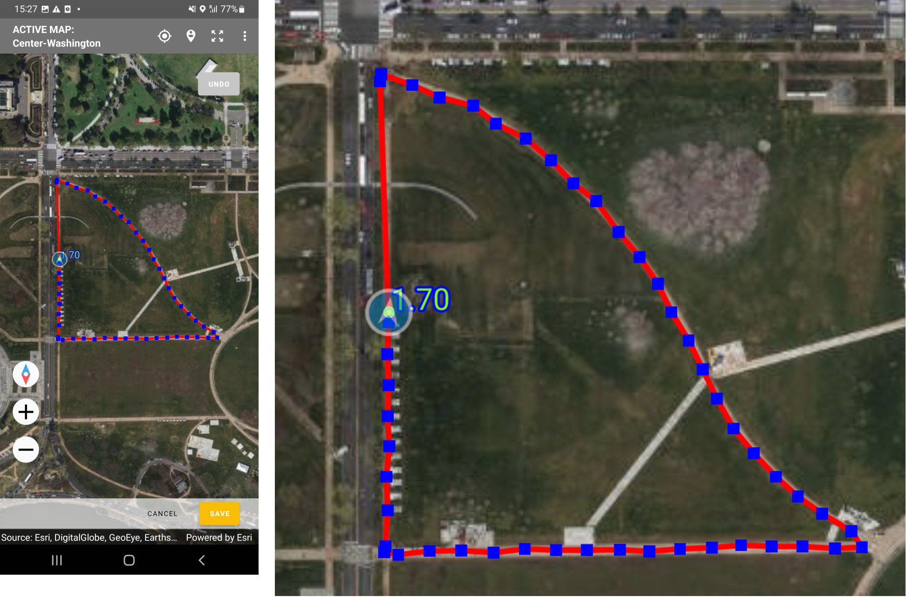

+++
title = "Version 22.12"
keywords = ["22.12"]
date = 2022-12-14T00:00:00Z
lastmod = 2022-12-14T00:00:00Z
+++

This release has benefitted from collaboration with colleagues from the [50x2030 initiative](https://www.50x2030.org/).

### New feature: Input mode for Geography question

We have received questions about automatic GPS-based area measurement quite
frequently in the past, both in the Survey Solutions users’ forum (like
  [here](https://forum.mysurvey.solutions/t/continuously-recording-gps-coordinates-based-on-user-location-without-pressing-on-the-map-for-each-dot/3162) and [here](https://forum.mysurvey.solutions/t/automatic-area-calulation-whitout-a-map/3443))
  as well as during consultations and training sessions.

Now, backed by colleagues from the 50x2030 initiative, which strive to improve
the quality of measurement of land parcels, we have added this possibility to
this release of Survey Solutions!

The new feature extends the already existing geography-type question with
automatic (periodic) and semi-automatic (user-activated) measuring modes. These
modes allow marking the waypoints as the interviewer navigates around the
boundaries of the parcel. From the measured coordinates the area and perimeter
of the parcel are then calculated automatically.

  

Read more in the
[Geography question](/questionnaire-designer/questions/geography-question/)
article.

### New feature: Overlap detection for Geography-type question

This version introduces a new feature to Survey Solutions’ geography question:
overlap detection. It is applicable only to the geography questions placed in
a roster. When activated by the questionnaire designer, it will assist the
interviewers in marking the areas in such a way that there is no overlap
between multiple marked plots/parcels. This is important to avoid
double-counting of any area in calculation of the total area.

If an overlap is detected, the program signals about it at the bottom of the
map, mentioning the other roster items with which an overlap was detected.

  

The overlap detection serves a warning purpose only. It doesn’t prevent such
data from being recorded and submitted by the interviewer.

Note that the overlap applies to all variants of the geography question:
polygon, polyline, multipoint and single point, and is signaled when there
is at least one common point of the current answer with the answer to the
same geography question in any other items of the roster.

The overlap detection applies to all modes of measurement: manual, automatic,
and semi-automatic.

The overlap detection does not affect the export of the data, and whether the
answer overlaps with another or not is not accessible from the syntax in
writing expressions.

Read more in the
[Overlap detection](/interviewer/special/overlap-detection/) article.

### Bugfix: Attachments in special values

A possibility to declare attachments in special values (for numeric questions)
has been introduced in the version 22.09, but such attachments were not
displayed in the Interviewer App. This has been fixed.

### Bugfix: Answers to identifying questions could be modified

It was possible to modify answers to questions on the cover page preloaded by
the headquarters users in the CAWI mode interviews under some conditions, while
the preloaded answers should have been protected against such changes. This has
been fixed.

### Bugfix: Shapefiles consisting of points were not shown on tablets

Shapefiles consisting of points were delivered to the tablets as per
assignments, but not shown in geography questions and map dashboard. This has
been fixed.

### Warning: Export was affected by the current update.

When the Survey Solutions server is updated to this released version, it will
refresh the export data structures. This will require the stored data to be
reprocessed and may take considerable time with large datasets. Please be
patient. Subsequent export operations will run with usual performance.

### Warning: New limit has been introduced on naming of variables

With this release a new limit has been introduced on the length of the variable
name for geography questions. These variables can be at most 26 characters long.
If a questionnaire with geography-type question was already imported into an
earlier version of Survey Solutions and subsequently updated, it can get renamed
to a different name that satisfies the new limit on the variable name.

See other [Survey Solutions Limits](/questionnaire-designer/limits/survey-solutions-limits/)

### Warning: Raising minimum requirement for tablets to Android OS 8 in the future.

We announce that we intend to raise the minimum requirements for the operating
system to Android OS 8 for the Survey Solutions apps on the tablets. This
concerns the Interviewer App, Supervisor App, and the Tester App. Any tablets
with lower versions of Android OS will not be supported in the future versions.
Some devices with lower versions of the operating system may be upgraded to a
more modern version via an OS upgrade supplied by the manufacturer. Please refer
to your tablet's user manual or the following generic instructions from Google:
[Check & update your Android version]( https://support.google.com/android/answer/7680439?hl=en)

Systems already deployed with the versions of Survey Solutions before the change
happens will continue to operate, but interviewers will not be able to update to
a newer version of the corresponding Survey Solutions App if they don’t have the
proper OS version. Survey coordinators must take this into account before
upgrading the server.

Using devices with lower versions presents a security risk as they are no longer
updated for any new security threats.
