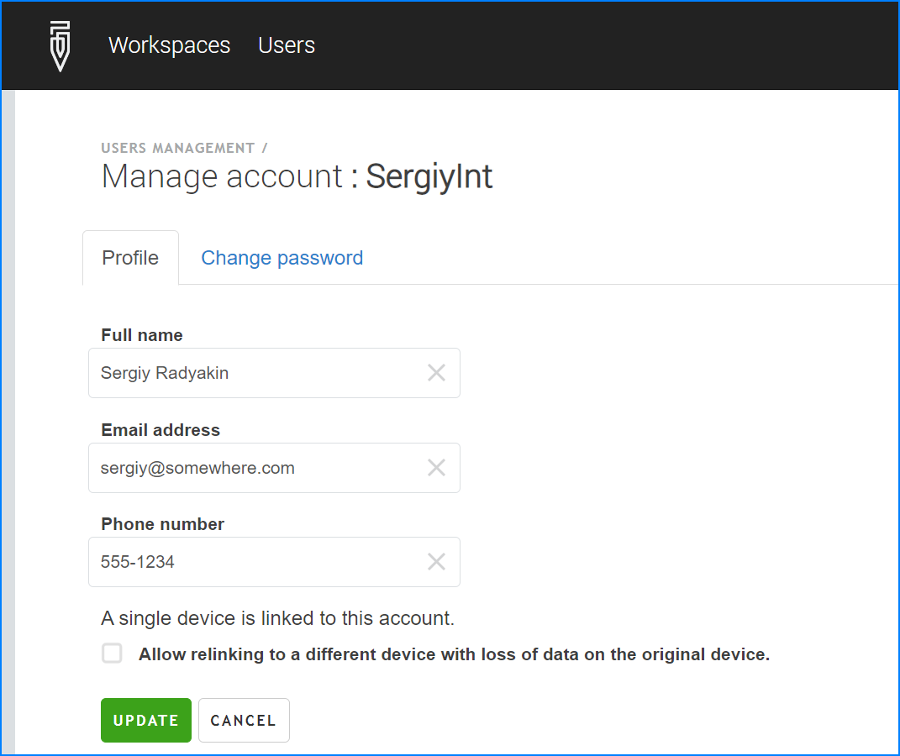
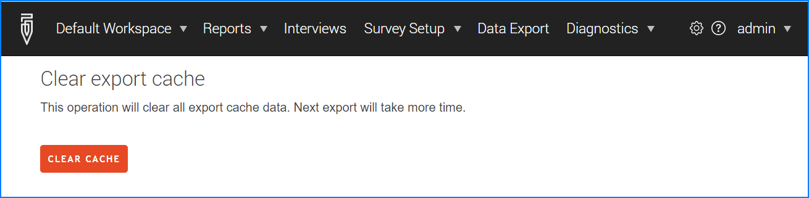
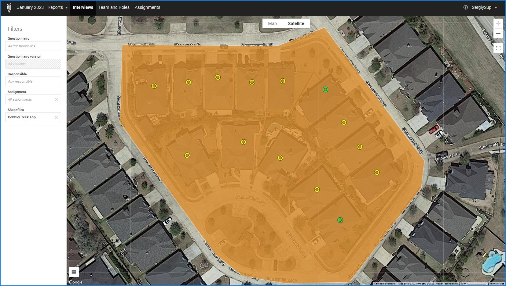

+++
title = "Version 23.04"
keywords = ["23.04"]
date = 2023-04-23T00:00:00Z
lastmod = 2023-04-23T00:00:00Z
+++

In this new version we extend the features of Survey Solutions by adding
a map dashboard for the Supervisor App and other changes and improvements
listed below. Adding a map dashboard for the Supervisor app and navigation
enhancements were implemented with funding and support from the UNHCR
World Bank [Joint Data Center (JDC)](https://www.jointdatacenter.org/) as
part of the project to improve the quality of data on refugees and internally
displaced persons.

### New feature: Map dashboard in the Supervisor app

One of the key responsibilities of the supervisors is to ensure the data
collection is done in the proper areas as assigned to the interviewers.
Staying within assigned areas can be difficult for interviewers when the
boundaries are not tied to visible natural or man-made boundaries (rivers,
roads, etc.) It is even more difficult when the boundaries of area of
responsibility are completely virtual, such as the case with spatial
sampling where a sampled area is just a range of coordinates. Supervisors
working online can see the locations of the submitted data on a map
dashboard, but this functionality was missing in the Supervisor App on
mobile devices, which is used by supervisors of teams when they are
working in remote locations where internet-connectivity is sporadic or
non-existent.

The new functionality is akin to the map dashboard present in the
Interviewer App, but note an important difference on how the status of
the interviews is indicated for the supervisors. The color coding is
relevant to the supervisor, so the completed interviews are marked as
blue for the supervisors, because they require
supervisor's action -- a quality control decision on whether to approve
or reject them, while they are indicated with green
color at the interviewers' dashboards, because they don't require any
more work. Similarly the interviews that are approved by the supervisor,
or rejected by the supervisor are both shown in green
color, because the supervisor has already taken her action on them.
Red color is used for the interviews that were rejected
by the headquarters, to signify that the superiors were not satisfied
with the supervisor's decision to approve that interview. The map
dashboard can also display the interviews in the status
`Interviewer Assigned`, which indicates interviews in progress. They
are also indicated in green, as they don't require
a supervisor's involvement until completed.

Read more in the
[Supervisor map dashboard](/supervisor/supervisor-map-dashboard/)
article.

### New feature: Navigation to destination

Navigation to destination facilitates locating the targeted location when its
coordinates are known, for example from the previous visit or a listing survey.
This feature works by establishing a collaboration between the Survey Solutions
app (Interviewer or Supervisor) which stores the GPS location data and a
user-installed mapping app that visualizes that location and possibly shows a
route from the present location to the target.

This feature is now available both for the Interviewer and the Supervisor apps,
and can be called from any GPS location question, including the ones that are
not on the cover page, which is useful if the GPS location question is in a
roster (that is common for listing questionnaires) or in a section tracking
visits.

Read more on this feature in the
[Navigation to Destination](/faq/navigation-to-destination/) article.

### New feature: Control over relinking of the mobile device

Survey Solutions establishes a tie between the interviewer (account) and the
actual mobile device used to submit the information to the server. In the
past it was possible to switch the device through a process known as
re-linking, which was intended to be used in the situations when the
interviewer’s mobile device is lost, stolen, or permanently damaged. We have
been notified by the users community that the relinking process could have
caused undesirable consequences when used carelessly, such as when the
interviewers are made aware of each other’s passwords, causing interference
between various interviewer accounts.

To alleviate the problem, we introduce the mechanism to control relinking
of the device by the interviewer. This is now regulated by a new
account-specific permission visible as a checkbox in the interviewer’s profile:

  

The interviewer may relink to a new device when this checkbox for his/her
account is set.

Note that the initial attachment of the device does not require a supervisor's
action to set this permission! It is only required to relink to a new
(second, third, etc) device.

This new setting is available for the supervisor and superior users
(headquarters, administrator).

See also: [consequences of relinking a tablet device](/interviewer/troubleshooting/consequences-of-relinking-a-tablet-device/).

### Maintenance procedure M1 is made accessible for remote administration

[Maintenance procedure M1](/headquarters/config/procedures/#M1) was useful
and effective for the users experiencing problems with export of data, but
it had two problems:

- First, it was a manual procedure that required access to the DB on the
server where it needs to be performed, which is not available to the users
of the Survey Solutions connecting through the internet.

- Second, it was prone to human error, as a user could accidentally delete
more than needed, causing serious data damage.

We have added interface to launch this procedure remotely by an administrator
user. This functionality is accessible from the workspace context menu
(click on any workspace, select `Settings`, then scroll to paragraph
`Clear export cache`):

  

When the administrator user clicks the `Clear cache` button the server will:

- perform the procedure known as M1 in the maintenance list (remove schemas
in the DB that are storing the data prepared for export);
- delete any export files currently saved at the file system corresponding
to surveys in the current workspace.

Note that the first export after this procedure may take considerable time
to re-create required export schemas.

Note also, that this procedure does not erase data stored in the cloud storage
(if you’ve redirected storage of export data to the cloud).

### Other changes:

- <U>PLEASE NOTE:</U> The minimum required version of the
Android operating system on a mobile device for use with the Android-based
apps (Interviewer, Supervisor, Tester) is now <B>6.0</B>. If the manufacturer
of your device provides an update of the Operating System, please, do update
the OS before updating the Survey Solutions Apps, as they will not be able
to run correctly in an outdated version of the OS.

- The versions of Android below 9.0 are out of support now,
they do not receive security and maintenance updates. We do not recommend
using the devices based on older/unsupported Android for data collection, and
will increase the minimum version of the Android OS in future versions
in line with the [earlier announcement](/release-notes/version-22-12/).

- Users working with the Designer tool will find that the entry fields for
the question's enabling condition and categorical question's filter are
behind the corresponding links: `ADD ENABLING CONDITION` and `ADD FILTER`.
(In the past the users often confused the two conditions). Once the
condition is specified, it will be displayed without the need to click on
the link.

- **Change of the format of categories upload files in the Designer**. When
uploading categories from a text file that file must now have a
header that specifies the meaning of the information stored in that
column. This allows to avoid confusion in the situations when the content
of the file may not be interpreted uniquely and where in the past the
program was using not-obvious defaults to guess the type of content. The
recognized column names are: `id`, `text`, `attachmentname` and `parentid`.
With the introduction of the header, the columns may now appear in any
order. If you have an older file prepared for use with the Survey Solutions
Designer, add just the header line denoting which column has which content.
Note that the `parentid` column is only relevant for cascading selection
questions.

- **Password reset of Interviewer and Supervisor users by the Headquarters users**.
With the introduction of multiple workspaces the Headquarters and supervisor
users have lost the ability to reset interviewers' passwords. Indeed, the
interviewer account may belong to multiple workspaces where the HQ user may
not have access. If HQ retained a possibility to reset the password, that
would be overstepping the allowed domain. Yet concentrating all powers to
reset the passwords in the hands of the administrative user has proven too
inconvenient for some surveys with a very wide base (a lot of interviewers)
or operations spread across multiple time zones, etc, which made it difficult
for the administrator to be sufficiently responsive to the password reset
requests. We bring back the possibility for the Headquarters users (but not
supervisors) to reset interviewers' passwords, provided that that Headquarters
user has access to all the workspaces that the interviewer is accessing. If
there is even a single workspace for that interviewer that the HQ is not
permitted to access, that will block for that HQ to reset the password of
that interviewer and such cases must be elevated to the administrator.

- Supervisor's name didn’t appear as a possible selection for filtering
assignments, interviews, or making reassignments. This has been fixed. The
supervisor now has the possibility to narrow down the lists of interviews
and assignments to the ones that she is responsible for, and to make
reassignments of interviews and assignments to herself.

- Answering questions in table-rosters (web interviews only) previously
required to double-click a cell. This has been changed. Only a single click
is now required.

- For administrator users who are troubleshooting connectivity issues we've
added an indicator `Designer connection check` to the
[`Healthcheck`](/headquarters/config/healthcheck/) page. It verifies and
reports whether the Designer is reachable from the Headquarters.
If the Designer site is not reachable, the users will not have a possibility
to import any questionnaires to this server. This is usually the result of
network policies and restrictions imposed on the data server, rather than
availability of the Designer.

- For HQ-users there are additional statistics reported for each export job
(visible on the data export page). Once the export file is produced, the
corresponding card now displays the duration that job has spent in the waiting
queue and in processing.

- The map dashboard for online users now supports overlaying of shapefiles.
This helps checking whether the interviewers are collecting data in the proper
areas.

  

