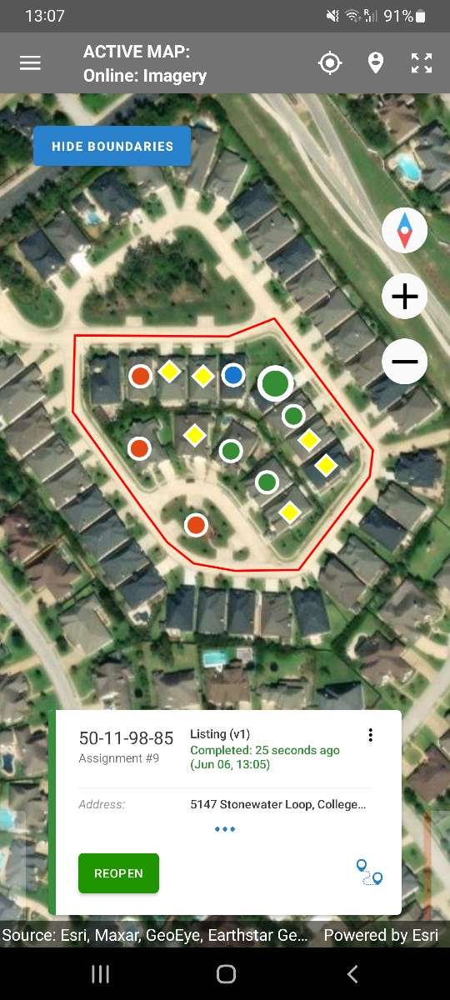

+++
title = "Version 23.06"
keywords = ["23.06"]
date = 2023-06-08T00:00:00Z
lastmod = 2023-06-08T00:00:00Z
+++

In this new version we extend the features of Survey Solutions by adding
a carousel control to the map dashboard for the Supervisor and Interviewer
Apps, possibility to make map assignments interactively to supervisors and
headquarters users and other changes and improvements.

1. Carousel in the map dashboard in Interviewer and Supervisor Apps.
2. Possibility to assign maps in the server user interface.
3. Maps assignment by supervisors.
4. Warning for markers outside shape file boundaries.
5. Export of list question.
6. Other changes.

### 1. Map dashboard carousel

Map dashboard in the Interviewer and Supervisor Apps has got a new control - a
carousel displaying interviews and assignments: The carousel automatically
appears when any marker is selected on the map replacing the earlier available
balloon with the `Start new interview` button.

  

It serves the following tasks:

- Provides identifying information about the selected marker;
- Allows navigation between the overlapping markers (such as in the case when
an interview covers an assignment marker in a close or exactly same location).
- Allows access to the common actions to be done with the corresponding document
(depend on the role of the user):

  - Start an interview from an assignment;
  - Approve or reject an interview;
  - Assign a new responsible for assignment/interview;
  - Open location in an external mapping application.

- Displays when the interview has changed its status;
- Displays calendar event and other information.

The appearance of the card is unified in the map dashboard and the regular
dashboard.

In the cases when there are numerous identifying fields (more than 3) only the
first 3 are shown, while the others may be seen by unfolding the card (by
tapping on its header or the three dots at the bottom). An unfolded card can
be folded again by the same gesture.

**Available actions:**

In the Interviewer App:

- start a new interview from an assignment;
- open a started interview;
- reopen a completed interview;
- discard interview;
- add a calendar event, edit calendar event, delete calendar event

In the Supervisor App:

- Open an interview.
- Change responsible for an assignment or an interview;
- Approve an interview that is in the status Completed or Rejected by Supervisor;
- Reject an interview that is in the status Completed.

The cards in the carousel can be swiped left and right revealing other cards
corresponding to the markers on the map in sequence. Cards corresponding to
the markers occupying the same position will be following one another in this
sequence.

To hide the carousel control tap anywhere on the map, where there is no marker.

### 2. Possibility to assign maps in the server user interface.

Management of maps for Survey Solutions users just got easier! Earlier the
headquarters users had to download, modify, and re-upload a special maps
assignments file, which listed which maps were accessible by which users.

Beginning with version 23.06 the map assignment can be done interactively in
the server interface. When you review the properties of a map it shows the list
of linked users (those who have access to this map) providing a possibility to
add to this list or remove from this list.

To add a new user (supervisor or interviewer), type his/her name in the search
bar, the system will shortlist the accounts to the list of user names that
match the typed characters. When you see the user you wish to add, click on
his/her name and then the green plus sign.

To remove a user from the list, click the user name, and in the context menu
that appears, select `Unlink user from map`.

This method is convenient when you want to adjust a couple of map assignments
and it doesn't replace, but rather it complements the previously available
file-upload method for making map assignments.

### 3. Maps assignment by supervisors

Users in the role `Supervisor` logging to the server can now:

- preview maps assigned to them directly or to any members of their team;
- view the assignments of maps to users;
- change assignments of maps using the server's user interface.

In the past the supervisor of a team could reassign a certain area of
responsibility or a particular household from one interviewer to another
interviewer in his/her team. But if fulfillment of that assignment depended on
a digital map (e.g. to mark the parcel boundaries) that was not always feasible
for the newly assigned interviewer. Either he/she had to have that map loaded
in advance (meaning all interviewers carry their maps and copies of everyone
else's maps), or they resort to using online maps only, or they need involvement
of the headquarters users to match the changes in interview assignments with the
corresponding changes in maps' assignments.

Now, if the supervisor finds that interviewer *X* is working slowly and wants to
delegate a few households to interviewer *Y*, who has already completed her
tasks, the supervisor can transfer the assignments and also any necessary maps
from *X* to *Y*.

Importantly, the maps are still synchronized from the server and thus the
supervisor has to make the reassignment of the maps on the server, but it does
not require the participation of the headquarters user anymore, so can be done
by the local team only. This should improve the reaction to non-standard
situations, like interviewers falling ill, and allow local teams to cope with
that with their remaining interviewers.

The supervisor can both give and withdraw access to the specific maps of the
specific interviewers and control own access. For example, the supervisor can
assign all the maps to herself, though she can still see all the maps assigned
to any of her team's interviewers (in addition to what is assigned to her
directly).

Note that if the last user in the team is denied access to a map, then the
team's supervisor will also lose access to that map.

Note also that the supervisors can't make assignments of maps by uploading a
file. This is still available to the headquarters and admin users only.

### 4. Warning for markers outside shape file boundaries.

While there are many uses of shapefiles in Survey Solutions, one of the commonly
practiced is to designate a certain area of responsibility which could be an
administrative district, or more often an artificially created enumeration zone.
The requirement for the interviewers then is that the data they collect should
be from the locations within that assigned zone of responsibility. A typical
operation of that kind is a listing operation, in which a village is divided in
several zones, which are assigned one to each interviewer, who have to scout the
area for all the residential dwellings. It would be a mistake of double-counting
if an interviewer oversteps from her assigned area into another area, because
the dwelling there is to be collected by another interviewer.

A combination of boundary files with satellite or aerial photography and a
location sensor built into the modern mobile devices presents a superior tool
to verbal descriptions of the area, allowing the interviewers to have the
instant check whether they are in the proper area or not. The areas don't have
to be square or rectangular, in many cases they are of irregular shapes,
especially if the boundaries are following natural features, like coasts or
mountain ridges.

The newly implemented feature will automatically check if there are markers on
the map dashboard that are falling outside of the selected shapefile and if yes,
then an alert is automatically shown.

This new feature is also available to the supervisors in the supervisor's app,
which simplifies the control of the interviewers. Indeed this feature is most
useful in conjunction with the filter, for example by responsible, where the
supervisor may choose, e.g. the shapefile corresponding to the area of
responsibility of interviewer *X*, and then also filter the data to only the
interviews received from interviewer *X*. Or the supervisor may be issued the
map of his team's area of responsibility, to control for no overlap with other
teams' areas.

### 5. Export of list question.

The data export format of the list question is changed from this version
forwards. In the past a problem existed if there was a linked question using
the categories of a list question as a source for the choice categories. Since
the remaining items in the list question were not renumbered after deletion of
other items, it was not possible to determine correctly, what was the meaning of
the selected indices in the linked question (the problem formally described in
[this ticket](https://github.com/surveysolutions/surveysolutions/issues/2475) in
our online issue tracker).

The format of the export of the list question is thus the following: for every
item in the list two columns are exported. The column names are `x__INDEX` and
`x__INDEXc`, where:

- `x` is the variable name assigned to the list question in the Designer;
- `INDEX` is a numerical index ranging from `0` to `C-1` (`C` is the
capacity of the list, 200 if not specified in the Designer tool);
- `c` is a constant suffix "*c*".

Columns without the suffix "*c*" store the elements of the list (same as in the
previous versions). Columns with the suffix "*c*" store the code of the element
of the list. If an element was selected in a single select question linked to
list question `x`, then the value of the linked question is that code, and it
is guaranteed to occur once and only once among the columns `x__INDEXc`.

For example, if value `9` was selected in the single select household head
question, then it is guaranteed that for this interview value 9 will be present
in the columns `members__*c`, and it will only occur once. The corresponding
column `members__*` will contain the name of the household member selected for
the head in this household.

If your questionnaire was not using any linked questions, there is no problem
to worry about, except that it is really a good idea to assign a certain
capacity to each list that you are using in your questionnaire. If you don't do
that, each list question that you add to your questionnaire will result in 400
columns in the data export structure, which is a complexion you'd most likely
want to avoid.

If you did use a select question linked to a list, be aware of this important
change. Your code should not rely on the value of the linked question as the
raw index in the list, but rather convert it to the index value by searching
for it among the saved values in the code-columns.

### 6. Other changes

A number of changes were done to the visual appearance of the Interviewer App:

- Assignment cards are now displayed with yellow tab color instead of gray.
Similarly, the markers corresponding to assignments in the Interviewer Map
Dashboard are now yellow diamonds, instead of blue diamonds as in earlier
versions.

- An icon is displayed on cards corresponding to geo-targeted assignments and
interviews instead of the `Show location` button.

- A map is shown with a link for an answered geolocation question on a fully
answered cover page (previously an empty frame was displayed).

**Boundaries color**: On the server the map preview shows the boundaries in red,
rather than orange color.

**Dashboard location permission:** Following the best practices for managing
permissions in an Android-app, the Survey Solutions Interviewer and Supervisor
Apps are asking for location permission not immediately on entry to the map
dashboard (as it was the case in the earlier versions), but when the user
requests acquisition of location (with the corresponding toolbar icon). This
allows some users (e.g. the supervisors) to use the map dashboard, without
permitting the app to handle their own location, but inspect the locations
captured by other users (interviewers in this case).

**Supervisor must confirm reassignment of an assignment that has already been
received.** Reassigning of an assignment that has already been received by an
interviewer to another interviewer carries the danger that both interviewers
will start an interview from it, resulting in extra interviews (more than was
originally planned/sampled). In the past, it was possible to do such a
reassignment in the supervisor app, and it is still possible in the newly
released version. But now the supervisor app will detect this and ask for
additional confirmation from the supervisor. This is something that was already
implemented in the web-version of the supervisor, but was missing in the tablet
version.

  

