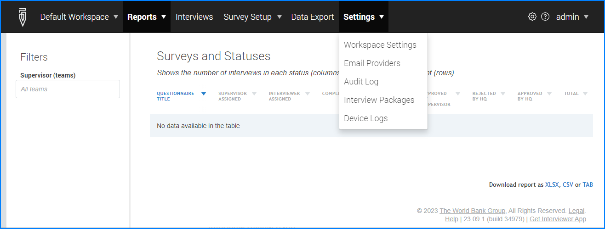
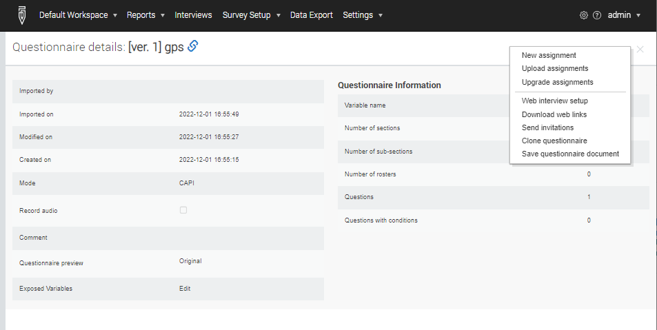
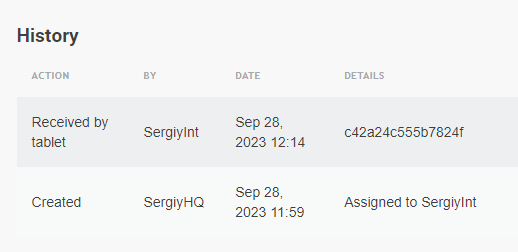

+++
title = "Version 23.09"
keywords = ["23.09"]
date = 2023-09-13T00:00:00Z
lastmod = 2023-09-13T00:00:00Z
+++

Release of version 23.09 of Survey Solutions has a number of user interface
improvements and bug fixes. Here are the changes that the users must be aware:

**Administrator users can get straight to the workspace settings from within a
workspace**, without having to get to the list of workspaces first. The
`Diagnostics` submenu of the main menu was renamed to `Settings`. The menu
items for `Workspace settings` and `Email providers` was added to the
`Settings` sub-menu of the main menu. The same items are retained in the
context menu for workspace records in the list of the workspaces (as was the
only way in the previous versions).

  

**Action buttons were added to questionnaires and assignments details pages and
the interview review page**.

  

Questionnaire details page was enhanced with a new questionnaire action menu in
the top-right corner:

- This menu provides access to the common actions that the HQ or admin user may
do on a questionnaire - such as create new assignments or set up a web survey.
The functionality of the actions in this menu replicates the same functionality
accessible in the context menu in the list of the questionnaires page.

- Assignment details page now has an assignment action button for common
actions on an assignment. This menu includes the items replicating the actions
available in the assignment context menu in the assignments page.

- Interview review page was enhanced with a new interview actions button that
provides access to the common actions the reviewer may want to do on an
interview, such as reassign or switch the interview mode (CAPI/CAWI). The
functionality of the actions in this menu replicates the same functionality
accessible in the context menu in the list of the interviews page.

**The workspaces page was enhanced with a search box for quick filtering
workspaces.** The search happens both in the name and display name fields and
matches anywhere (in the beginning, middle, or in the end). The search is not
case sensitive.

**Assignment history is now augmented to show the tablet ID.** When the
 assignment was received on a tablet, the identifier of the device is
 displayed in the details of this event. This helps understanding what device
 has actually received the assignment in case of troubleshooting or forensic
investigations.

  

**GDAL installation is now optional for the use of digital maps in GeoTiff file
format.** If you are using maps in geotiff format and have had compatibility or
security issues before, you no longer have to install the GDAL tools to support
Survey Solutions. Still we recommend to validate the files locally, before
uploading them to Survey Solutions server to make sure the files are not
corrupt. If the GDAL tool is not installed and the geotiff file is corrupt the
server will accept it on upload, and the file corruption fact will be
established only later when the file is delivered to the interviewer to be
used in the Interviewer App (resp. to the supervisor to be used in the
Supervisor App).

**Calculated variables can now be seen in the WebTester.** A new button
introduced in the WebTester's toolbar allows displaying calculated variables
during testing sessions. In the earlier versions this was available only to
the users of the Tester Android App on mobile devices. Now users testing the
questionnaires in the web mode can also see the calculation results (when this
  mode is active - indicated by a checkbox on the corresponding button).

**Event timestamps in paradata now contain information with milliseconds
precision.** This will allow more precise measurement of the time when the
event has occurred and the duration of time between the different events in
the paradata stream. Mind however, that the clock settings on most devices will
not be accurately set to milliseconds precision, so comparing timestamps across
different devices is valid only in special cases.

**Paradata export archive now has additional identification files.** The two
files `export__readme.txt` and `export__info.json` provide information about
the version of the software producing the paradata, the title and identifier
of the questionnaire. The text file presents this information in a form of a
human-readable text, while the JSON file contains it in a form more intended
for processing with automated tools/scripts.

**Assignment color update.** The color associated with assignments used to be
gray in the dashboard and yellow in the map dashboard (where gray color is
often not distinctly visible) of the Android Interviewer App. A single purple color has now replaced them to denote assignments
in both dashboard views.

**PDF transcripts of interviews no longer contain preloaded values of hidden
questions**, since these values were not provided by the respondents.

**Other interface changes included**:

- removal of the questionnaire title in web-interviews where it appeared twice
(once on the toolbar and once on the cover page);
- using one cover page instead of two in the Interviewer App (earlier versions
presented editable and read-only versions of the cover page separately);
- adding supervisor's name to the drop down list of responsible users (missing
in earlier versions);
- adding questionnaire title to the questionnaire details page (more
prominently).

Alert: Android 7.0 or more recent is required for this version!
