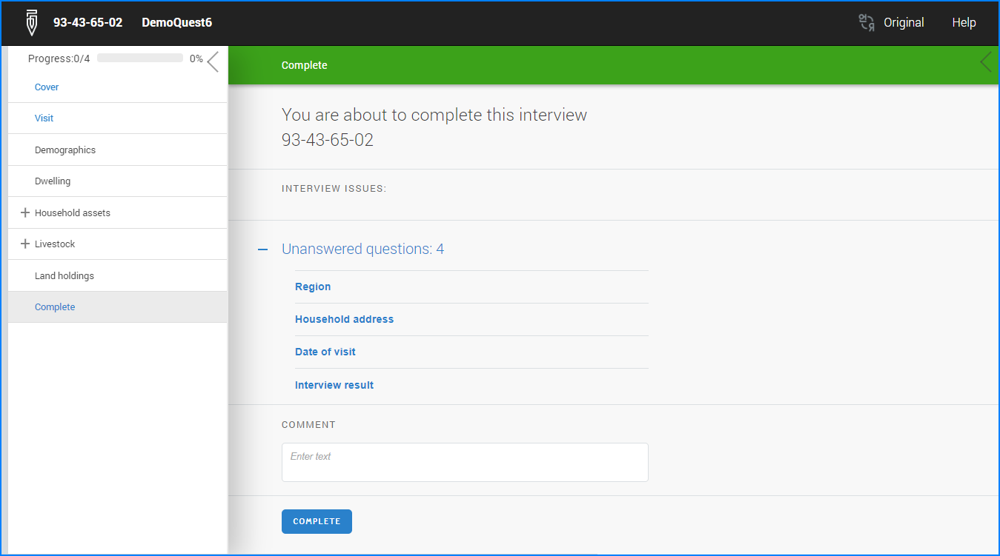
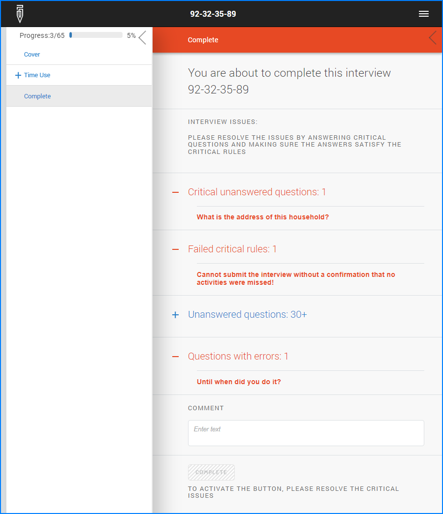

+++
title = "Version 24.06"
keywords = ["24.06"]
date = 2024-06-06T00:00:00Z
lastmod = 2023-06-06T00:00:00Z
+++


<FONT color="maroon">Before updating users hosting their Survey Solutions
server in a Docker container need to familiarize themselves with the
instructions below regarding [important configuration changes](#hosting-survey-solutions-in-a-docker-container).</FONT>

The new features in this release include the following:

- [critical rules and questions, action at submission](/questionnaire-designer/techniques/critical-rules-and-questions/).
- [list of unanswered questions at completion screen](#the-list-of-unanswered-questions-at-completion-screen).
- [higher precision integer numbers](#higher-precision-integer-numbers).
- [roster limits have been revised](#roster-limits-revised).

The following bugs were fixed:

- Export of data via API with selection by modification date/time treated it
inconsistently with the user interface under some conditions.
- Tester App not allowing to answer geography-type questions (on some devices).
- Interviewer App crashing when `Show All` button is pressed while answering
a geography-type question.
- Map preview in headquarters was not showing up under some configurations.
- Respondents are now not allowed to access web interviews if the responsible
for the interview is not in the role of interviewer (which was possible in
earlier versions).
- It was not possible to leave comments in web-interviews to preloaded
identifying questions, while it was possible in the same interviews conducted in
the Interviewer App on a mobile device (now fixed to be possible in both
platforms: online and in App).
- Comments of interviewers left for identifying questions were not visible
to the supervisory staff (now visible).

And also the following issues were fixed (both issues were realistic to
encounter only during massive operations, like population censuses, which
involved millions of interviews):

- Having a large number of events (more than approx 2.1bln) causes the server to
stop receiving the interviews (all newly received interviews end up in broken
packages, but recoverable from there).
- Export doesn't work for surveys with more than 2.1bln events in the event
stream.

**Other important changes:**

- Online maps in the Tester App are no longer available.
- Use of online maps with the Android Apps (Interviewer App and Supervisor App)
requires the administrator to enter a usage key in workspace settings. See
details at the following page: [Online maps key](/headquarters/mapsmanage/online-maps-key/)

<FONT color="maroon">

Please note that after the data server is updated, there will be a migration of
the data, which may take considerable time (depending on the amount of data you
have, performance of the server, and other factors). After the update is
installed:

- access the login page,
- wait for the migration to complete,
- then log in as administrator, and
- verify the status in the <A href="/headquarters/config/healthcheck/">health check page</A>.

</FONT>

The list of unanswered questions at completion screen
-----------------------------------------------------------

The completion screen has been revised to include optional foldable lists of
interview issues. The four groups of issues on this screen are:

- unanswered questions,
- questions with errors,
- critical unanswered questions, and
- failed critical rules.

Each group may list up to `30` questions or issues and each group is foldable
(the group will show `30+` if there are more than 30).

The list of the unanswered questions was frequently asked by several users in
the Survey Solutions users' forum.

<CENTER>
  <A href="images/unanswered_questions.png">
    
  </A>
</CENTER>

If there are no issues with the interview, the `INTERVIEW ISSUES` block will not
appear on this page.

The total number of answered questions is no longer shown as a separate counter,
but is apparent from the progress bar.

<CENTER>
  <A href="images/completion_screen.png">
    
  </A>
</CENTER>


Higher precision integer numbers
------------------------------------

For users collecting large values the precision offered by the integer question
(approx. 10 digits) may not have been sufficient in the past. This has been
improved with this version the users can take advantage of the double-precision
storage type (64-bit floating point numbers restricted to have no decimals by
the imposed formatting constraint) to accommodate a few extra digits. To achieve
this, do the following:

1. uncheck the `Integer` attribute of the numeric question, and subsequently
2. set `Number of decimal places` attribute to 0 (zero).

This change must be done for every question in the questionnaire where more
digits are desired.

Roster limits revised
-----------------------------

Survey Solutions earlier had two sets of limits controlling how much the rosters
could grow: `60` and `200`, depending on whether the roster included another
(nested) roster and the number of elements (questions, variables, etc) in the
roster.

In the new version the value `200` replaces the older limit of `60` where it was
limiting the growth of the roster. This should make the rosters functionality
more predictable during design time and simplify planning.

Users are advised to take caution when planning 'explosive' data structures,
which multiply the questions and consider the total time for the interview and
acceptable respondent's burden as important limiting factors.

Other limits on the rosters, such as the total number of elements (currently
`80,000`) continue to apply.

Users are advised to consult the
[Survey Solutions Limits](/questionnaire-designer/limits/survey-solutions-limits/)
page often for verifying applicable limits during questionnaire design and
planning of the data collection operation.

Hosting Survey Solutions in a Docker container
-------------------------------------------------------

Important note about updating for users running their Survey Solutions server
in a Docker container: before updating to the new version, configuration of the
container needs to be changed!

Read the following documentation first, to understand what has changed:
https://learn.microsoft.com/en-us/dotnet/core/compatibility/containers/8.0/aspnet-port

Your environment and settings may be different from the example below, so it is
important that you understand what has changed and how to address this in your
environment before starting the update, or you'll risk disabling your Survey
Solutions server.

Example:
Docker container was run with Survey Solutions listening to port `80` in the
container and that was mapped to port `80` in the host system, (in the Docker
desktop you could see `"80:80"` next to the Headquarters container). If you
just update the Survey Solutions container, it will no longer respond to the
queries. Correspondingly, we need to:

1. Stop the Docker environment
2. Update the `docker-compose.yml` file adding a new parameter:
```
    ASPNETCORE_URLS: http://+:80
```
3. Rebuild the Docker container by running run.bat or directly issuing a command:
`docker-compose up -d`
4. The Docker container will be started automatically.

Your ports configuration may be different from this example. The change affects
the default port in the configuration (which changed from `80` to `8080`).
Correspondingly the port on which the service is run inside the container is to
be mentioned in the `ASPNETCORE_URLS` setting.
