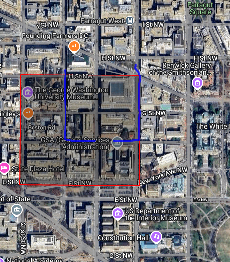
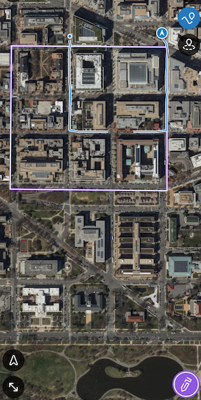
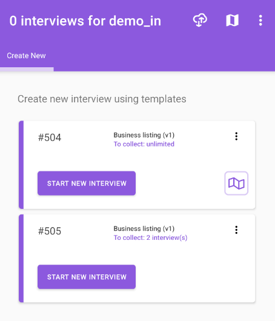
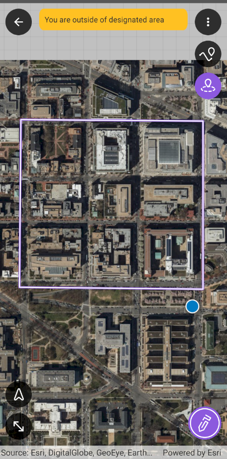
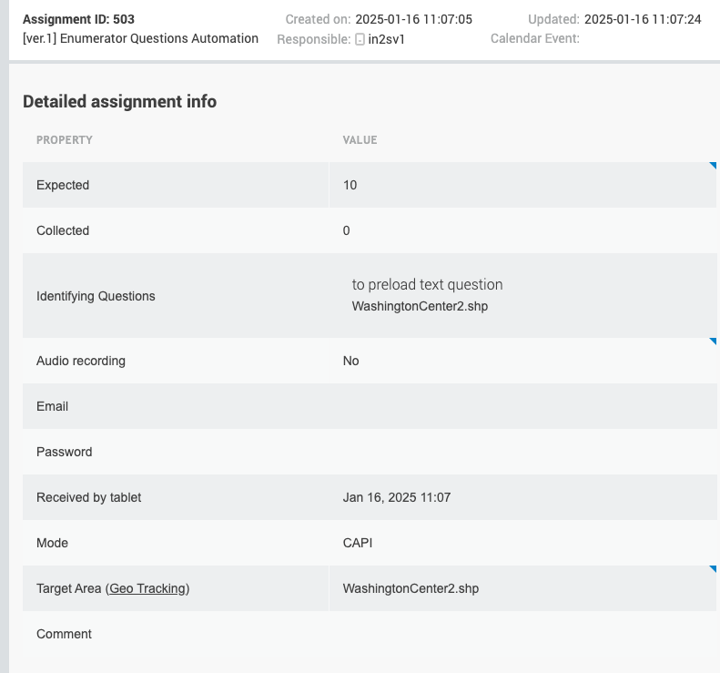

+++
title = "Version 25.01"
keywords = ["25.01"]
date = 2025-01-16T00:00:00Z
lastmod = 2025-01-16T00:00:00Z
+++

Minimal supported Android version on device is now 8.

The new features in this release include the following:

An assignment may have a shapefile associated with it. This association [`Target area` property] could be established either when assignment is created or it could be updated on the assignment details page. This property could be set before the shapefile is uploaded.

  

Shapefile should be additionally linked to the interviewer and shapefile should be synchronized to the device. Assignment card with specified Target Area on the device now has a new **Assignment map** button.  
Interviews from such assignments are recommended to be created from the **Assignment map**.

  

Geofencing
-----------------------------------------------------------

For an assignment with specified **Target area** a new map presentation is available.   
The shapefile will be automatically loaded on the map. Once a new **Geofencing** button is activated, the device will turn on location readings and start verifying device position regarding the shapefile. Device will notify users if the last received position is outside of the boundaries of the shapefile.  
*The verification occurs only if the accuracy of the obtained location fits into limits. Could be changed in the workspace settings, default value is 10 meters.*

  

Geo tracking
-----------------------------------------------------------

For assignment with specified **Target area** a new map presentation is available.   
Users will be able to load the required map and start geo tracking of the route during the scouting of the target area. Once the **Geo tracking** button is activated the device will record the track of the route. If the track is currently recording it will continue the process even if the application is sent to the background or the screen of the device is turned off. Users are recommended to create interviews from the **Assignment map**. Once the **Create interview** button is activated, the recording of the current track will be stopped. Navigating away from the map will stop track recording as well.  
*Track recording occurs only if the accuracy of the obtained location fits into limits. Could be changed in the workspace settings, default value is 10 meters.*

  

Collected tracks could be checked on the Headquarters application after synchronization.  

  

**All map functionality on mobile applications were redesigned.**

