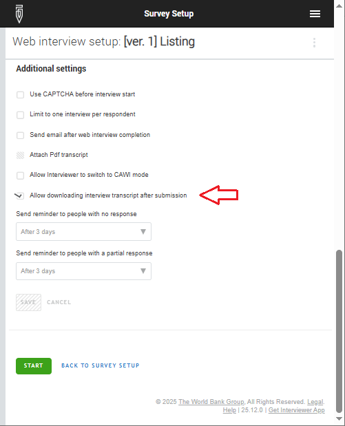
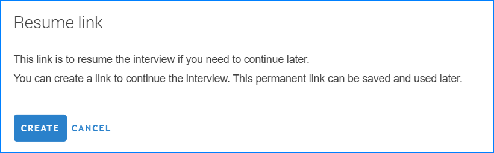

+++
title = "Version 25.12"
keywords = ["25.12"]
date = 2025-12-05T00:00:00Z
lastmod = 2025-12-05T00:00:00Z
+++


This release concentrates on improvements to the usability of the Survey
Solutions software. The new features include the following:

- Developer mode in WebTester.
- Revision of the `Submit` screen.
- Patterns used in text questions can now be specified in macros.
- Control over downloading of transcripts by respondents.
- PDF generation quotas at Designer.
- Resume link for web interviews.
- Interviewer download page revised.
- Audio compression on the client device.
- Updates to components.

Besides the new features, this release addresses several bugs that our users
have reported to us since the previous release.

<FONT color="maroon">
If you haven't installed hotfixes 25.04.1-25.04.8 this release incorporates
them, so consider upgrading to 25.12 as soon as possible.
</FONT>
<BR><BR><BR>

Developer mode in WebTester
------------------------------

Users testing the questionnaires in the Designer with the WebTester will find
additional convenience and functionality with this new update. Earlier (since
[version 23.09](/release-notes/version-23-09/))
the tool already allowed showing the [normally invisible for interviewers and
respondents] [calculated variables](/questionnaire-designer/components/variables/)
by activating the corresponding checkbox. This checkbox is now more powerful and
activates the ***Developer mode***. In this mode the testers can see:

- calculated variables;
- supervisor's questions (if any);
- hidden questions (if any);
- variable names attached to the questions.

The latter also work as hyperlinks. By clicking on the added variable name for
the question you can be taken to that question in the questionnaire Designer
tool, for example, to inspect or adjust its properties.

Exposing supervisor's and hidden questions is crucial to allow testing the
questionnaires that were otherwise impossible to test in the Designer since
they would require bringing them to the headquarters for preloading. Now the
tester can switch to the Developer mode, provide responses to e.g. the hidden
questions, save them as a scenario, and then restart testing not in Developer
mode from that scenario simulating preloaded content.

The Developer mode checkbox is affecting all your testing sessions (in case you
are testing several different questionnaires at the same time in different
windows) launched in the same browser. The setting is now sustained between the
questionnaire refreshes (once activated, it stays on until deactivated).


Revision of the `Submit` screen
---------------------------------

Submit page replaces the Complete page. It now shows a tabbed list of errors,
critical rules and unanswered questions. Importantly for errors one now can see
not only the text of the question with error, but also the error message itself
(last error if there multiple errors are found in that question). If there were
any comments left for such a question, they will be displayed in the same
interface.

<CENTER><A href="images/review_and_submit.png">
  
</A></CENTER>


Patterns used in text questions can now be specified in macros
----------------------------------

It is a common situation when there are multiple questions in a survey that
need to comply with a certain pattern of input. For example, there could be
a main phone number and a backup phone number to contact the respondent, in
which case they should be formatted the same. When preparing a template
questionnaire that can be used in different countries, the revision of the
input pattern is thus a necessary customization task, that needs to be
performed diligently throughout the whole questionnaire and overlooking a
single question may result in inability to enter contact information during
data collection.

This version permits the text input pattern to be specified in a macro, and
that macro used in text questions throughout the questionnaire.

For example, we can define
```
$phone_format=”(###) ###-####”
```

and then use the macro `$phonefmt` in patterns for questions `main_phone`
and `alt_phone`.

The convenience of this approach is that if the questionnaire needs to be
adjusted to a particular country, the phone format needs to be adjusted in
just one place.

Designers should be aware that older patterns (such as, for example,
`"$###.##"`) continue to work even if they include a dollar sign, as long as
the dollar sign character (which identifies macros) is not followed by an
identifier that is also actually defined as a macro. For this reason, no error
is being issued if you are specifying a pattern like `"$value: ###.##"` and
don't define the macro named value (which would have been the case had you
written `$value` elsewhere in a syntax expression).

In the unlikely event that your questionnaire included a pattern like
`"$price is: ###.##"` where the word "*price*" was intended to be displayed
as is and there was actually a macro named `price` defined in the
questionnaire, then you need to rename that macro to something else, for
example, to `price2`.


Control over downloading of transcripts by respondents
---------------------------------------------------------

CAWI interviewing functionality of Survey Solutions normally offers an
option of downloading a transcript of the interview, which contains
questions and answers, as well as the timestamps of when the answer was
recorded (see [v20.09](/release-notes/version-20-09/)). While most of
the respondents will appreciate the option to retain a record of their
submitted answers, some surveys may see this as non-desirable. This
release of Survey Solutions allows central control over the transcript
downloading in CAWI-mode interviews, by setting or unsetting a
corresponding checkbox in the survey settings. Thus downloading
transcripts, though permitted by default, can now be disallowed if needed.

<CENTER><A href="images/allow_transcripts.png">
  
</A></CENTER>


PDF generation quotas at Designer
---------------------------------------

Designer site users find the feature of
[generating PDF documents](/questionnaire-designer/interface/pdf-export-/) from
their questionnaires very useful. While this is needed only occasionally,
the process of rendering complicated questionnaires in a document format
may take some time. Users placing multiple simultaneous requests for PDF
generation may encounter a message indicating the need to wait for
processing of their posted requests before posting new ones. This is
normal and the generation of PDF questionnaire documents becomes
available automatically once the earlier requests have been processed.


Resume link for web interviews
------------------------------------------

Respondents to web-interviews often find themselves in need to interrupt
their interview and resume it later, possibly even on a different device.
In the earlier versions of Survey Solutions the users had an option to
send themselves a resume-link, which allowed them to continue the
interview if it needed to be resumed. Now this link can be generated, and
the respondent may pass it to himself using any convenient and available
sharing mechanism (for example, through a messenger, email, or preserve
it as a bookmark or in a file on their device).

Generation of the resume-link does not require the bulk email sending to
be configured on the server and it is automatically available in any
CAWI-mode survey.

To create a resume-link, the respondent needs to select `Resume link`
in the menu (while the interview is still in progress):


<CENTER><A href="images/resume_link1.png">
  
</A></CENTER>

and in the dialog that pops-up clicks `CREATE` to obtain the link:

<CENTER><A href="images/resume_link2.png">
  
</A></CENTER>

Click `CANCEL` when done copying.

The same dialog can be accessed again to display the same link later on.

The link remains accessible until the interview is submitted.


Interviewer download page revised
-----------------------------------

The Interviewer App download page was causing confusion where the checkbox
was excluding some optional functionality (displaying of maps). Now the logic
has been changed to inclusion: users that need to display maps need to check
the checkbox, which is unchecked by default.

New users will find this new behavior more intuitive, but existing users
need to pay attention to the revised behavior.


Audio compression on the client device
------------------------------

In the earlier versions of Survey Solutions compression of audio data was
handled in part by the server. This meant that some of the data sent to
server was large and required additional processing before it was usable
for export (Survey Solutions employed `ffmpeg` tool for this purpose if it
was installed and available).

In this new release there is no longer need to install and maintain `ffmpeg`
for compression of audio data. Both audio type question and audio audit data
are being compressed on the client device before being submitted to the
server and remain unchanged since accepted.

If `ffmpeg` was earlier installed and configured to be used in conjunction
with Survey Solutions, newer versions will disregard it.


Updates to components
--------------------------

We've updated several the 3rd-party components included with Survey Solutions,
which are responsible for the following functionality:

- **Barcode scanning**: Following up on the signals from the users that
encountered that the barcode recognition is not working reliably in some
circumstances we have updated the component utilized in the Survey Solutions
Interviewer and Tester applications. While the new component replicates
the behavior and interface of the previously used one (such as the ability
to automatically recognize the format of the barcode/QR-code presented to it),
it works more reliably in the situations that we've reviewed.

- **Web preview**: We've changed the visual component utilized for editing and
showing previews of the web page templates for CAWI interviewing.
