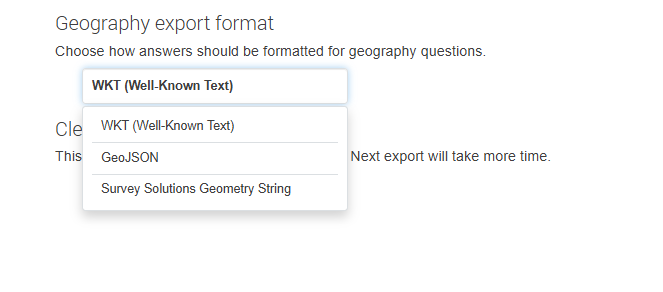

+++
title = "Version 26.04"
keywords = ["26.04"]
date = 2026-04-23T00:00:00Z
lastmod = 2026-05-17T00:00:00Z
+++

This release has benefitted from collaboration with colleagues from the [50x2030
initiative](https://www.50x2030.org/).

The following new features were added in `v26.04` of Survey Solutions:

- **Export of geography data into GeoJSON and Well-Known Text formats.** This is
described in detail in the [Geography Export Format](/headquarters/export/geography-export-format/)
article of the documentation.

  

- **Detection of abnormal server responses.** A useful troubleshooting tool that
helps detection of responses originating not from the Survey Solutions server.
While relatively rare, these issues are difficult to detect and a message from
the software may save hours of troubleshooting work. It is described in detail
in [Server response check](/headquarters/config/response-check/) documentation
article.

Users upgrading from earlier versions should familiarize themselves with the
descriptions of the new features mentioned above. Note that the WKT format is
now default for the export of geography data. Any existing pipelines that rely
on this data be formatted as Survey Solutions Geography String may need to be
adjusted for the new format, or the legacy format be specified in the [workspace
settings](/headquarters/config/admin-settings/) (by the administrator user).
