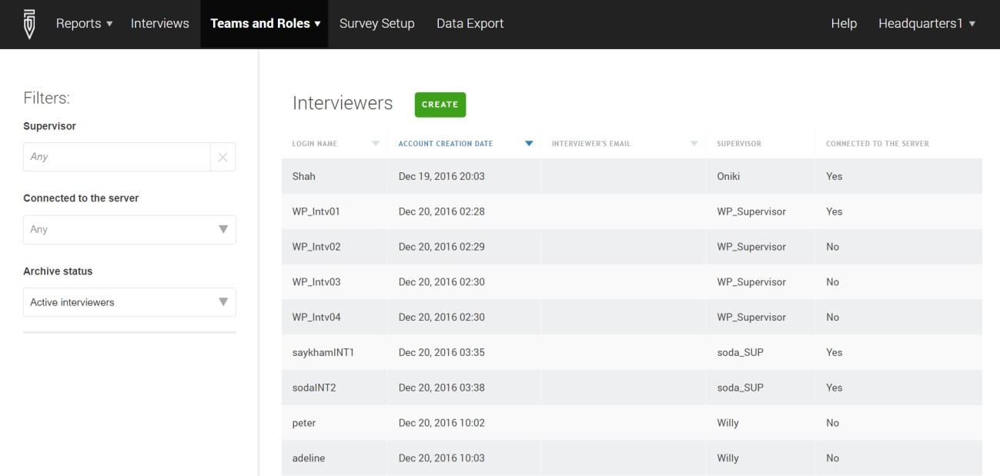
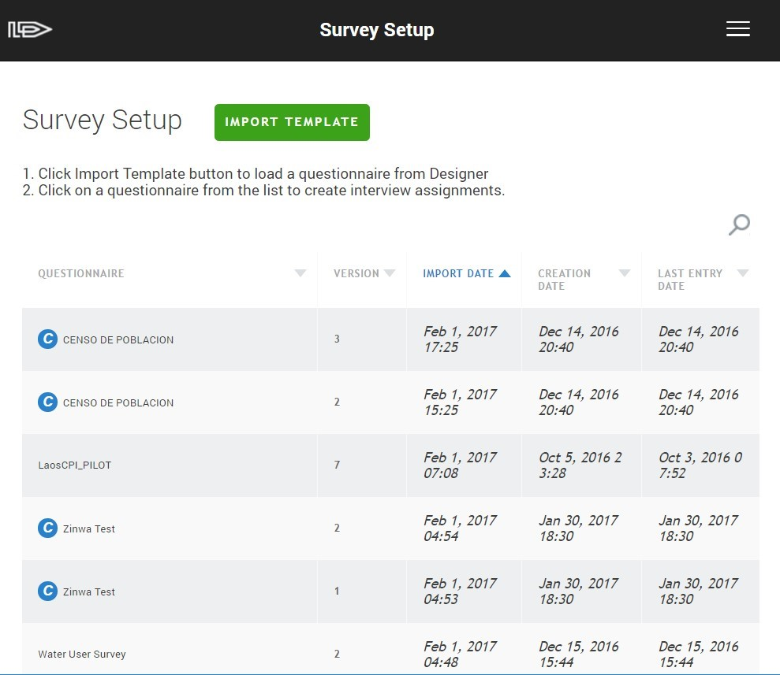

+++
title = "Version 5.17"
keywords = [""]
date = 2017-03-09T21:59:44Z
lastmod = 2017-03-09T21:59:44Z
aliases = ["/customer/portal/articles/2763003-version-5-17","/customer/en/portal/articles/2763003-version-5-17","/customer/portal/articles/2763003","/customer/en/portal/articles/2763003"]

+++

Version 5.17.0 released on Feb 1, 2017 contains improvements in the look
and feel of our software. In particular, we changed design of the
following pages of HQ/Supervisor application:

-   Survey Setup
-   Headquarters
-   Interviews
-   Observers
-   API-users

The update improves the appearance and user experience for the users of
different screens, from older low resolution devices, to modern high
pixel density screens.

The overall design is responsive to the environment of the browser, and
some elements may be collapsed or presented differently depending on the
screen size and device resolution, providing access to the same
functionality.

We are constantly listening to the feedback and suggestions from our
users. Many suggestions were voiced during our virtual user group
meetings and some have been implemented already. If you are thinking
about new functionality for Survey Solutions please use the following
feature request
[form](https://docs.google.com/forms/d/e/1FAIpQLSc7HFPVMEhmKf7E-GFlbBYhCConJtxhO4JSEnI1Pyujw-3nXg/viewform#start=invite)
.
