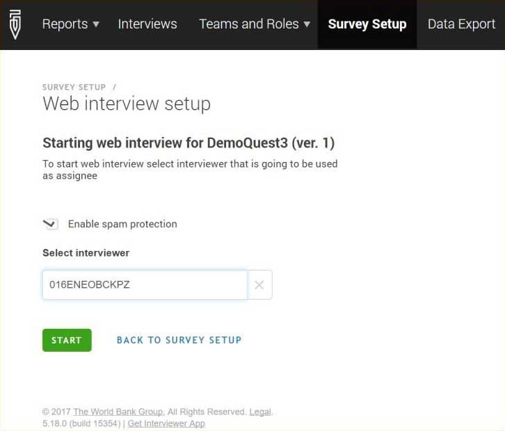
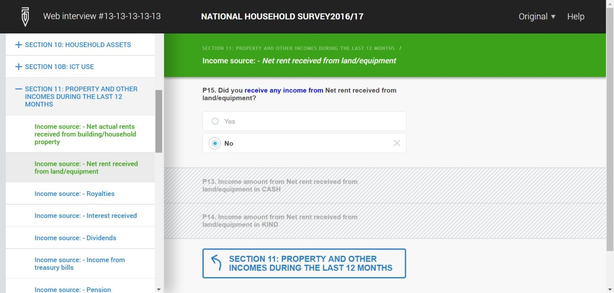
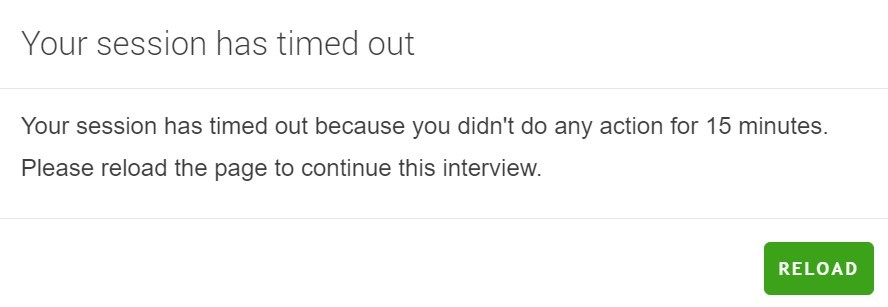
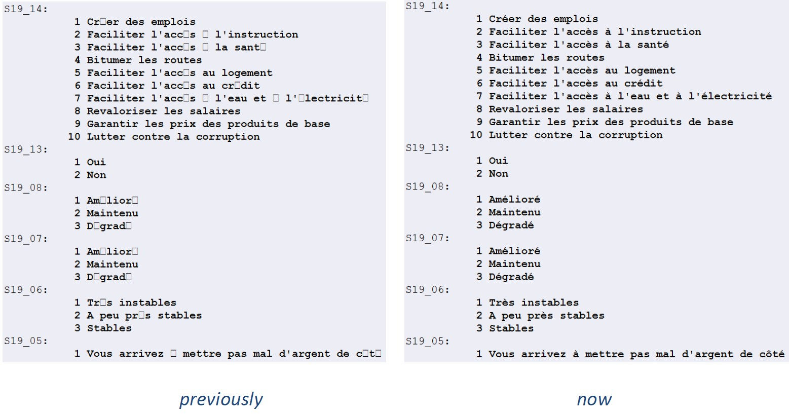

+++
title = "Version 5.18"
keywords = [""]
date = 2017-03-07T19:58:00Z
lastmod = 2017-03-07T19:58:00Z
aliases = ["/customer/portal/articles/2760551-version-5-18"]

+++

Dear friends of Survey Solutions,

Below is an overview of the new features added in version 5.18. This is
a major release with big changes compared to the previous versions, and
it also contains smaller fixes and improvements necessary to improve
reliability, stability, and security of our application. It is important
to be aware of the new features to utilize Survey Solutions to its full
potential:

-   web-interview mode;
-   export to Stata Unicode format (Stata 14);
-   User-requested feature: clickable GPS location;

3rd Survey Solutions Online User Group Meeting
----------------------------------------------

Tuesday, March 14th, 2017  
9:00 am | Eastern Standard Time (New York, GMT-05:00) | 1 hr Meeting
number (access code): 738 604 216 Meeting password: 6JjGtYHM

[**JOIN THE
MEETING**](https://worldbankgroup.webex.com/mw3100/mywebex/default.do?service=1&siteurl=worldbankgroup&nomenu=true&main_url=%2Fmc3100%2Fe.do%3Fsiteurl%3Dworldbankgroup%26AT%3DMI%26EventID%3D538762857%26UID%3D0%26Host%3DQUhTSwAAAAM0k73yorgG80QY-w9TG73oTlujpQXIq_p7tKNIM-7dEhiU745zW-z49Zo6E3IGuW_PTkl5HQePH3_zcxPzUGYD0%26FrameSet%3D2%26MTID%3Dmecfa1bc5d436c57667e30985f49a046e)

Feature request form
--------------------

This
[form](https://docs.google.com/forms/d/e/1FAIpQLSc7HFPVMEhmKf7E-GFlbBYhCConJtxhO4JSEnI1Pyujw-3nXg/viewform#start=invite)
can be completed before and after the meeting to suggest a new feature
for Survey Solutions.

### Web-interview mode

The new version of Survey Solutions extends data collection modes to web
surveys. The web survey mode allows collecting survey information
through web interviews (CAWI). Interviewers are not part of this mode as
the respondents are fully guided by the software, with which they
interact through the internet. This mode is most useful when the
respondents are not easily approachable, not known, or a face-to-face
interview can’t be easily scheduled. For example, a link to the survey
may be placed at a website, where cooperating visitors may follow this
link to get to the interview form.

Nothing special is required during the preparation of the questionnaire
to be applied in web-interview mode. In fact any questionnaire used
before may be imported and applied in web-interview mode, or a new
questionnaire may be created.

The designers of the questionnaires that will be applied in the
web-interview mode need to be aware of the following:

-   **self-enumeration:** the respondents will enter their information
    themselves without presence of the interviewer, hence navigation
    must be intuitive and clear;
-   **instructions and questions wording:** the respondent will not be
    trained on the survey and may need more instructions and
    explanations relatively to the interviewers that had had a training
    on the survey;
-   **error messages** must be clear, and give an indication of where
    the problem may be, and how it may be resolved;
-   **different presentation** of some question types in the web
    interview (for example, barcode reading);
-   interviews collected in web-survey mode **may not be rejected** back
    to the respondents.

#### Setting up Survey Solutions web-interview mode

Web-interview mode can be understood as an additional channel through
which interviews arrive to the system and extends Census mode.

On the Survey Setup page click on any survey that has been imported in
census mode and select *Web interview setup*. Then select an interviewer
from the list of existing
interviewers:

Enabling spam protection will help defend against robot-submitted data.
The interviewer that has been picked up at this point is not conducting
the interviews, but will receive any completed interview that has been
rejected by the supervisor. When the web-interview mode has been
started, a link will be shown, which can be placed on a public web page
or mass-mailed to potential respondents.

The web interview looks and behaves identical to the interview on a
tablet:

The respondents have to maintain internet connection while completing
the interview to allow the data to be submitted to the server. If the
interview process is interrupted for a prolonged period, the program
will freeze the interview and require the respondent to confirm when she
is ready to continue.

If the respondent needs to interrupt an interview for a longer time, and
close the program or restart a computer, she should retain her own
personalized interview link, which is created when she starts responding
to the questionnaire. This is displayed at the top of the page.

The data entered as part of the web-interview is sent to the server
immediately, so there is no *Save* action specifically required from the
respondent. But the respondent still needs to click Complete to signify
that there is nothing else she wants to add or change in the interview
and it may be sent for validation and processing.

#### Mixed mode of data collection

With introduction of web interview mode, Survey Solutions CAPI software
allows reaching customers not available for face-to-face interviews, but
it still allows the survey administrator to decide, which part of the
survey should be conducted in which mode. In some situations one may opt
for a fully face-to-face survey, while in others for a fully web
interviewing, yet in others a certain proportion of the interviews may
be collected using one instrument, and the rest using the other.

The mixed mode has many advantages, that our users will find useful. For
example, one may start with an attempt to conduct a face-to-face
interview, and upon a refusal offer the respondent to fill out a form in
the internet. The data coming from both channels will be absorbed into
the same database and exported as a whole, making it immediately
available for quality control, cleaning and analysis.

Some of our clients may be concerned about the effects that combining of
different instruments may cause. Recall, that the questionnaire is still
the same (unless another version has been created for web-interviewing
intentionally), which reduces the possibility for inconsistencies. But
web interviewing removes interviewer-effects and biases, which actually
may be desirable.

### Export to Stata Unicode format (Stata 14)

Starting with version 5.18 of Survey Solutions the data export to Stata
produces data files saved in the format introduced with Stata v.14. The
advantage of this format is explicit use of Unicode standard for string
data allowing storage of characters from Cyrillic, Thai, Chinese, Khmer,
and many other alphabets.

Even where the Latin alphabet characters were used, the users earlier
could see the missing characters instead of accented
letters:

No special action is required from the user to take advantage of the
benefits of the new format as new datasets will be saved into this
format automatically, but the users must be aware that Stata 14 will be
required to open datasets produced with Survey Solutions.

Newer format will also accommodate larger string content. The exact
limit depends on the type of characters/alphabet being used, but is at
least 500 characters.
