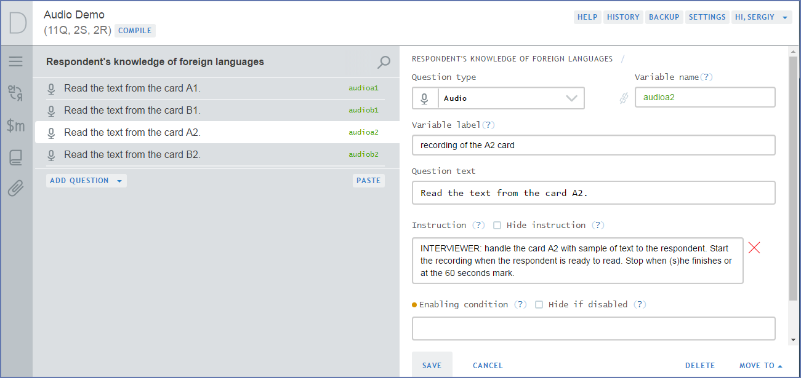
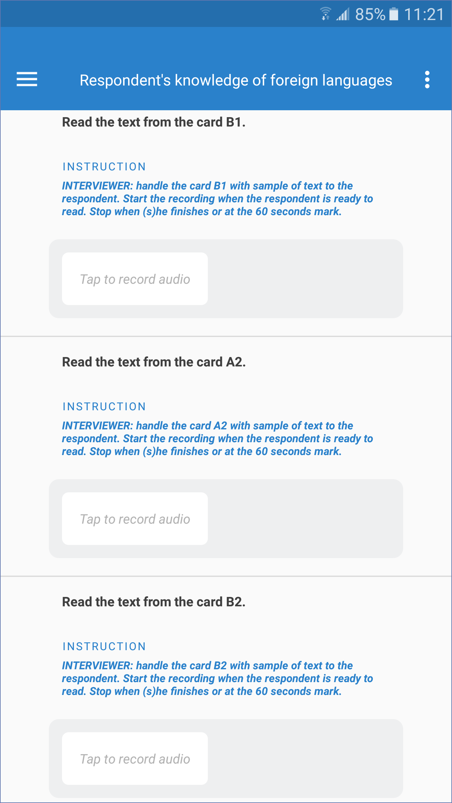
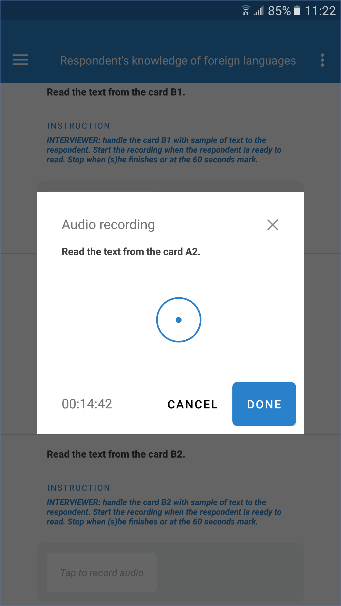
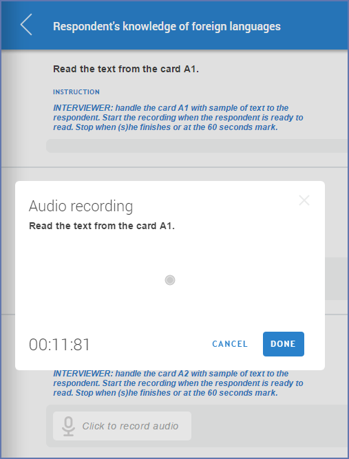
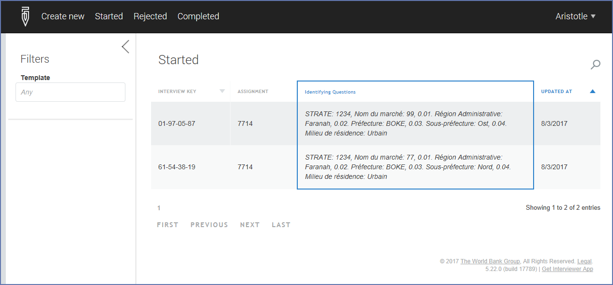

+++
title = "Version 5.22"
keywords = [""]
date = 2017-08-03T20:02:47Z
lastmod = 2017-08-03T20:02:47Z
aliases = ["/customer/portal/articles/2853037-version-5-22"]

+++

In
Survey Solutions v5.22 we have added access to server by interviewers, a
new question type (audio) and various other improvements.

Audio question
=======================================================================================================================================================================================================================================================

The
new audio question type has been added following the overwhelming number
of requests from our users, especially dealing with surveys in literacy,
education, and public opinion research. In these surveys the recording
of the respondent’s voice may serve quality control purposes or be
directly of interest to the researchers.

Audio
question allows recording sound (voice) of the respondent as part of the
interview using the tablet’s microphone. The recorded data is then
transferred to the server and exported as part of the binary data
export.

An
audio question doesn’t have any custom properties and can be added in
Designer by specifying an appropriate question type, text, variable name
and other common properties:

An
optional instruction may indicate how the interaction between an
interviewer and the respondent should proceed. As any other question,
audio question may be asked or skipped based on the internal logic of
the questionnaire, which is fully under control of the questionnaire
designer.

Audio
questions may only have one scope: interviewer.

On
a tablet the audio question is represented similarly to an image type
question, with the button which needs to be tapped to start
recording:

During
the recording, a timer and recording status are displayed. If necessary,
the recording can be deleted, and a new recording be made
instead.

Note
that the audio recording is activated by the interviewer, it is a
conscious action (commonly the consent of the respondent is also to be
obtained).

An
audio question can also be used in web interviews. Note that an audio
question has a 180 seconds limit on recording duration, and if the
recording is not cancelled at that time it will be saved automatically
replacing the previous answer for this question. For web interviews the
compression is performed on the server. All audio data is saved in the
AAC (advanced audio encoding) format into \*.[m4a
files](https://www.google.com/search?q=m4a).

Interviewer sign in to Survey Solutions
================================================================================================================================================================================================================================================================================

In
this version we have expanded the Survey Solutions server functionality,
which now allows interviewers to sign in using the same credentials as
on the tablet. Once signed in, the interviewers have access to
their:

-   Assignments;

-   interviews
    (started, completed and rejected);

-   Profile
    (counts of interviews and device description and
    status).

When
an assignment has been made to the interviewer, he can pull it out to
the tablet (just clicking the synchronization button), or start it as a
web-interview and complete it online. Interviews started online, may be
completed online or on the tablet after synchronization, but interviews
received on the tablet must be completed on the tablet.

Other changes and improvements
=======================================================================================================================================================================================================================================================================

-   Single-select
    cascading questions may now also use validation
    conditions;
-   Comments
    are now supported in web interviews and can be accessed from the
    question’s menu;

-   Interview
    key is now displayed throughout the whole system, including the
    tablet after the interview has been opened;

-   Images
    taken with the tablet’s camera are automatically proportionately
    resized to have longer side no longer than 1024
    pixels;

-   Language-switch
    icon was added to web interviews to signal the nature of the
    selection to international users.
