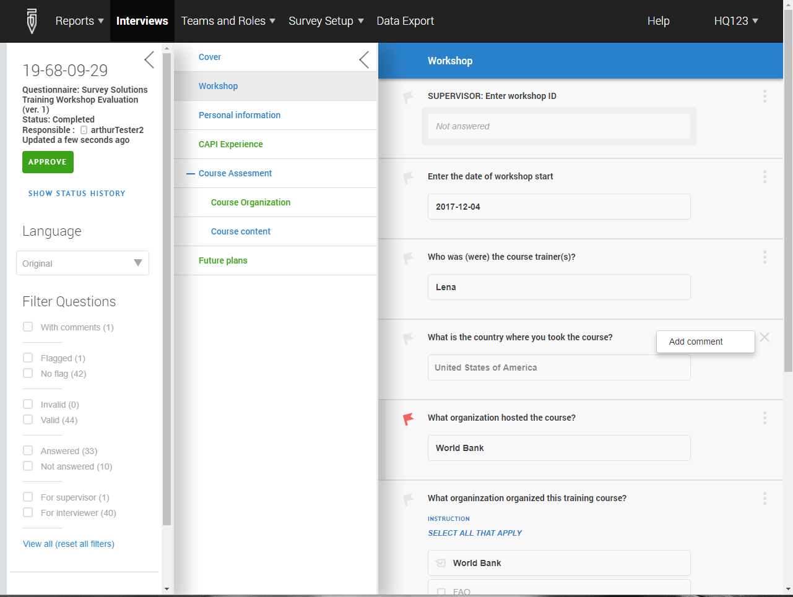
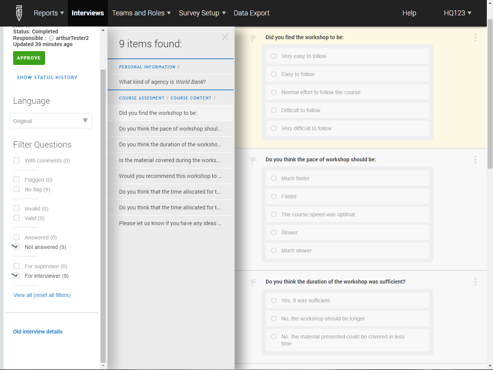
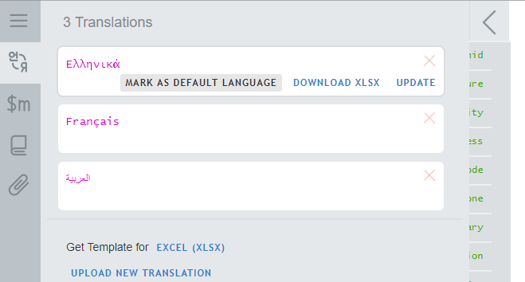
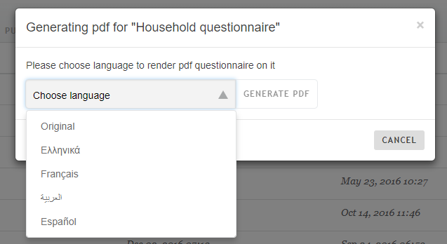
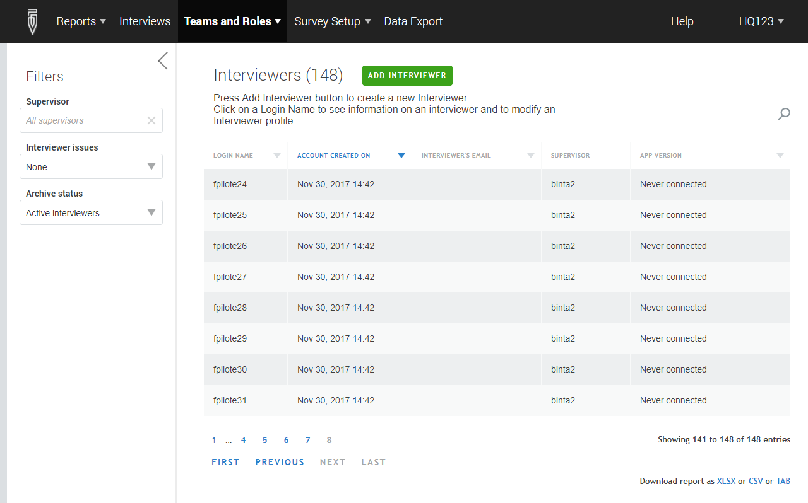
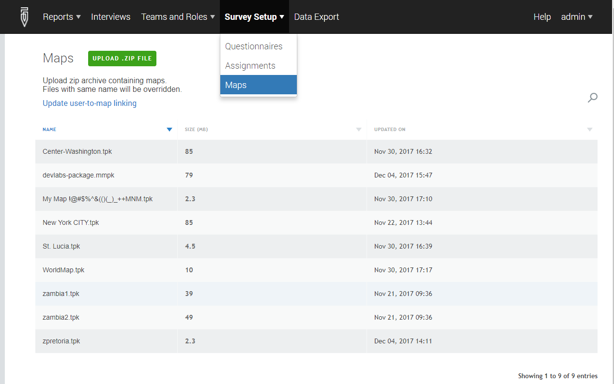
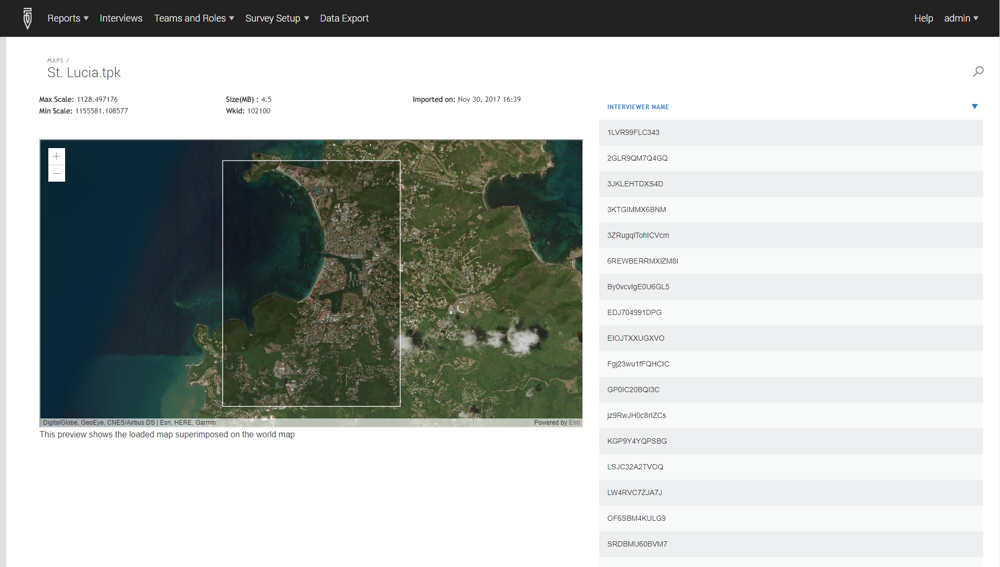
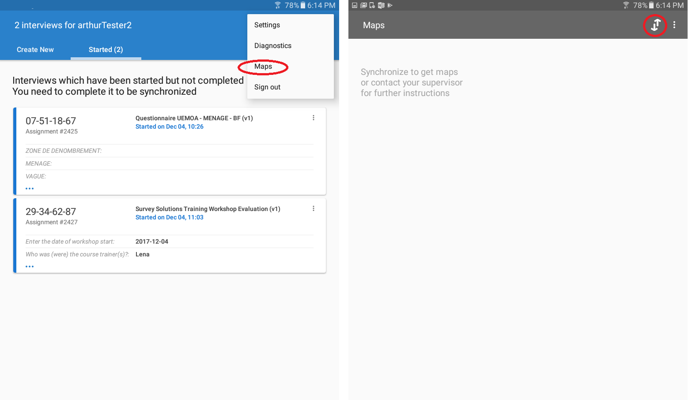

+++
title = "Version 5.25"
keywords = [""]
date = 2017-12-06T17:58:29Z
lastmod = 2017-12-06T17:58:29Z
aliases = ["/customer/portal/articles/2908701-version-5-25"]

+++

Dear Survey Solutions Users,

 

The December development sprint focused on improving the user experience
in several areas:

-   **Interview details interface.** More intuitive, the interface for
    reviewing interviews now matches that for completing them on the
    tablet and the web. More powerful, the interface features filters
    for quickly locating interview content of interest.
-   **Complete localization of the user interface.** All components of
    Survey Solutions—including Designer—have been translated into
    French, Russian, and Spanish. More languages are planned.
-   **Multi-language features.** For better multi-language
    documentation, the PDF export of questionnaires can created for each
    user-defined translation. For better ease of use in the field,
    survey coordinators may define the default language for a survey.
-   **Data export files.** To make data management easier, ID variables
    have been harmonized across all export files. To make survey
    management more powerful, new data files now exist to analyze data
    collection devices and interview errors.
-   **Folders on Designer.** To better organize public questionnaires
    for user learning, sharing of resources, and development and
    dissemination of standards.
-   **Managing and distributing maps.** New tools for headquarters to
    manage maps and distribute them wirelessly to interviewers.
-   **Admin auditing log.** Record of all the main actions on the
    server, identifying who made the action, and when. Examples include:
    importing a questionnaire on the server, initiating data, deleting a
    questionnaire, etc.

While new features typically do not interfere with old features,
sometimes there are exceptions. With this release, there are two such
features:

-   **New interview details interface.** By default, the new interface
    will be shown. If users are not ready for the new design, they may
    revert to the old design for now.
-   **New naming scheme for ID variables.** Because Survey Solutions
    expects the same type of files it produces, the changes is the names
    of variables names need to be taken into account by users uploading
    interview assignments.

Coming is another such feature. To make significant improvements to
responsiveness of the Interviewer’s user interface, especially for large
questionnaires (i.e., 800+ questions), we will be releasing an update.
In mid-December, we will be releasing this as a hotfix to the current
version, 5.25. To receive this hotfix, users need to write our support
team. In early February, we will be releasing this code as part of the
new version, 5.26. At that point, the update will be automatically sent
to all servers. Whenever this update is received, users will need to
update their tablets so their updated servers can talk to tablets with
updated software.

New Interview details interface
-------------------------------

To make reviewing interviews easier, the interview details view—that is,
the view Headquarters and Supervisors have of the full interview—has
been substantially improved in two ways.

First, the user interface has been redesigned to match that of the
Interviewer application. To make navigation intuitive, the interview
details view now has the same navigation pane as the Interviewer
application. Sections of the questionnaire listed on the left. Colors
indicate completion status of sections. And sections may be expanded to
navigate directly to sub-sections and roster rows. To make interview
content clear, the interview details view renders questions and their
answers just like the Interviewer application. In that way, Headquarters
and Supervisors users see what Interviewer users do. More than mere
aesthetics, this change reduces the training needed for Headquarters and
Supervisors to review interviews, since the user interface is
essentially the same as on the tablet.

Second, the user interface has been made more powerful by the
introduction of filters. In the left-most pane, Headquarters and
Supervisor users may filter interviews in order to focus on content of
interest by ticking on the corresponding box(es) (e.g., supervisor
questions, flagged questions that are also invalid, etc.). When used,
filters query the questionnaire for questions of interest, and yield a
list of results in the middle pane. Clicking on a result has the effect
of moving to that result and its context in the questionnaire.

Have a survey in the field right now? Inform field teams of the change,
and help them make the transition from the old interface to the new one.

Not ready for the update? No problem. The old interface can still be
used for the next few months. To revert to the old design, click on Old
interview details at the bottom of the left-most pane.

Complete localization of user interface
---------------------------------------

Previously, most parts of Survey Solutions were localized to other
languages. But there were a few gaps. Designer was not localized. For
some previously localized software components, like Headquarters, recent
development outpaced translation.

Now, every component of Survey Solutions speaks your language. With
version 5.25, all text in all software components—that is, in Designer,
Tester, Headquarters, Supervisor, and Interviewer—have been translated.

For the moment, the full interface has been translated for the following
languages:

-   French
-   Russian
-   Spanish

In future releases, there are plans to translate the interface fully
into these languages as well:

-   Arabic
-   Chinese

(A small technical note: for web-based software components, the
interface language follows web browser’s language; for tablet-based
software components, the interface language follows the device
language.)

Improvements to multi-language questionnaires
---------------------------------------------

Beyond localization, version 5.25 has made two more steps towards making
Survey Solutions even more multi-lingual friendly:

### Set default language in Interviewer

Previously, the multi-language features took the language the language
of a questionnaire’s design—that is, the language used to develop a
questionnaire in Designer—as the main language, and languages as
translations.

Now, the questionnaire designer can select the default language of
administration—that is, the language version that is shown when an
interview is opened in Interviewer. To mark a language as the default,
open the translations pane in Designer, hover over a translation, and
click on MARK AS DEFAULT LANGUAGE. To keep the language of design as the
default language, no action is required.

### Export PDF version of questionnaire into any questionnaire language

Previously, Designer produced a PDF version of the questionnaire only in
the language of the questionnaire’s design.

Now, users may select the export language for the PDF file form a
drop-down menu of translations defined for that questionnaire. To do
this, export the PDF as usual, select a language from the drop-down menu
of translations, and click on GENERATE PDF to download the file.

Folders on Designer
-------------------

Up until now, questionnaires have been a searchable list of documents.
With version 5.25, folders will be introduced for public questionnaires.

This is an exciting development, for several reasons. First, it
organizes questionnaires into thematic groups (e.g., questionnaires from
YouTube videos, questionnaires for learning features, examples of
questionnaires deployed by users).

Second, and perhaps more exciting, is that folders will allow the Survey
Solutions community to share resources and establish standards. Examples
include national or international classification systems (e.g., ISIC,
ISCO, COICOP, etc.); questionnaires that reflect regional or
international standards (e.g., WAEMU’s Harmonized Household Living
Standards Survey, OECS’ Labor Force Survey, FAO’s Forestry Module,
etc.); and questionnaires that showcase features and common or complex
validations (e.g., checking that the household head and son/daughter
have an appropriate age differential, lookup tables to evaluate unit
prices, etc.).

But these are simply examples. To make this content most useful, we ask
our users to write us with ideas and with content to share. To do so,
please write us at <support@mysurvey.solutions>.

In future releases, folders may be expanded to help users with file
management. In the near future, all users will have a Shared with me
folder that captures all questionnaires developed by other but shared
with users.

Export files improved
---------------------

Version 5.25 contains several improvements to export data files.

(Note: users with code that creates assignment files will need to update
that code to ensure that those files contain the new variable names
Survey Solutions now expects.)

### Identifiers have fixed, descriptive names

Data files have been revised in two ways. First, identifiers have the
same name in every file in which they appear. The household identifier,
for example, has the same name in all files that contain it.

Second, identifiers take on the name of object they identify. If the
household member roster is called hhroster, for example, then its
identifier is named hhroster\_\_id.

The new naming scheme is as follows. The main case identifier is
interview\_\_id. The case identifier for roster rows is the roster
variable name plus \_\_id– for example, a roster with the roster
variable name agParcels would have a roster row identifier named
agParcels\_\_id.

### Case identifiers appear in all files

To facilitate merging, the following case identifiers appears in every
export file:

-   interview\_\_id
-   interview\_\_key

The variable interview\_\_id corresponds to the 32-character
system-generated identifier previously captured in Id in the main data
file. The variable interview\_\_key corresponds to the short, more
user-friendly identifier for tracking interviews in Headquarters,
Supervisor, or Interviewer applications.

### Interview attributes exported to the main data files

Previously, the status of surveys and their data have been separate
entities. To see status, one needed to consult interview reports (or
find a case in the interview\_actions export file). To analyze data, one
needed to export data.

Now, the export files contain two variables that provide a useful bridge
between survey management and data analysis. In the main data export
file, users will find the following variables:

-   interview\_\_status
-   has\_\_errors

The interview\_\_status variable corresponds to the status in the survey
management system (e.g., Completed, ApprovedBySupervisor, etc.). The
variable has\_errors captures whether the interview contains any
validation errors—1 if so; 0 otherwise.

New export files
----------------

With version 5.25, we have continued implementing the following data
policy: if Survey Solutions captures or displays it, Survey Solutions
should also export it. That way, users can use all the rich data we
capture, and conduct analyses that go beyond what the current user
interface allows.

With that in mind, two new data files are now available for export:

-   Interviewer/device information
-   Interview errors

### Interviewer/device information

Previously, Survey Solutions collected summary information on
interviewers, and detailed data on the devices they use (e.g., Android
OS version, battery power, speed of connection on last sync, etc.). The
interviewer information was available on Teams and Roles &gt;
Interviewers. The detailed device and sync data could be seen on that
interviewer’s profile page.

Now, Survey Solutions combines those two reports into a single,
exportable one. To export that report, navigate to Teams and Roles &gt;
Interviewers, scroll to the bottom of the screen, and click the desired
file format.

Note: creation of the export file may take some time when there are a
large number of interviewers, since the export file is constructed from
interviewer attributes and the details of the device’s last known
status.

### Interview errors

Previously, validation errors were visible in a few ways. First, users
could see them upon manual review of interviews. Second, advanced users
could see them in the paradata.

Now, the interview\_\_errors contains a compilation of all validation
errors. Following the structure of the interview\_comments file, the
interview\_\_errors allows the user to link validation errors back to a
particular validation for a particular question (in a particular roster
row) in a particular interview. To allow this linking, the file contains
the following information:

-   **variable**. The name of the object to which the validation error
    is linked.
-   **type**. The type of object to which the validation error is
    linked: 1=Roster, 2=Question, 3=StaticText, 4=Variable.
-   **roster**. If the error occurs outside of a roster, this column
    will be blank. If the error occurs in the roster, the column will
    contain the roster variable name for the roster where the error
    occurs.
-   **interview\_\_id**. The identifier of the interview.
-   **id1**. The identifier of the top-level roster instance. The value
    communicates both the name of the roster and the row. If the roster
    is named myRoster, then the value for row two is
    myRoster\_\_id\[2\].
-   **id2**. The identifier for the second-level roster instance.
-   **id3**. The identifier for the third-level roster instance.
-   **message\_number**. The validation error number in Designer.
-   **message**. The string error message (without text substitution)
    that is displayed.

This data could aid survey manager is in identifying the most frequent
validation errors, overall and/or by team. A boon for active survey
management.

Manage distribution of maps
---------------------------

Earlier, Survey Solutions’ area questions required maps to be
side-loaded to a particular folder on each deployed tablet. This process
for map distribution, to say the least, is tedious and error prone.

Now, Survey Solutions allows survey managers and interviewers alike a
user-friendly for map management—for assigning maps to interviewers and
for downloading maps to tablets, respectively.

### Assign maps to interviewers

Map assignments, like all other assignments made on Headquarters, are
part of survey setup.

To make assignments, follow these simple steps:

-   **First, log into Headquarters.**
-   **Then, upload maps to the server.** Click on UPLOAD .ZIP FILE.
    Select a zip archive containing one or more maps.
-   **Next, assign maps to users.** Click on the Update user-to-map
    linking. Upload a tab-delimited file that assigns one or more maps
    to users. 

For any given map, the survey manager may preview the map on
Headquarters, and see the users to whom it is assigned

### Receive maps on tablets

Map assignments, like all other interviewer assignments, must be
downloaded via synchronization. Because map assignments are special (and
may contain very large files), their synchronization has a special
screen and special process that is separate from typical
synchronization.

To download assigned maps, follow these steps:

-   **Open the Interviewer application**
-   **Navigate to the map synchronization screen.** From the Interviewer
    dashboard, tap on the overflow menu. Then, select maps. From the
    maps screen, tap on the sync button.
-   **Wait for maps to download.** Because map files may be quite large,
    it is strongly advised that map synchronization be done in the head
    office before deployment to the field.

Other improvements
------------------

In addition to the big-ticket items above, version 5.25 contains several

-   Answers to area questions—that is, the map and user-sketched
    boundary—can be seen on web interview and interview details.
-   Interview\_actions contain two new actions: paused and resumed.
    These actions allow survey managers to compute more precise
    estimates of interview duration. The paused action occurs when an
    interview is closed or the tablet goes to sleep (or after 15 minute
    timeout for web interview). The resumed action occurs when an
    interview is reopened or the tablet wakes up (or when the page is
    reloaded for web interview). Duration reports in Headquarters do not
    yet use these actions for improved interview duration estimates.
-   Audit log, available to server admin users, lists all actions taken
    on the server, and their timestamp.
-   Bug fixes and performance improvements
