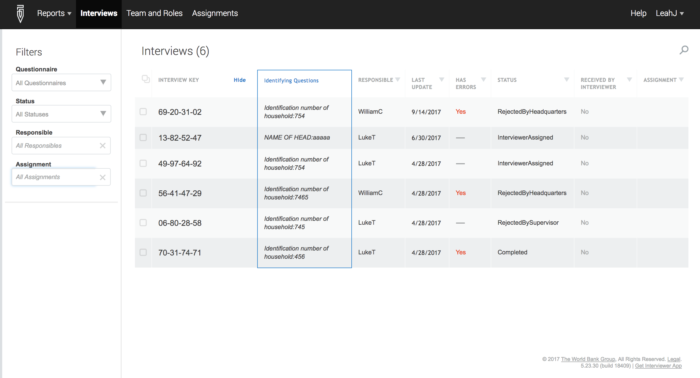
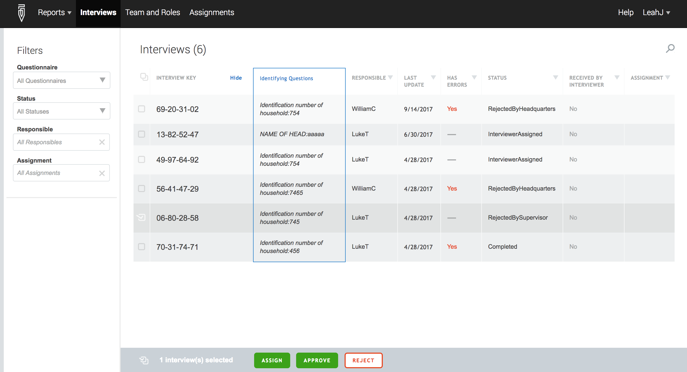
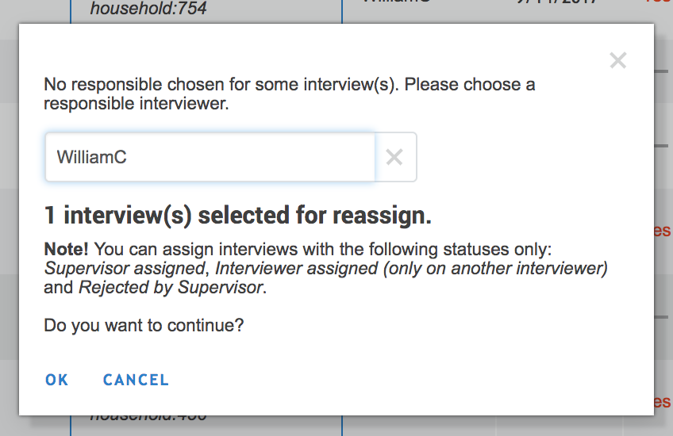

+++
title = "Reassign an Interview"
keywords = [""]
date = 2017-09-20T20:44:49Z
lastmod = 2017-09-20T20:44:49Z
aliases = ["/customer/portal/articles/2877883-reassign-an-interview"]

+++

To begin, click on the Interviews tab at
the top of the screen**.**The supervisor application will then show the
full list of interview cases.   
  
 

Cases to be reassigned to another interviewer
---------------------------------------------

  
You may need to change survey case assignments because of interviewer
job performance issues, illness, and management of the team’s workload.
For example, reassigning a survey case from an overloaded interviewer to
an interviewer that has time.  
  
The protocol for changing assignments vary depending on the interview
status.  There are three possible scenarios:  
 

1.  To change the allocation of assignments that have not yet been
    synchronized with interviewer’s tablets, do so under the
    [assignments tab](/supervisor/distribute-an-assignment).
2.  To change the allocation of assignments that have been synchronized
    with interviewer’s tablets, follow the steps outlined in the
    [Distributing Assignments](/supervisor/distribute-an-assignment)
    article. You will then be prompted to confirm the change in
    assignments. Note that any data collected for these cases by the
    former interviewer will be lost. 
3.  To change assignments of completed interviews, select the interviews
    you want to reassign by clicking the checkbox. Reject these
    interviews by pressing *Reject* button on the toolbar, then reassign
    the interviews to another interviewer. To reassign the case, select
    the check box to the left of the survey case(s), then click on
    *Assign* and select an Interviewer from the pop-up menu.   
       
      
    Another similar scenario where this protocol can be applied is
    when the first interviewer has opened a number of assignments and
    needs the second interviewer to finish them, he/she should mark them
    as completed (even they are only partially filled out) and let the
    supervisor know to reject them to the second interviewer. In that
    case the data already collected to date will flow over to the second
    interviewer.

 

    
--
