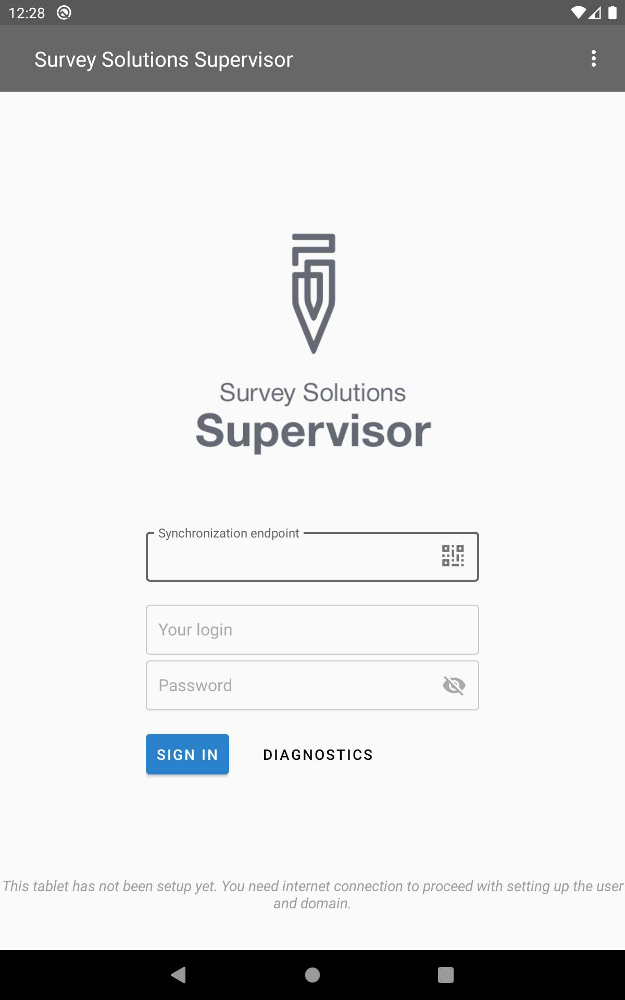
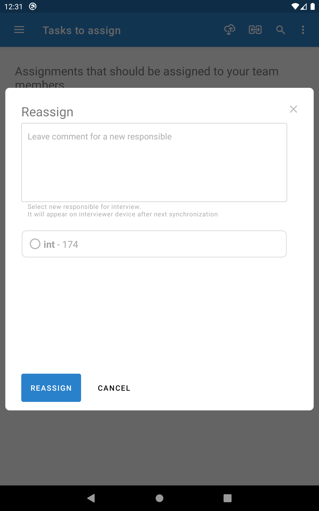

+++
title = "Supervisor App"

keywords = ["supervisor","app"]

date = 2019-08-28

+++

The Survey Solutions Supervisor App
===========================================

The Survey Solutions tablet supervisor app opens a possibility for the in-field supervision 
without the need to utilize the internet.

A common use scenario is when a team of interviewers along with the supervisor work in a 
remote location for a prolonged time and no communication possible to exchange the data with 
the server. At the same time it is still desirable for the supervisors to control the work 
of his team. The app allows them to

  - distribute assignments between the interviewers in that area;
  - review and comment the incoming interviews;
  - answer supervisor questions;
  - make a decision to approve or reject the completed interviews;
  - collect and store the interviews completed by all the members of the team, synchronize
  them with the server in a single synchronization session;
  - distribute the updates of the Interviewer application to the interviewers.

Importantly the supervisor app is working with the data stored on the supervisor tablet and 
does not require internet connectivity for the above functionality. Only synchronization with 
the server of the supervisor app requires the internet connection.

Communications
----------------------

 **Vertical synchronization:** the supervisor tablet 
must be connected to the WiFi or 3G or similar connection to the Internet to exchange the 
data with the server.

**Horizontal synchronization:** the tablets rely on the 
[Bluetooth](https://en.wikipedia.org/wiki/Bluetooth) and [WiFi-Direct](https://en.wikipedia.org/wiki/Wi-Fi_Direct)
technologies to find each other and exchange the data between themselves. Both are short-range 
communications, meaning the tablets must be in close proximity (meters away) to each other. 
During the horizontal synchronization the connection to other networks will be switched off 
(this may disconnect other applications installed on the tablet from the Internet) and such 
connection may be reinstated by Android automatically once the Survey Solutions 
synchronization is completed.

Installation
--------------------------
The supervisor app has the same hardware and software requirements as the interviewer app, so the
same tablets may be used for both interviewers and supervisors. Yet the work load on the supervisor
tablet may be larger, and with large amount of assignments/interviews the memory capacity of the
tablet becomes critical.

To acquire the app the supervisor should:

  1. While connected, e.g. in the office, start the browser and proceed to the page corresponding
  to the synchronization point, such as https://demo.mysurvey.solutions .
  2. Login into his account with the supervisor credentials.
  3. Click on his name in the right corner and select 'Download supervisor app', wait for the
  download to complete and start the installation.
  4. Confirm the security settings if prompted.

Note that the supervisor app will accumulate data from multiple tablets, and will need to also
carry the interviewer app to be distributed as updates to the interviewers. Thus the storage space 
consumed by the supervisor app is bigger than the interviewer app. Have at least 2GB free space 
when you install it and watch the available space closely as the survey progresses.

Initialization
----------------------------

After the supervisor app is successfully installed and while still connected to the internet:

  1. the supervisor should login with his supervisor credentials; one can utilize the QR-code
  displayed on the download page to quickly enter the address of the synchronization point;
  2. each interviewer in his team should uncheck 'Allow synchronization with Headquarters' in
  the Interviewer app settings;
  3. the supervisor app must be synchronized with the server (vertical synchronization).
  4. in the supervisor app activate the synchronization with tablets (horizontal synchronization)
  in the supervisor app;
  5. synchronize all the interviewers tablets with it one by one.

After the synchronization of the interviewer tablet with the supervisor tablet is successfully 
completed, the interviewer has no way of returning back to direct communication with the server. 
This flag will remain disabled in the Interviewer app settings after the first successful 
synchronization.

Supervisor App Functionality
-------------------------------------

The supervisor app provides the following menu choices:

**Tasks to assign** -- shows the list of assignments received from the HQ that need to be
distributed between the interviewers of the team. The assignments are represented as cards with
identifying information and the <ASSIGN> button, after clicking which the supervisor can select
the name of the interviewer to complete the assignment.

**Waiting for your action** -- completed interviews received from the interviewers will be shown 
on this page, each represented by a card with the 'OPEN' button. After reviewing the interview
the supervisor can 'APPROVE' or 'REJECT' it.

**Outbox** -- shows the page with the list of the assignments/interviews which have been processed 
by the supervisor and awaiting the synchronization with their recipients.

**Sent to interviewer** -- shows the interviews and assignments that have been already received 
by the interviewers.

Color coding
------------------

The following colors are used to highlight the sides of the cards in the interface:

  - **Gray** - for new assignments;
  - **Green** - for completed interviews received by the supervisor;
  - **Red** - for completed interviews rejected back to an interviewer;
  - **Cyan** - for completed interviews approved and awaiting synchronization to the server (HQ).
  

Reviewing interviews
------------------------

Interviews that have been submitted by the interviewers to the supervisor can be found seen at the 
'waiting for your action' page. The supervisor can view the interview details in exactly the same 
presentation as the interviewers see on their tablets. During the review the supervisors may leave 
comments to any questions and answer supervisor questions. Supervisors can't change other
(non-supervisor) questions.

The supervisor can open the interview many times and switch between multiple interviews before
making a decision on whether to approve or reject an interview.

If the supervisor rejects an interview to the interviewer and it's picked up, the supervisor still 
has access to the interview details and may continue reading the interview information with the 
understanding that it is potentially being modified at the same time by the interviewer.

Commentaries
-------------------

The supervisor app shows all the commentaries in the chronological sequence of how they were left 
by the users.

Bypassing the supervisor
----------------------------

A direct assignment by the HQ users to the interviewers is possible even when the interviewer is 
synchronizing with the supervisor app. In such a case the interviewer receives the assignment 
after the following three actions are completed in this order: assignment is made by the HQ, 
supervisor synchronizes, interviewer in question synchronizes.

Reassignment
------------------

Reassignment is possible in the supervisor app. But it is important to coordinate the actions 
between the original and the new responsible interviewers to avoid duplicate interviewing. Make 
sure the original interviewer synchronizes after reassignment and before the second interviewer, 
so that his responsibility is taken off from him before the work starts.

Synchronization
-------------------

During vertical synchronization the program is blocked and awaits for the synchronization to 
complete. During the horizontal synchronization the supervisor app keeps waiting for other 
tablets to connect, so that multiple interviewers can send data to the same supervisor at 
the same time.

Limitations
----------------------

The first version of the offline supervisor app addresses the most common tasks of our users 
working in remote areas without coverage. We had to forgo some of the online supervisors' 
functionality, which may be re-introduced at a later point. For the moment the offline supervisor 
does not contain any equivalent of the:

  - team display;
  - interviewer profiles and accounts management;
  - supervisor's reports;
  - interview history display;
  - flagging of questions;
  - own account management.

Updates
-------------

The Supervisor App will receive all the updates from the server. We recommend to always update 
the Supervisor app immediately as the updates are received.

The interviewers working with the supervisor will see the updates during synchronization with 
the supervisor. Receiving updates in this way doesn't consume additional traffic on the 
3G network, which supervisor utilizes and all the interviewers can be updated with the same 
package.

For consistency we recommend to update all interviewers at the same time and as soon as 
possible after the supervisor receives the update.

Common use scenarios and ideas
----------------------------------

We have anticipated that the offline supervisor app would be useful for the following common 
situations:

  1. **Distributions of assignments** -- the team is working in the remote area without 
  connection and the distribution of the assignments between the interviewers may be done 
  only in the area, hence the interviewers can't travel with the assignments pre-synced 
  to their tablets.
  2. **Replacements** -- the issuance of the replacement assignments in the remote areas 
  where the number of replacements is limited (e.g. 3 replacements for 12 households in EA)
  and it is not a priori known which interviewers will need replacements.
  3. **Courrier function** -- the supervisor accumulates all completed interviews in his 
  tablet, so that he can travel alone from a remote to the connected area and synchronize 
  all of the completed interviews while the interviewers work on the next batch.
  4. **Partial synchronization for backup purposes** -- the supervisor receives and 
  immediately rejects interviews back to the interviewer, retaining a snapshot of the 
  interview for the cases when the interviewer device is lost, stolen or permanently 
  damaged.
  5. **In-field review** -- when the feedback of the supervisor is critical to continue 
  the interviewing process. For example, to check whether the enterprise was classified 
  correctly as manufacturing enterprise, not services in an enterprise survey, or that 
  the household is classified correctly as eligible for survey, based on the initial 
  screening questions.
  6. **EA completion** -- making sure that all the data is collected and all the issues 
  are resolved before the team leaves the EA.
  7. **Traffic saving** -- utilizing short-range wireless communication for direct transfer 
  between Survey Solutions devices in the remote area. Customers synchronizing over 
  satellite modems save on the satellite data costs because the traffic is not consumed for 
  the reviewing purposes, updates of Survey Solutions interviewer app is downloaded only 
  once per team and other apps installed on the interviewers' tablets are not receiving 
  updates.
  8. **Control over the traffic** -- the whole data traffic to the Internet is happening 
  through the supervisor device, so individual interviewers' tablets do not need access 
  to the internet and can thus achieve better security.

Caution!
--------------

The interviewers that have switched to the synchronization with the supervisor app can not
return to the original mode of direct synchronization with the server. For that the whole
team needs to finish the work taken offline and synchronize to the server (so that all of
their dashboards are empty). After that the applications may be cleared and reinstalled.

If the supervisor app is uninstalled or its data cleared using the Android OS, all the
data stored in the supervisor tablet will be irrecoverably lost.

The same will happen if the supervisor tablet is lost, stolen or destroyed.

Synchronize the supervisor tablet to the server whenever the opportunity arises to secure 
the collected data!

Relinking the interviewer tablets working in the synchronization mode with the offline
supervisor may lead to undesirable consequences, as the supervisor app knows nothing about 
the relinking happened on the server.

Interviewer tablets synchronizing data through the supervisor app will not receive operating 
system patches and updates and prolonged work with no updates is undesirable for security 
reasons. Periodically connect interviewer tablets to Internet when opportunity arises to 
allow them receive updates for the OS and other installed applications.

The Supervisor app is actively developed at the moment. If you have interesting ideas or
suggestions, feel free to post them to our user forum: https://forum.mysurvey.solutions

The original 2018-article announcing the Supervisor App is linked [here](announcement).