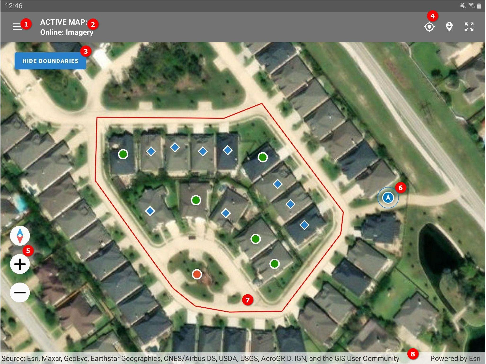
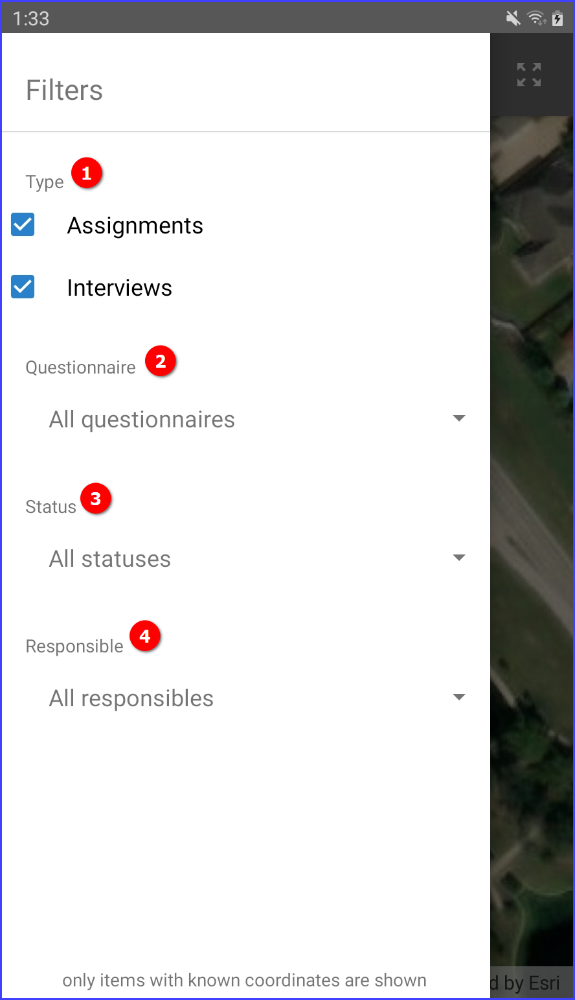
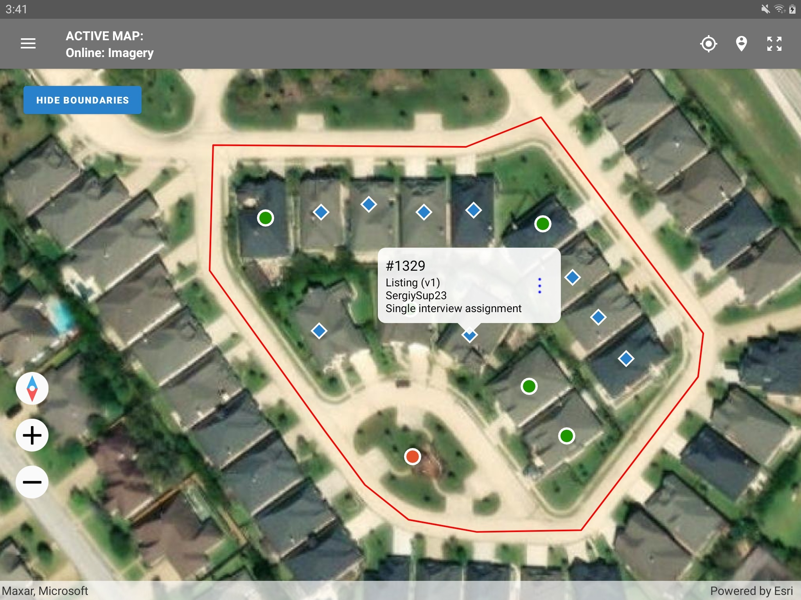
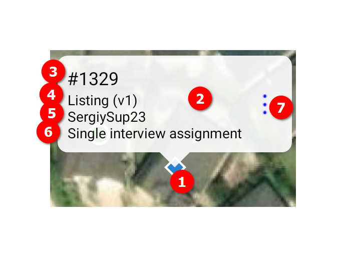

+++
title = "Supervisor: Map Dashboard"
keywords = ["supervisor"]
date = 2023-04-18T00:00:00Z
+++

#### Map dashboard elements

1. Access map filters.
2. Set up active map.
3. Overlay or hide a shapefile boundary.
4. Show current location / navigate to extent of the data / navigate to the extent of the map.
5. Control map zoom level and rotation.
6. Current location of the supervisor.
7. Map area with markers corresponding to assignments and interviews and overlayed boundary file.
8. Status line indicating source of the map data.

#### Active map and boundaries

An active map can be an online or offline map source. The following online maps are available:

- Online: imagery;
- Online: imagery with labels (English only);
- Online: open street maps (OSM, with labels in local language based on location)
- Offline: World Map (this low resolution map is installed automatically with the app);
- Offline: Other user-uploaded maps in supported raster [map formats](/headquarters/mapsmanage/map-formats/).

The boundaries are uploaded to the Headquarters as shapefiles. They can then be assigned to 
interviewers or supervisors.

While the supervisor map dashboard may utilize online map sources for displaying the background 
map layer, the key advantage is that the supervisor may also utilize offline maps acquired from 
the data server (Headquarters) similar to how it is done by the interviewers for answering the 
geography-type questions or for their own map dashboards. This allows the Supervisor App to be 
autonomous from the internet connectivity and work in the areas where it is sporadic or not at 
all available. For that, the supervisor is given access to all the maps that are assigned to 
any of her interviewers (note, this could be a very sizeable amount of data for download, be 
careful with downloading over metered connection!) and further maps can now be assigned to 
supervisors directly. All of the offline maps the Supervisor App receives during the 
`maps synchronization` process, which is different from `data synchronization` process, and 
need to be performed in the `Maps` menu.

#### Map dashboard filters

1. Type of documents to show on the map dashboard - select assignments, or interviews, or both.
2. Select a questionnaire to restrict to assignments/interviews in that survey only or select "All questionnaires" to not filter by questionnaire.
3. Select status of interviews to be displayed on the map dashboard (this filter is not applied to assignments, since they don't have a status).
4. Select person responsible for the interview/assignment (single select from all team members including the supervisor).

The status in filter 3 can be any one of the following:

  - All statuses;
  - Created;
  - Interviewer assigned;
  - Restarted;
  - Rejected by supervisor;
  - Completed;
  - Supervisor assigned;
  - Rejected by headquarters.

Note that the map only shows items with known coordinates (from a survey with an identifying GPS question, which has been answered).

#### Map markers 

The map dashboard is not just reporting instrument for the supervisor, but is an active environment 
for conducting common supervisory tasks. Clicking on a map marker brings a balloon with the 
information corresponding to the selected assignment or interview:

1. Map marker
2. Balloon
3. Assignment number
4. Survey questionnaire and version
5. Name of responsible
6. Assignment size
7. Action button (reassign).

#### Map actions

- ***change responsible for an assignment***: the supervisor can click the `reassign` action 
(3-dots icon) in the balloon to access the reassign dialog and then specify the new responsible 
team member (which could be an interviewer or the supervisor herself).

- ***reading incoming interviews***: the supervisor can click on a particular interview and 
select the `open` action (blue dot icon) to view the content of that interview directly from 
the map dashboard. When the interview is open, the supervisor can further:
  - ***making a quality control/workflow decision***: select the action to `approve` or `reject` 
it in the `resolve` section. 
  - ***reassign interview to a new responsible***: which could be another interviewer 
or the supervisor herself.

Note that the `open`, `approve`, and `reject` actions are only applicable to interviews 
and not available for assignments.

