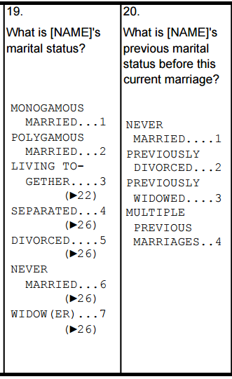
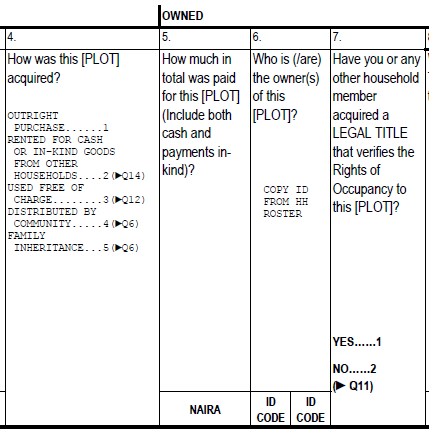
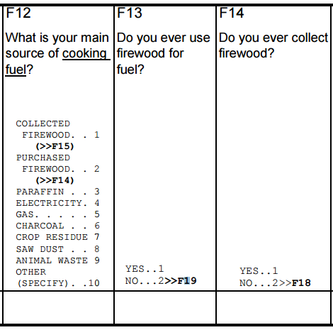
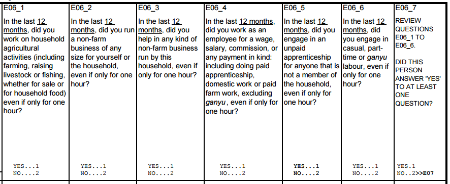

+++
title = "Syntax Guide: Single-select questions"
keywords = ["syntax","single select"]
date = 2016-11-17T19:31:25Z
lastmod = 2016-11-17T19:31:25Z
aliases = ["/customer/portal/articles/2646959-syntax-guide-single-select-questions"]

+++

Common tasks
============

The section below lists the common tasks, and the elements of the syntax
for accomplishing them.

Comparison to a value
---------------------

-   [Relational Operators](/syntax-guide/syntax-guide-operators)
-   less than, greater than, equal to, etc.

Comparison to a range
---------------------

-   [InRange.](#InRange) Checks if the selected answer falls within a
    range of user-specified values.

Comparison to a list of values
------------------------------

-   [InList](#InRange). Checks whether the selected answer is among the
    set of enumerated values.
-   [IsNoneOf](#IsNoneOf). Confirms that the selected answer is not
    among the set of enumerated values.

Count the number of values
--------------------------

-   [CountValue](#CountValue). Counts the number of times a specified
    value is recorded as the answer to the set of enumerated questions.

Syntax explained
================

InRange
---------------------------------

### Syntax

    singleSelect.InRange(a,b)

### Description

Checks if the selected answer falls within a range of user-specified
values. Returns *true* if

    a ≥ singleSelect ≥ b

. Returns *false* otherwise.

 

### Example

For numeric questions, InRange was a convenient way to determine whether
a value fell within a well-defined interval. For single-select
questions, the same is true. But the use case is for identifying the set
of ajacent answer options that map to a certain survey behavior, for
example a skip.

Consider the set of questions below.

For certain marital statuses, there is a follow-up question. For others,
no such follow-up question is administered.

        // administer B20 when the household member is married (i.e., answer 1 or 2 to B19)
    hh_b19.InRange(1,2)

When answer 1 or 2 is selected in B19, the question B20 is enabled. When
any other answer is provided for B19, question B20 is disabled.

InList
-------------------------------

### Syntax

    singleSelect.InList(a,b,c,...)

### Description

Check if the selected answer is part of the set of enumerated values.
Returns *true* if

    singleSelect ∈ {a,b,c,...}

. Returns *false* otherwise.

 

### Example 1: Where InRange would also work

See the example in the InRange section above. This could also have been
done with InList.

        // administer B20 when the household member is married (i.e., answer 1 or 2 to B19 hh_b19.InList(1,2)

When the number of values in a range is small, InList may be roughly as
effective a solution as InRange. When the number of values in the range
is large, InRange is the better solution.

### Example 2: Where InList is the better choice

While InList and InRange may sometimes be used interchangeably, there
are moments when InList is the clear choice. See the excerpt below for
such an example.

Let's describe the conditions under which question 6 is answered. If the
interviewer records option 1 for question 4, then question 6 is asked.
If options 4 or 5 are recorded, then question 6 is also administered.
Otherwise, the interviewer skips to later questions. To summarize, then,
question 6 is enabled when options 1, 4, or 5 is recorded. Or, in code:

        // enable question 6 when answer is 1, 4, or 5 is chosen for question 4
        ag_q4.InList(1,4,5)

IsNoneOf
-----------------------------------

### Syntax

    singleSelect.IsNoneOf(a,b,c,...)

### Description

Checks that the selected answer is none of the listed values--in other
words, is not part of the set of
enumerated values. Returns *true* if

    singleSelect ∉ {a,b,c,...}

. Returns *false* if singleSelect ∈ {a,b,c,...}.

 

### Example

Often, it is easier to say what should not be, rather than what should
be. Consider the following example. Follow-up questions about firewood
use are asked only if the household does *not* use firewood as its main
source of cooking fuel.

Certainly, one could write the following enablement condition,
identifying which answers lead the interviewer to F13.

        // enable F13 if one of these answers selected for F12
        self.InRange(3,10)

However, it may be more efficient, more compact, and more readable to
write which answers will disable F13.

        // enable F13 if no firewood option is chosen for F12
        self.IsNoneOf(1,2)

CountValue
---------------------------------------

### Syntax

    CountValue(a,singleSelect1,singleSelect2,...)

### Description

Counts the number of times the value a is selected in the set of
enumerated variables (i.e., singleSelect1, singleSelect2, ....). Returns
the number of occurrences (as a long). Returns 0 if the value does not
appear. Returns 0 if all variables are null or disabled.

### Example: Number of yes answers

Sometimes, survey sections have not one but several screening questions.
Typically, in that cases, the interviewer is asked to verify whether
there is at least one "yes" answer in the series of screening questions.

Consider the labor module example below. Each household member is asked
a series of yes/no screening questions (i.e., E06\_1 - E06\_6). If there
is at least one "yes" answer, then more detailed labor questions are
administered. If there is not a single "yes" answer, then interviewer
administers a different set of questions.

To implement this enablement condition, we can use the CountValue()
method.

        /* enable the questions after E06_6 if there is at least 1 "yes" answer */

        // count the number of "yes" answers, and verify that it is greater than 0
        CountValue(1,hh_e06_1,hh_e06_2,hh_e06_3,hh_e06_4,hh_e06_5,hh_e06_6) > 0
